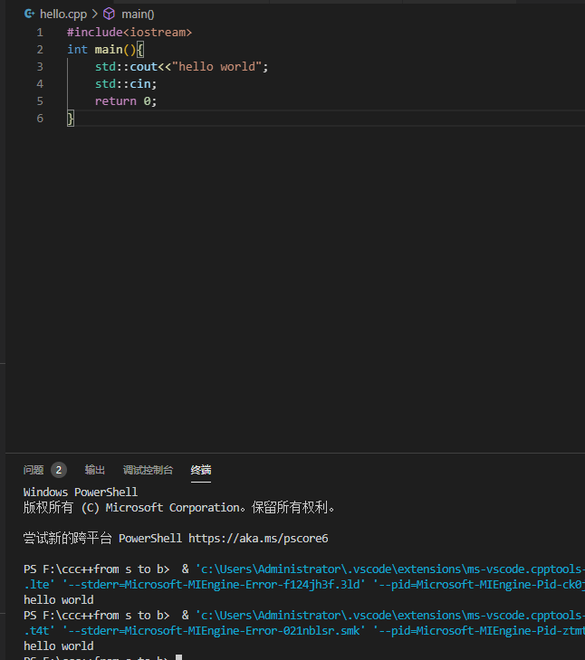

# 聪聪的c++学习之旅

[](https://github.com/yujiecong/cc-c51-learning)

这是好久之前就要学的东西，非要拖在现在，是因为我真的太懒了，而且也太菜了。

希望在这里记录下自己的学习，让自己有那么一点点成就感，可以坚持下去！  


_教程使用的是网上资料，包括但不限于[菜鸟教程](https://www.runoob.com/cplusplus/cpp-tutorial.html),C ++Primer, fourth Edition,教材书等_
我们从这里开始
```
#include <iostream>
using namespace std;
int main()
{
    cout << "Hello, world!" << endl;
    return 0;
}
```
会从这里结束吗?_谁又知道呢?but who cares?_
__我祝我c++之旅顺利吧__
***
本仓库包含以下内容：

1. 一个标准的学习[流程](spec.md)。
2. 待定
3. 待定
4. 待定
5. 待定

## 内容列表
- [更新](#更新)
- [背景](#背景)
- [安装](#安装)
- [示例](#示例)
- [相关仓库](#相关仓库)
- [维护者](#维护者)
- [如何贡献](#如何贡献)
- [使用许可](#使用许可)
## 更新
- 2020年9月29日12:16:30 更新[第二章](https://github.com/yujiecong/yjc-cpp-from-s-to-b/tree/master/contents/%E7%AC%AC%E4%BA%8C%E7%AB%A0%20C%2B%2B%E5%9F%BA%E7%A1%80)
- 2020年9月29日12:15:22，发现vscode有很多bug，文件操作时发现，比如控制台不能cin，调试无反应等，所以用回了vs2019，环境统一为vs2019了。。
- 2020年9月28日13:16:48 更新了[第一章](https://github.com/yujiecong/yjc-cpp-from-s-to-b/tree/master/contents/%E7%AC%AC%E4%B8%80%E7%AB%A0%20C%2B%2B%E4%B8%8E%E9%9D%A2%E5%90%91%E5%AF%B9%E8%B1%A1%E7%A8%8B%E5%BA%8F%E8%AE%BE%E8%AE%A1%E6%A6%82%E8%BF%B0)，实际上说了一大堆但只是个introduction？

## 背景

`cc-c++` 我其实早就想学c++了，但是各种各样的原因一直导致我没时间或者说没学明白，所以又只能推翻重学，生命就是这样啊，不断的倒下又重来，不过懒是要懒的，唉！！

> 这个项目纯粹是个人向，我也会尽力会写详细，当然除了一些人尽皆知的常识  

—— yujiecong

这个仓库的目标是：

1. 一个定义良好的**教程导向**。在仓库中的位置是 [spec.md](spec.md)。它是一个一直在持续优化的文档，欢迎您提 Issue 讨论其中的变化。
2. 让自己熟悉一下c++
3. 让你们觉得容易理解入门

## 安装

这个项目不推荐使用 [vscode](https://code.visualstudio.com/),因为我碰到了很多bug，具体的环境配置参考[这里](https://www.php.cn/tool/vscode/441244.html)
__推荐使用傻瓜式操作visual studio2019__点[这里下载](https://visualstudio.microsoft.com/zh-hans/downloads/)

```sh
待定
```


## 示例


## 相关仓库

- 暂无
- 暂无

## 维护者

[@yujiecong](https://github.com/yujiecong)。

## 如何贡献

非常欢迎你的加入！[提一个 Issue](https://github.com/yujiecong/yjc-cpp-learning/issues) 或者提交一个 Pull Request。


本 Readme 遵循 [Contributor Covenant](http://contributor-covenant.org/version/1/3/0/) 行为规范。

### 贡献者

感谢以下参与项目的人：  
<a href="graphs/contributors"></a>


## 使用许可
[MIT License](https://github.com/yujiecong/yjc-c--from-s-to-b/blob/master/LICENSE)
