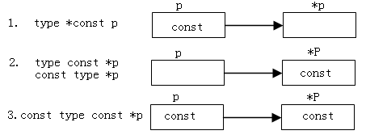
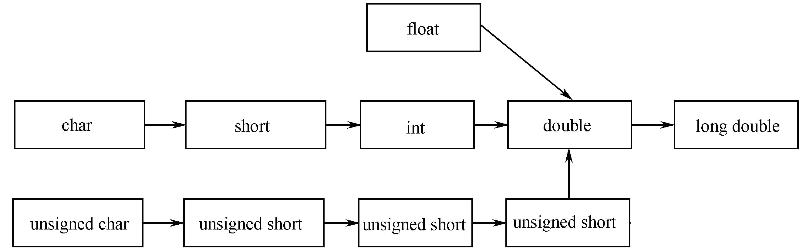

# 第2章 C++基  础 
本章主要介绍 C++对C语言的某些改变和扩展，是非面向对象方面的特征，包括：
- C++的数据类型
- 类型转换
- const常量、引用、指针及函数参数
- 函数原型、默认参数、函数重载
- 内联函数
- 名字空间及其应用
- 变量作用域和生存期
- 数据输入/输出
## tips
- 本文件所有代码是比较旧的，直接在vscode运行会报错,现在统一为最新版的。
- 解决办法
	- 把void main改成int main 并且return
	- 加入using namespace std;
	- iostream.h改成iostream
## 2.1  C++对C语言数据类型的扩展
### 1、C数据类型在C++中继续可用
### 2、C++对C的结构、枚举、联合进行了扩展
_C：结构名不是类型_
```
struct {……} some_struct;
struct some_struct struct_var;
typedef struct some_struct struct_type;
```
_C＋＋：结构名、联合名为类型_
```
struct struct_name{……};
struct_name struct_var;
union
enum 
```
这里的意思就是原来的C语言需要用struct struct_name 声明一个struct_var，而在C++中可以直接用 struct_name 声明一个var，而在原来的c中需要用typedef struct struct_name 才可以做到同样的效果。  
在C++中，可有下述的声明和定义：
```
enum Color {black, white, red, blue, yellow};
struct Student {
	char name[6];
	int age;
	int getAge() {
		return age;
	}
};
union Xy {
	int x;
	char y;
	int f() {
		return x + y;
	}
};

Student s1;
Xy x1;
Color col;

```
_这也是一个比较微妙的差别_
## 2.2  局部变量说明
- C局部变量的定义 
    - 在语句块内、可执行语句之前
- C＋＋局部变量的定义
    - 可在语句块内任何语句可以出现的地方（见下页, Eg2-1.cpp）
    - 但不能被goto及类似语句跳过
    - 好处
        - 方便：使用时才定义
        - 易读：类型信息就近获取  

_这个我们就很熟悉了，就是c对变量规范的问题，还记得之前的c51吗，是不允许的在一条赋值语句或函数后定义变量的_
```
【例2-1】下面的程序在C语言中存在编译问题，但在C++中是正确的.
//Eg2-1.cpp
void main(){
	int x;     			//L1
	x=9;      			//L2
	int y;     			//L3
    y=x+1;    		//L4
}

```
_这得看c的规范遵循哪一个版本,否则会出问题_
```
【例2-2】  在C++中，在for循环的测试语句中定义变量。
//Eg2-2.cpp
#include<iostream.h>
void  main() {
	int n=1;
	for (int i=1;i<=10;i++) { 
		int k;
		n=n*i;
		k=i;
	}                       		//i, k的作用域至此结束
    	cout<<n<<i<<endl;		//i在此的值是11，详见Page23注①
}                      			//n, i的作用域到此结束

```
## 2.3  指针
_指针大家都蛮熟悉了，就嗯！_
- 本节主要介绍C++的指针及C++动态内存分配运算符new和回收运算符delete
- 指针与常量之间的关系，及0指针和void指针
### 2.3.1  指针概念的回顾
#### 1、C++内存分配
静态分配（静态变量）
- 编译器在处理源代码时为变量分配内存，其效率较高，但缺少灵活性（要求程序执行之前就知道变量所需的内存类型和数量）  

动态分配（动态变量）
- 程序执行时，调用运行时刻库函数来分配变量的内存。

上两者的区别
- 静态变量是有名字的变量，可以通过名字对它所代表的内存进行操作；动态变量是没有名字的内存变量，只能通过指针进行操作。
- 静态变量的分配和释放由编译器自动处理；__动态变量的分配与释放必须由程序员控制。__

_我滴妈，就是这个动态变量的内存分配问题是C/C++最头疼的了！！_
#### 2、动态内存分配---指针
对类型T，T*是“到T的指针”，即一个类型为T*的变量，能存一个类型T的对象的地址
```
char c; 
c=‘a’;
char p*
p=&c;
```
_我的妈啊，这还少第一次见p*的用法！！我裂开了_

- 指针是一个复杂的概念，它能够指向（保存）不同类型变量的内存地址。例如：
```
int *pi;             	// pi是指向int的指针
int **pc;            	// pc是指向int指针的指针
int *pA[10];         // pA是指向int的指针数组
int (*f)(int,char);  // f是指向具有两个参数的函数的指针
int *f(int)          	// f是一个函数，返回一个指向int的指针
```
### 2.3.2  指针与0和void *
- 0指针
    - 0是一个整数，在C语言和C++中可以把它转换成为任意数据类型，如整型、浮点型、指针等。可以把0赋值给不同类型的变量。
- 没有任何变量会被分配到地址0，所以0就可以作为一个指针常量，表明指针当时没有指向任何变量。

比如，对于前面的指针定义，以下赋值是正确的：
```
pc=0;
pA=0;
f=0;
```
0与NULL 的含义相同
#### 1、指针与地址
每个指针都是一个内存地址，但都有一个相关的类型指示编译器怎样解释它所指定内存区域的内容，以及该内存区域应该跨越多少个内存单元。相同类型的指针进行比较或相互赋值才有意义。

#### 2、void *指针
void*指针只表示与它相关的值是个地址，但该地址的数据类型是未知的。它是能够接受任何数据类型的特殊指针。

__void*最重要的用途是作为函数的参数，向函数传递一个类型可变的对象。另一种用途就是从函数返回一个无类型的对象，在使用时再将它显式转换成适当的类型。__

说实话，这些都蛮重要，因为在之前用到过，很好用的啦！！  
```
【例2-3】 void*指针的应用.
//Eg2-3.cpp
#include<iostream>
using namespace std;
int  main() {
	int i=4,*pi=&i;
	void* pv;
	double d=9,*pd=&d;
	pv=&i;      					//L1：正确
	pv=pi;      					//L2：正确
//	cout<<*pv<<endl;				//L3：错误。问：为什么？
	pv=pd;      					//L4：正确
	cout<<*(double*)pv;				//L5：正确，输出9
    return 0;
}
```
结果为
```
9
```
上面这里没有强制转换是不能直接输出void类型的变量的..  
### 2.3.3  new 和delete(这个也很重要)
#### 1、动态存储管理的概念  
- 系统为每个程序提供了一个在程序执行时可用的内存空间，这个内存空间被称为空闲存储区或堆（heap），运行时刻的内存分配就称为动态内存分配。

#### 2、在C语言中，动态内存用mallc分配和free释放函数完成
```
int * ip = (int*) malloc (sizeof (int) * 100);
…
free (ip);	// 问：若无此语句，会出现什么问题？
```
上面的现象太经典，太经典的内存泄露了  
#### 3、C＋＋动态内存分配可由new,delete运算符完成
- new用于从内存中分配指定大小的内存
```
用法1：p=new type;
用法2：p=new type(x);
用法3：p=new type[n];
```
- delete用于释放new分配的堆内存
```
用法1：delete p;
用法2：delete [ ]p;
```
for example
```
4、【例2-4】  用new和delete分配与释放堆内存。
//Eg2-4.cpp
#include <iostream>
using namespace std;
int main() {
	int *p1,*p2,*p3;
	p1=new int;     		//分配一个能够存放int类型数据的内存区域
	p2=new int(10);  		//分配一个int类型大小的内存区域，并将10存入其中
	p3=new int[10];  		//分配能够存放10个整数的数组区域
	*p1=5;
	*p3=1;
	p3[1]=2;         		//访问指向数组的数组元素
	p3[2]=3;
	cout<<"p1    address: "<<p1<<"  value: "<<*p1<<endl;
	cout<<"p2    address: "<<p2<<"  value: "<<*p2<<endl;
	cout<<"p3[0] address: "<<p3<<"  value: "<<*p3<<endl;
	cout<<"p3[1] address: "<<&p3[1]<<"  value: "<<p3[1]<<endl;
	delete p1;        		//释放p1指向的内存
	delete p2;
	delete p3;        		//能编译，但有误。因只释放了p3指向数组的第1个元素
	//delete []p3;        	 	//释放p3指向的数组 
	//值得一提的是，如果在debug下，是会报错的，个人猜测是p3已经被释放了，那么释放[]p3是不存在的，但奇怪的是,直接运行是可以的，这里有点奇怪
    return 0;
}
```
结果是
```
p1    address: 0x2582490  value: 5
p2    address: 0x25824b0  value: 10
p3[0] address: 0x2582800  value: 1
p3[1] address: 0x2582804  value: 2
```
#### 5、new、delete和malloc、free的区别
 
- new能够自动计算要分配的内存类型的大小，不必用sizeof计算所要分配的内存字节数
- new不需要进行类型转换，它能够自动返回正确的指针类型。
- new可以对分配的内存进行初始化。
- new和delete可以被重载，程序员可以借此扩展new和delete的功能，建立自定义的存储分配系统。
### 2.4 引用（Reference）
#### 1、概念
“引用”即“别名”，即是某对象的另一个名字，引用的主要用途是为了描述函数的参数和返回值。特别是用于运算符的重载。
```
定义引用：
		类型 &引用名=变量名;
```
例如：
```
int i=9;         		//L1
int &ir=i;       		//L2   ir 与 i是同一实体的不同名称
```
与指针区别
```
   int * ip = &i;
   int & ir = i;
```
1. 指针通过解引用运算符“*”才能访问它所指向的内存单元，而引用不需要；
2. 指针是一个变量，可重新对其赋值，但引用必须在定义时进行初始化。
#### 2、【例2-5】  引用的简单例子。
```
//Eg2-5.cpp
#include <iostream>
using namespace std;      
int main() {
	int i=9;
	int& ir=i;
	cout<<"i= "<<i<<"    "<<"ir="<<ir<<endl;
	ir=20;
	cout<<"i="<<i<<"    "<<"ir="<<ir<<endl;
	i=12;
	cout<<"i="<<i<<"    "<<"ir="<<ir<<endl;
	cout<<"i 的地址是："<<&i<<endl;
	cout<<"ir的地址是："<<&ir<<endl;
    return 0;
}
```
结果
```
i= 9    ir=9
i=20    ir=20
i=12    ir=12
i 的地址是：0x61fe14
ir的地址是：0x61fe14
```

#### 3、使用引用应该注意的事项
- 引用不是值，不占用存储空间
- 引用在声明的时候必须初始化，否则会产生编译错误
- 引用的初始值可以是一个变量或另一个引用
- 引用可以视为“隐式指针”，但不分配存储空间
- 引用由类型标准符和一个取地址操作符来定义，必须被初始化，且不可重新赋值
```
int i, k;
int &r=i;
r=&k		// error
r=k;		//ok
```
_引用的地址就是其所引用的变量的地址_
```
int num=50;
int &rnum=num;
int *p=&num;      //p是指向num的指针，非引用；
int *rp=rnum;      //err，当为int *rp=&rnum;
```
若一个变量声明为T&，必须用一个T类型的变量或对象，或能够转换为T类型的对象进行初始化
```
int i = 2;
double  &rr=i;
```
可以有指针变量的引用，不能有指向引用的指针
```
int  &a=1;    // error
int  *p;
int  *&rp=p;//ok   rp是一个引用，它引用的是指针
int  &*ra=a;//error，ra是一个指针，指向一个引用。
```
不能建立引用数组，可以建立数组元素的引用
```
int  a[10];
int  &ra[10]=a;//error
int  &ra=a[8];//ok
```
引用的引用不存在，因为T&不是类型
```
int i = 2;
int  &a=i;
int  &&ra=a;//error
```
【例2-6】引用与指针的区别。
```
//Eg2-6.cpp
void main() {
	int  i=9;    				//L1
	int *pi=&i;  				//L2
	int &ir=i;   				//L3
	*pi=2;      				//L4
	ir=8;       				//L5
}
```
## 2.5  const常量
### 2.5.1  const常量的定义

#### 1、常量定义
C
```
#define 常量名称 常量 
```
C＋＋
```
const 类型 常量名称 = 常量; 
```
#### 2、常量说明
常量一经定义就不能修改，例如：
```
const int i = 5;                	// 定义常量i
i = 10;                      		// 错误，修改常量
i++;                        		// 错误，修改常量
```
const常量必须在定义时初始化，例如：
```
const int n;                  	//错误，常量n未被初始化
```
在C++中，表达式可以出现在常量定义语句中。如果定义的常量是整型，则类型关键字int可以省略。
```
int j,k=9;                    		//L1
const i1=10+k+6;             	//L2 
const int i1=10+k+6;           	//L3 
```
### 2.5.2  const与指针
#### 1、指针与const的限定关系
  
这里是一个蛮复杂的关系，以后遇到的话再说这个,要知道哪个修饰哪一个.

```
const 引用是指向 const 对象的引用： 
 const int ival = 1024; 
 const int &refVal = ival; // ok: both reference and object are const 
 int &ref2 = ival; // error: non const reference to a const object
```
可以读取但不能修改 refVal ，因此，任何对 refVal 的赋值都是不合法的。这个限制有其意义：不能直接对 ival 赋值，因此不能通过使用 refVal 来修改 ival。   

同理，用 ival 初始化 ref2 也是不合法的：ref2 是普通的非 const 引用，因
此可以用来修改 ref2 指向的对象的值。通过 ref2 对 ival 赋值会导致修改 
const 对象的值。为阻止这样的修改，需要规定将普通的引用绑定到 const 对
象是不合法的。  
const 引用可以初始化为不同类型的对象或者初始化为右值，如字面值常量： 
```
 int i = 42; 
 // legal for const references only 
 const int &r = 42; 
 const int &r2 = r + i;
```
同样的初始化对于非 const 引用却是不合法的，而且会导致编译时错误。
其原因非常微妙，值得解释一下。   
观察将引用绑定到不同的类型时所发生的事情，最容易理解上述行为。假如我们
编写 
```
 double dval = 3.14; 
 const int &ri = dval; 
```
编译器会把这些代码转换成如以下形式的编码： 
```
 int temp = dval; // create temporary int from the double 
 const int &ri = temp; // bind ri to that temporary 
```
如果 ri 不是 const，那么可以给 ri 赋一新值。这样做不会修改 dval，
而是修改了 temp。期望对 ri 的赋值会修改 dval 的程序员会发现 dval 并没有被修改。  
仅允许 const 引用绑定到需要临时使用的值完全避免了这个问题，
因为 const 引用是只读的。 
非 const 引用只能绑定到与该引用同类型的对象。 
const 引用则可以绑定到不同但相关的类型的对象或绑定到右值

> 术语：const 引用是指向 const 的引用
C++ 程序员常常随意地使用术语 const 引用。严格来说，“const 引
用”的意思是“指向 const 对象的引用”。类似地，程序员使用术语
“非 const 引用”表示指向非 const 类型的引用。这种用法非常普遍
#### 2、限制变量、参数的访问，避免非本意的数据修改举例
```
#include<iostream.h>
main(){
int i, j;
const int ic = 100;
const int * ip = & ic;
int * const icp = & i;
//icp = &j;                    //err  icp是一个常量地址,此处企图修改它
*icp = 200;	
cout<<"i="<<i<<endl;
cout<<"j="<<j<<endl;
cout<<"*ip="<<*ip<<endl;
cout<<"*icp="<<*icp<<endl;
}
```

#### 3、指向常量的指针
在指针定义前加const，表示指向的对象是常量。
```
const  int  a=78;
const  int  b=28;
int  c=18;
const  int  *pi=&a;   //定义指向常量的指针
*pi=58; 	//error，不能修改指针指向的常量 
pi=&b;	//ok，指针值可以修改
*pi=68; 	//error
pi=&c; 	//ok
*pi=88; 	//error
C=98; 	//ok
```
这波啊，就是一个指向常量的指针，指针可以变，指向的内容不可以变  
例题:限制函数修改参数
```
      //eg.cpp
#include <iostream.h>
void mystrcpy(char * Dest,const char *Src)
{	while(*Dest++=*Src++); }

void main(){
	char a[20]="How are you!";
	char b[20];
	mystrcpy(b, a);
	cout<<b<<endl;
}
```
上面这个，用了一个const的字符串修饰src，防止strcpy过程中，src变量的改变，达到正确copy的功能

#### 4、指针常量
在指针定义语句的指针名前加const，表示指针本身是常量。
例如：
```
char * const pc=“aaaa”;	//定义指针常量 ，在定义时必须初始化
pc=“bbbb”;  		//error，指针常量不能改变其指针值
*pc=“a			 //err,所指的内容可改
*pc=‘a’;      		 //ok
*(pc+1)=‘b’;		//ok,
pc++=‘y’;    		//error
const int b=28;
int * const pi=&b;	//error
//pi不能变,但它所指的内存单却可以改变,此处却将它指向了一个不可变的内存单元,即:
//不能将const in * 转换成int *
```
上面这个就是指针是const类型的，即指向的地址不能变，但是指向地址的内容可变
#### 5、指向常量的常指针
可以定义一个指向常量的常指针变量，它必须在定义时进行初始化。  
例如：
```
const int ci=7;
int ai=8;
const int * const cpc=&ci; 	//指向常量的指针常量
const int * const cpi=&ai;   //ok
cpi=&ai;    			//error，指针不能修改
*cpi=39;   		 //error ，不能修改所指对象
ai=39;      		 //ok,
```
指针和变量都是常量，那么动都别想动我！
#### 6、const、指针与变量赋值
_一般编译器不能跟踪指针在程序中任意一点所指向的对象,任何一个“企图将一个非const对象的指针指向一个常量对象”的动作都将引起编译错误。_
```
const double minWage=9.60;
// error: cannot convert from 'const double *' to 'double *'
double *ptr=&minWage; //加个const就行
```

const对象的地址只能赋值给指向const对象的指针，但是指向const对象的指针却可以被赋于一个非const对象的地址。
```
    const double minWage=9.60;
   const double *ptr=&minWage;
    double dval=3.14;
    ptr=&dval;
    *ptr=23;	//error: l-value specifies const object
     dval=23;
```
指向了一个const的本身不是const的指针当然可以不指向那个const啦，你都不变了，老子喜欢变的，就指向了别的变量。
```
//Eg2-7.cpp
#include <iostream.h>
int main(){
	char  *const  p0;    		//L1   错误，p0是常量，必须初始化
	char  *const  p1="dukang";    	 //L2   正确
	char  const  *p2;    		 //L3   正确
	const char   *p3="dukang";    	 //L4   正确
	const char *const p4="dukang"; 	 //L5   正确
	const char *const p5;            	 //L6   错误，p6是常量， 必须初始化
	p1="wankang";			//L7   错误，p1是常量， 不可改
	p2="wankang";			 //L8   正确，p2是变量， 可改
	p3="wankang";			 //L9   正确，p3是变量， 可改
	p4="wankang";			 //L10  错误，p4是常量， 不可改
	p1[0]='w';			//L11  正确
	p2[0]='w';			//L12  错误，*p2是常量，不可改
	p3[0]='w';			 //L13  错误，*p3是常量，不可改
	p4[0]='w';			//L14  错误，*p4是常量，不可改	
   return 0;
}
```
上面揭示了const和指针和变量作用的结果，非常具有参考性。
### 2.5.2  const与指针
练习1、下面的声明中，哪些是错误的？
```
   int i;
	const int ic; //说了很多遍，const的变量一定要初始化            
	const int *pic;     //声明一个指向const int类型的指针，可以不初始化，当然初始化指向NULL最好.
	int *const cpi; //说了很多遍，const的指针变量一定要初始化            
	const int *const cpic;   //说了很多遍，const的变量一定要初始化            
```
练习2、指出下面的错误
```

int i=-1;
const int ic=i;//const int 类型变量
const int *pic=&ic;//指向 const int类型的指针
int *const cpi=&ic;//
const int *const cpic=&ic;
i=ic;
pic=&ic;
cpi=pic;
pic=cpic;
cpic=&ic;
ic=*cpic;

```
### 2.5.3 const与引用
#### 1、引用与const 
const可限定引用不可修改
```
#include<iostream.h>
void main(){
	int i=10;
	const double &x=23+23+i;
	cout<<"x="<<x<<endl;
}
```
上面理解起来可能会有疑惑，为什么引用的是一个23+23+i呢？  
实际上计算机在计算23+23+i时是放入了临时内存，我们引用的也就是这一块临时内存，所以我们的x其实就是引用了这一块const的临时内存,直到x被回收.  
_详细解释在这里_  
对于形如T& x的普通引用，必须用一个类型T的左值初始化x。
对于一个形如const T&x的初始化，则不必是一个左值，甚至可以不是T类型的，其处理过程如下：  
1. 首先，如果需要，将应用T的类型转换。
2. 而后将结果存入一个类型T的临时变量。
3. 最后将此临时变量用作初始式的值。
#### 2、const限定引用的实现方式
```
	double dval=1024;
	const int &ri=dval;
	dval=90;
	cout<<"dval="<<dval<<endl;
  	cout<<"ri="<<ri<<endl;
    ri=90;     //错误，修改常量
程序输出结果：
   dval=90
   ri=1024
```
 why ri is 1024?  
 the trus is...   
编译器将此定义转换成类似如下的代码：
 ```
int temp=dval;
const int &ri=temp;
```
 对dval的修改不会影响到temp，所以ri的值不会因dval而变动。  
__其实就是一个const类型的引用不会因被引用对象的值变化而变化，这点是值得注意的__
## 2.6 类型转换
类型转换的概念  
- 类型转换就是将一种数据类型转换为另一种数据类型。

下面的例子说明类型转换的过程
```
int ival=0;
ival=3.54+3;
```
编译器的处理过程（nonono：编译器将给出警告）  
为防止精度损失，将int 3提升为double 3.00;  
执行3.54+3.00结果为6.54;  
将=右边的类型转换为=左边的类型，直接切除小数右边的部份,即6.54变成了6  
将6赋给ival;
### 2.6.1 隐式类型转换
#### 1、隐式类型转换的概念
C++定义了一套标准数据类型转换的规则，在必要时，C++会用这套转换规则在程序员不参与进行数据类型的自动转换。
#### 2、四种常见的隐式类型转换
- 在混合类型的算术表达式中，最宽的数据类型成为目标类型，如图示。  
  
- 用一种类型的表达式赋予另一种类型的对象，目标类型是被赋值的类型对象。
- 把一个表达式传给一个函数调用，表达式的类型与形参的类型不同，目标类型是形式参数的类型；
- 从一个函数返回一个类型，表达式的类型与返回类型不符，目标类型是返回类型。
### 2.6.2 显式类型转换
#### 1、显式类型转换
显示类型转换也称强制类型转换（cast)，有时需要强制类型转换，但它也是错误的根源，因为它关闭了编译器的类型检查机制。
C中的转换形式：
（类型说明）表达式；
```
	int i = 100;
	float f = (float) i;
	void * p;
	char * cp = (char *) p;
```
C++中的转换形式：
类型名称（表达式）；
```
	int i = 100;
	float f = float (i);
	void * p;
	char * cp = char * (p);
```
#### 2、C++中强制类型转换的几种形式
```
cast-name<type>(expression);
```
其中的cast-name可以为：
- static_cast   :静态转换
- dynamic_cast：动态转换
- const_cast   ：常量转换
- reinterpret_cast：用于不相关的类型转换，如将int转换成指针等。
例：
```
double b=-67.89;
	int c=b;
int c=static_cast<int>(b);
```
__上面这个我见都没见过，暂时不知道干嘛用的__
#### 3、【例2-8】  利用const_cast转换去掉指针和引用的const限制。
```
//Eg2-8.cpp
#include<iostream.h>
void sqr(const int &x) {
	const_cast<int &>(x)=x*x;  	//去掉了x的const限制，否则不能修改x
	//x=x*x;			//错误，x为const，不能被修改
}
void main(){
	int a=5;
	const int b=5;
	sqr(a);           		//通过引用将a改为25
	cout<<a<<endl;    	//输出25
	sqr(b);		//由于b为const，sqr对其修改无效
	cout<<b<<endl;	//输出5
}
```
这...直接把x这个const类型的引用转化为了可以变的引用了
[由于内容实在是太多了，剩下的留给了这个c++基础2.md](c++基础2.md)