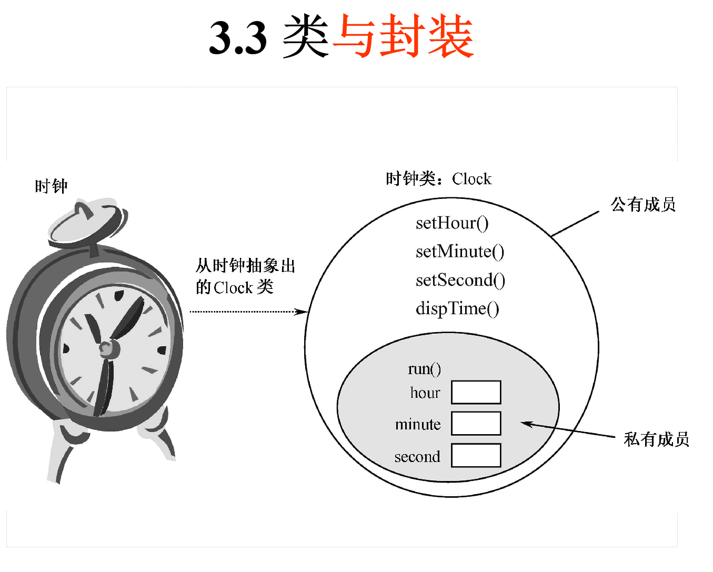
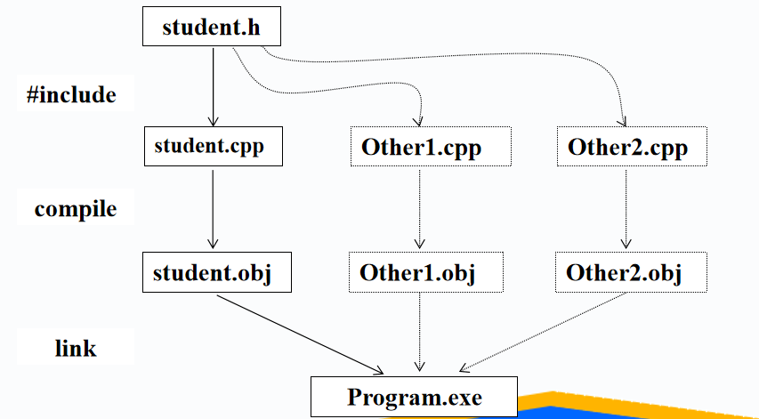
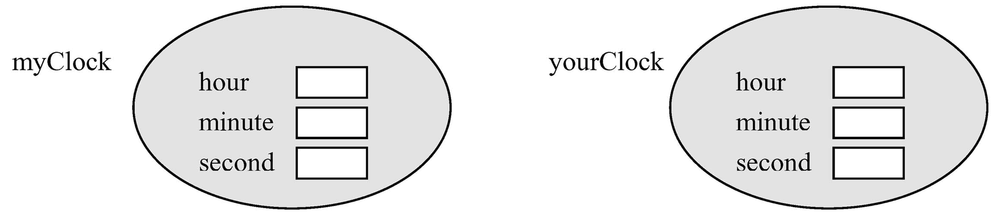
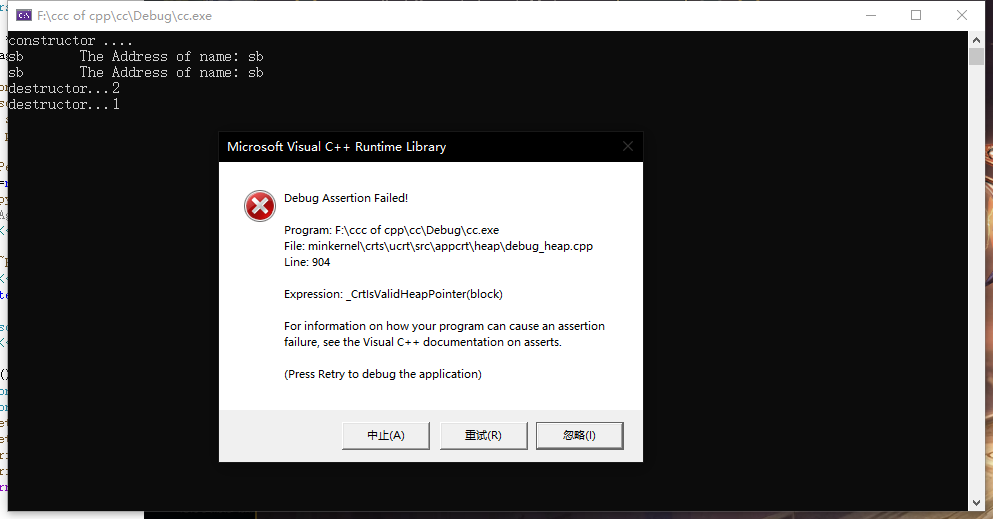
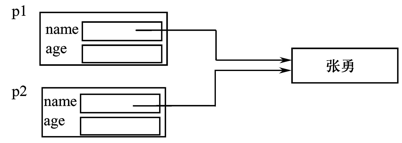
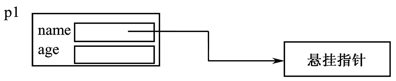
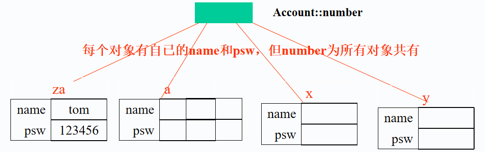

# 第3章 类与对象

_本章主要介绍类与对象。类（class）是面向对象程序设计的核心，是实现数据封装和信息隐藏的工具，是继承和多态的基础。 因此，本章是全书的基础与重点，也是学习面向对象程序设计技术的基础。学习者一定要掌握类的概念，类成员访问控制，构造函数与析构函数等重要概念。_
## tips
- 本文件所有代码是比较旧的，直接在vscode运行会报错,现在统一为最新版的。
- 解决办法
	- 把void main改成int main 并且return
	- 加入using namespace std;
	- iostream.h改成iostream

## 3.1 结构与类
### 3.1.1、C＋＋对C结构的扩展
最初的C++称为“带类的C”，它扩展了C语言结构的功能，结构不仅可以包含数据，而且还可以包含操作这些数据的函数。
```
【例3-1】  一个包含了数据和数据操作函数的复数结构。
//Eg3-1.cpp
struct Complex{
	double r;
	double i;
	void init(double rr,double ii){r=rr;i=ii;}
	double real()  {return r;}
	double image() {return i;}
};
```
_我听说结构体和类的区别就是他的多态木有，详细看[这里](https://blog.csdn.net/xianpingping/article/details/105369204)_

- 成员类型
    - 数据成员：结构中的数据和函数称为成员。r、i是数据成员。
    - 成员函数：init、real、image 是函数成员。在C++中，函数成员常称为成员函数。  
- 结构类型的应用
    - 定义Complex结构后，就可以用它来定义变量，并能像C语言的结构成员一样引用它的成员函数。 

```
void main(){
	Complex a;
	a.init(2,3);
	cout<<a.real()
	       <<"+“
            <<a.image()
            <<"i"
             <<endl;
}

```
_信息：设置访问权限的原因是隐藏_  
将数据和操作数据的函数包装在一起的主要目的是实现数据封装和信息隐藏，信息隐藏就是使结构中的数据和对数据进行操作的细节对外不可见。 
#### 成员的访问控制
```
public
```
- 可以从结构（类）的外部（使用者）访问
- 抽象，定义类的接口
```
private
```
- 仅供结构（类）的内部（自身成员函数）访问
- 封装，信息隐藏
```
protected
```
- 供结构（类）的内部及后代访问
#### 3、增加了访问权限的Complex 类
```
#include <iostream.h>
struct Complex{
private:
	double r;
	double i;
public:
	void init(double rr,double ii)
     {r=rr;i=ii;}
	double real()  {return r;}
	double image() {return i;}
};
```
对比的是
```
void main(){
	Complex a;
	a.init(2,3);
	cout<<a.real()<<"+“
                   <<a.image()
                   <<"i"<<endl;
	a.r=6;        //错误
	a.i=3.2;    //错误
    }

```
### 3.1.2  类 
#### 1、引入类的原因
- 解除struct的不安全性（struct成员的默认访问权限是public)
- 区别于struct,且class能继承
#### 2、类的定义形式
```
class 类名{
    public:		公有成员说明；
    protected:		保护成员说明；
    private:		私有成员说明；	
    };

```

#### 3、【例3-2】  用class定义的复数类Complex。
```
//Eg3-2.cpp
#include <iostream.h>
class Complex{
private:
		double r;
		double i;
public:
	void init(double rr,double ii)
      {r=rr;i=ii;}
	double real()  {return r;}
	double image() {return i;}
	};
```
#### 4、关于class的说明
① 类声明中的访问限定符private、public、protected没有先后次序之分 

② 在一个类中，访问限定符private、public、protected的出现次数没有限制 

③ 数据成员和成员函数都可以设置为public、private或protected属性 。出于信息隐藏的目的，常将数据成员设置为private权限，将需要让类的外部函数（非本类定义的函数）访问的成员函数设置为public权限。

④ 数据成员可以是任何数据类型，如整型、浮点型、字符型、数组、指针、引用等，也可以是另外一个类的对象或指向对象的指针，还可以是指向自身类的指针或引用，但不能是自身类的对象。此外，数据成员不能指定为自动（auto）、寄存器（register）和外部（extern）存储类型。例如：
```
class A{……};
class B{
private:
	int a;
	A  obja1;        		//正确
	A  *obja2;       		//正确
	B  *objb,&objr;  		//正确
	B  b1;          		//错误
	auto int b;       		//错误
	extern int c;      		//错误
public:
	……
};
```
_一般都是设置为private的哦亲,不允许通过任何手段访问到private_  
⑤ 在声明（或定义）类时，不能为数据成员赋初值。例如：
```
class A{
private:
	int a=0;        			//错误
	int b[3]={1,2,3};  		//错误
public:
	……
};
```
 _声明的时候当然不行.._
  
⑥ 类和结构的区别
- 在类定义中，默认情况下的成员是private;
- 在结构定义中，默认情况下的成员是public;
- 在C中，结构中不能有成员函数；
```
struct complex{
	double real;
	double image;
public:
	double realComplex();
	double imageComplex();
	double absComplex();
};
```
两者最大的区别就是默认为public还是private。
```
class complex{
	double real;
	double image;
public:
	double realComplex();
	double imageComplex();
	double absComplex();
};

```
 
## 3.2  成员函数
### 3.2.1、成员函数(方法)的定义
- （1）在类声明中定义（内置函数）  
- （2）在类声明以外定义
    - 返回类型 类名::成员函数名称 (参数表){	函数体}  

_注：将类定义和其成员函数的定义分开是目前开发程序的通常做法。把类的定义（头函数）看成是类的外部接口，类的成员函数的定义看成是类的内部实现。_

- (3)、定义成员函数的案例
```
class Date{
	int day,month,year;
public:
	void init(int ,int ,int );
	int getDay();
 int getYear(){return year;}
};
int Date::getDay() {return day;}
void Date::init(int d,int m,int y) {
		day=d;
		month=m;
		year=y;
}
```
_都蛮熟悉的吧，冲_  
### 3.2.2  常量成员函数
在C++中，为了禁止成员函数修改数据成员的值，可以将它设置为常量成员函数。形式如下：
```
class x{
	……
    T  f(…) const;
	……
};
```
#### 常量成员函数举例
```
class Employee{
    char *name;
    double salary;
public:
    void init(const char *Name,const double y);   
    double getSalary() const;	//常量函数，不能通过它修改name和salary
   };
```
说明：
- 只有类的成员函数才能定义为常量函数，普通函数不能定义为常量函数。下面的函数定义是错误的：
```
int  f(int x) const{		//错误，普通函数不能指定为const
    int b=x*x;
    return b;
}
```
- 常量参数与常量成员函数是有区别的，常量参数限制函数对参数的修改，但与数据成员是否被修改无关。

_杀疯了！！把函数也const了，那么限定死了类方法对属性的修改了_  

## 3.3 类与封装
### 1、对类封装性的认识
- 其一是类能够把数据和算法（操作数据的函数）组合在一起，构成一个不可分割的整体；
- 其二是类具有信息隐藏的能力，它能够有效地把类的内部数据（即私有和受保护成员）隐藏起来，使外部函数只有通过类的公有成员才能访问类的内部数据。
### 2、案例：clock类的封装
一个时钟类的定义如下：
```
class Clock{
public:
    void setHour(int h)   { hour=h;   }
    void setMinute(int m) { minute=m; }
    void setSecond(int s) { second=s; }
    void dispTime(){
        cout<<"Now is: "<<hour<<":"<<minute<<":"<<second<<endl;
    }
private:
    int hour,minute,second;
};
```

### 3、封装的意义
封装使类成为一个具有内部数据并有自我隐藏能力、功能独立的软件模块。

用private把不想让其他程序访问的数据或函数设置为私有成员，就可以禁止其他程序对这些数据的随意修改；用public设置一些公有成员，让本类之外的其他函数能够通过这些公有成员，按照类允许的方法访问类的私有数据，就能够实现数据保护的目的
### 4、一般C++类的文件组织形式
- 一个类组织在两个文件中
- 文件名与类名相同
- 类的声明文件以.hpp或.h为后缀
- 类成员函数的定义常放在与类同名的.cpp文件中

比如：
```
Complex.hpp
Complex.cpp
```
引用其他类
用#include指令包含类的声明
比如：
```
#include “complex.hpp”
```
### 5、应用C++类的文件组织形式

## 3.4 对象
### 1、对象与类的关系
类和对象
- class：数据类型
- object：类型的实例

类型和实例
- type
- instance

### 2、对象的定义
类名  对象1，对象2；  
例如：Clock  myClock, yourClock;

### 3、对象的引用
- 对象名.数据成员名
- 对象名.成员函数名（实参表）
例如，访问myClock的成员：
```
myClock.setHour(12);
myClock.dispTime();
```
说明：

① 在类外只能访问对象的公有成员，不能访问对象的私有和受保护成员；

② 如果定义了对象指针，在通过指针访问对象成员时，要用“->”作为指针对象和对象成员之间的间隔符.  
例如：
```
Clock *pClock;
pClock=new Clock;
pClock->setHour(10);
pClock->dispTime();
```
### 4、对象赋值
对象名1＝对象名2；
```
Clock *pa,*pb,aClock,bClock;
bClock=aClock;
pa=new Clock;
pb=pa;
```
1. 两个对象必须类型相同
2. 进行数据成员的值拷贝，赋值之后，两不相干
3. 若对象有指针数据成员，赋值可能产生问题
```
【例3-3】  Clock类及其对象的完整例程。
//Eg3-3.cpp
#include<iostream>
#include<string>
using namespace std;
class Clock{
public:
    void setHour(int h)   { hour=h;   }
    void setMinute(int m) { minute=m; }
    void setSecond(int s) { second=s; }
    void dispTime(){
        cout<<"Now is: "<<hour<<":"<<minute<<":"<<second<<endl;
    }
private:
    int hour,minute,second;
};

```

```
void main(){
    Clock *pa,*pb,aClock,bClock;
    aClock.setMinute(12);
    aClock.setHour(16);
    aClock.setSecond(27);
    bClock=aClock;
    pa=new Clock;
    pa->setHour(10);
    pa->setMinute(23);
    pa->setSecond(34);
    pb=pa;
    pa->dispTime();
    pb->dispTime();
    aClock.dispTime();
    bClock.dispTime();
} 

```

## 3.5 构造函数
构造函数与析构函数是两个极其特殊的函数，它们由系统自动执行，在程序中不可显式地调用它们。理解这两个函数对学好面向对象程序设计技术是大有帮助的。

构造函数的主要作用是用于建立对象时对对象的数据成员进行初始化；而析构函数主要用于对象生命期结束时回收对象。
### 3.5.1 构造函数
#### 1、构造函数的概念
构造函数（constructor）是与类同名的特殊成员函数，主要用来初始化对象的数据成员。其在类中的定义形式如下：
```
class X{
    ……
    X(…)；
    ……
} 
```

#### 2、构造函数的特点
- 构造函数与类同名。
- 构造函数没有返回类型。
- 构造函数可以被重载。
- 构造函数由系统自动调用，不允许在程序中显式调用。
	- 引用构造函数的原因
		- 自动完成数据成员初始化，减少出错几率

#### 3、构造函数的调用

只能在定义对象时，由系统自动调用！
调用形式：
```
类名    对象名（参数表）；
```
- 系统将根据参数表调用某个构造函数
- 若无参数表将调用缺省构造函数。
- 不允许程序员在程序中显式调用构造函数的名称，任何时候都不允许！

_python是可以的显式调动的_

```
【例3-4】  一个桌子类的构造函数。
//Eg3-4.cpp
#include <iostream>
using namespace std;
class Desk{
public:
    Desk(int,int,int,int);			//构造函数声明
    void  setWeight(int w){ weight=w; }
private:
    int weight,length,width,high;
};
Desk::Desk(int ww,int l,int w,int h) {		//构造函数定义
    weight=ww;  high=l;
    width=w;    length=h;
    cout<<"call constructor  !"<<endl;
}
void main(){
	Desk d1(2,3,3,5);
}

```
#### 4、使用构造函数应注意的问题
① 构造函数不能有返回类型，即使void也不行。

②构造函数由系统自动调用，不能在程序中显式调用构造函数。

③ 构造函数的调用时机是定义对象之后的第一时间，即构造函数是对象的第一个被调用函数。 

④ 定义对象数组或用new创建动态对象时，也要调用构造函数。但定义数组对象时，必须有不需要参数的构造函数 

⑤ 构造函数通常应定义为公有成员，因为在程序中定义对象时，要涉及构造函数的调用，尽管是由编译系统进行的隐式调用，但也是在类外进行的成员函数访问。  
### 3.5.2 无参构造函数

__无参数构造函数指在定义对象时，不需要提供参数的构造函数。在一些情况下,如定义数组,必须使用无参构造函数，因此需要引起重视__

#### 1、系统默认构造函数
C++规定，每个类必须有构造函数，如果一个类没有定义任何构造函数，在需要时编译器将会为它生成一个默认构造函数。 
```
class X {
    X(){}    //系统默认构造函数类似于此
    ……
}
```
在用默认构造函数创建对象时，如果创建的是全局对象或静态对象，则对象所有数据成员初始化为0；如果创建的是局部对象，则不进行对象数据成员的初始化。

```
【例3-5】  point类的默认构造函数。
//Eg3-5.cpp
#include <iostream>
using namespace std;
class point{
private:
    int x,y;
public:
    void setpoint(int a,int b) { x=a;    y=b;}
    int getx() { return x; }
    int gety() { return y; }
};
point p1; 				//定义全局对象
void main(){
    static point p2;				//定义静态局部对象
    point p3;				//定义局部对象
    cout<<"p1: "<<p1.getx()<<","<<p1.gety()<<endl;
    cout<<"p2: "<<p2.getx()<<","<<p2.gety()<<endl;
    cout<<"p3: "<<p3.getx()<<","<<p3.gety()<<endl;
}

```

说明：在类没有定义任何构造函数时，系统才会产生默认构造函数。  
一旦定义了任何形式的构造函数，系统就不再产生默认构造函数。
```
【例】  未定义无参构造函数引发的错误。
#include <iostream>
using namespace std;
class point{
private:
    int x,y;
public:
    point(int a,int b) { x=a;    y=b; }
	//    ……
};
point p1;	//error: 'point' : no appropriate default constructor available

void main(){
    static point p2;
    point p3,*p4,a[10];
    p4=new point;
}
```
#### 2、重定义无参数构造函数
系统生成的默认无参数构造函数，并未对对象的数据成员作什么实际的初始化工作。  
C++允许显式定义无参数的构造函数，这样就能通过它为对象的数据成员提供初始值。
有时为了让类能够正常工作，必须显式提供无参构造函数

__注意__

关于无参构造函数：
```
X::X(){}
```
在class没有定义任何构造函数时，系统可能动会产生缺省无参构造函数。

一旦定义了任意的构造函数。系统就不会产生缺省的无参构造函数
```
//Eg3-6.cpp
#include <iostream>
using namespace std;
class point{
private:
    int x,y;
public:
    point(int a=0,int b=0) { x=a;    y=b;}  // 缺省参数构造函数
    int getx() { return x; }
    int gety() { return y; }
//	point(){x=0;y=0;}		// L1，与带默认参数的构造函数产生二义性
};
point p1(1,1);			 //L2 调用point(int ,int)构造函数
void main (){
    static point p2;			//L3  调用point()，a、b 默认为0
    point p3,a[10];			//L4  调用point()，a、b 默认为0
    point  *p4;
    p4=new point;			 //L5 调用point()，a、b 默认为0 
    //……
}
```
_上面这些比较有用，真不错_  

##### 缺省参数的构造函数与无参构造函数的冲突问题
```
class X{
public:
	X(){};
	X(int i=0){x=i;};
private:
	int x;
};
main(){
	X one(12);
	X two;
}

```
X two调用：
```
X:X()
```
还是
```
X:X(int i=0)
```
_上面这个会报错哦，因为产生了二义性_
```
call of overloaded 'X()' is ambiguous
```
### 3.5.3 重载构造函数
构造函数可以重载。与普通函数的重载一样，重载的构造函数必须具有不同的函数原型
```
【例3-7】  有一日期类，重载其构造函数。
class Tdate{
public:
  Tdate();
  Tdate(int d);
  Tdate(int m,int d);
  Tdate(int m,int d,int y);
  //其他公共成员
protected:
  int month;
  int day;
  int year;
};
```
```
Tdate::Tdate()
{  month=4; day=15; year=1995;
  	cout <<month <<"/" <<day <<"/" <<year <<endl;}
Tdate::Tdate(int d)
{  month=4; day=d; year=1996;
  	cout <<month <<"/" <<day <<"/" <<year <<endl;}
Tdate::Tdate(int m,int d)
{  month=m; day=d; year=1997;
  	cout <<month <<"/" <<day <<"/" <<year <<endl;}
Tdate::Tdate(int m,int d,int y)
{  month=m; day=d; year=y;
  	cout <<month <<"/" <<day <<"/" <<year <<endl;}

```
```
void main()
{
  	Tdate aday;
  	Tdate aday( ); //可以吗?
  	Tdate bday(10);
  	Tdate cday(2,12);
  	Tdate dday(1,2,1998);
}
```
_答案是不可以，因为定义一个返回类型为Tdate的无参函数。与对象aday冲突_
将上面的几个构造函数结合为一个：
```
class Tdate{
public:
  Tdate(int m=4,int d=15,int y=1995)
  {
    month=m;  day=d;  year=y;
    cout <<month <<"/" <<day <<"/" <<year <<endl;  }
  	//其他公共成员
protected:
  int month;
  int day;
  int year;
};
```
### 3.5.4 拷贝构造函数
#### 1、什么是拷贝构造函数
拷贝构造函数是一个特殊的构造函数，用于根据已存在的对象初始化一个建新对象。它的形式如下：
```
class X{
public:
    ……
    X(const X&);//拷贝构造函数的常见原型
}
```
#### 2、默认拷贝构造函数
如果没有定义类的拷贝构造函数，在需要的时候， C++将产生一个具有最小功能的默认拷贝构造函数，类似于下面的形式：
```
X::X(const X&){ } 
```
默认拷贝构造函数以成员按位拷贝（bit-by-bit）的方式实现成员的复制。当一个类有指针类型的数据成员时，默认拷贝构造函数常会产生指针悬挂问题 。
```
【例3-8】  默认拷贝构造函数引起的指针悬挂问题。
//Eg3-8.cpp
#include <iostream>
#include<string>
using namespace std;
class Person{
private:
    char *name;
    int age;
public:
    Person(char *Name,int Age);
    ~Person();
    void setAge(int x){ age=x; }
    void print();
};
```
```
Person::Person(char *Name,int Age){
    name=new char[strlen(Name)+1];
    strcpy(name,Name);
    age=Age;
    cout<<"constructor ...."<<endl;
}
Person::~Person(){
    cout<<"destructor..."<<age<<endl;
    delete name;
}
void Person::print(){
    cout<<name<< "\t The Address of name: "<<name<<endl;
}
void main(){
    Person p1("张勇",21);
    Person p2=p1;     //调用默认拷贝构造函数
    p1.setAge(1);
    p2.setAge(2);
    p1.print();
    p2.print();
}

注：运行到最后，提示出错！

```
  
 Person p2=p1 调用默认拷贝构造函数，用p1构造p2对象。

  
 当p2结束生命期被析构时，p1的name成员就指向了被p2的delete的存储区域，产生指针县挂问题

  
#### 3．定义拷贝构造函数
解决上述问题的方法是为类提供拷贝构造函数
```
【例3-9】  为例3-8的Person定义拷贝构造函数。
//Eg3-9.cpp
class Person{
public:
    Person(const Person &p);    
……
};
Person:: Person(const Person &p){
    name=new char[strlen(p.name)+1];
    strcpy(name,p.name);
    age=p.age;
    cout<<"Copy constructor ...."<<endl;
}
……

```
#### 4．拷贝构造函数说明
（1）拷贝构造函数与一般构造函数相同，与类同名，没有返回类型，可以重载。

（2）拷贝构造函数的参数常常是const类型的本类对象的引用。

（3）在多数情况下，默认拷贝构造函数能够完成对象的复制创建工作，但当类具有指针类型的数据成员时，默认拷贝构造函数就可能产生指针悬挂问题，需要提供显式的拷贝构造函数。

（4）对拷贝构造函数的调用常在类的外部进行，应该将它指定为类的公有成员。

（5）调用拷贝构造函数的时机是用已存在的对象初始化同类的新对象。至少以下几种情况会导致拷贝构造函数的调用。
```
class X{};
X obj1;             
X obj2 = obj1;  //情况1：调用拷贝构造函数
X obj3(obj1);   //情况2：调用拷贝构造函数
f(X o);  		//情况3：以对象作函数参数时，调用拷贝构造函数
```
### 3.5.5 构造函数与初始化列表
#### 1、什么是初始化列表
成员初始化列表类似于下面的形式
```
构造函数名(参数表)：成员1(初始值),成员2(初始值),…{
……
}
```
介于参数表后面的“：”与函数体{…}之间的内容就是成员初始化列表。其含义是将括号中的初始值参数的值赋给该括号前面的成员。
 
```
【例3-10】  用初始化列表初始化Tdate的month和day成员。
//Eg3-10.cpp
#include <iostream>
using namespace std;
class Tdate{
public:
    Tdate(int m,int d,int y);
    ……					//其他公共成员
protected:
    int month, day, year;
};
Tdate::Tdate(int m,int d,int y):month(m),day(d) {
    year=y;
    cout <<month <<"/" <<day <<"/" <<year <<endl;
}
void main(){
    Tdate bday2(10,1,2003);                
}

```
_这个蛮有用的说实话，可以省去很多麻烦记住咋用多用用_  
#### 2、使用构造函数初始化列表的注意事项 
① 构造函数初始化列表中的成员初始化次序与它们在类中的声明次序相同，与初始列表中的次序无关。如对例3-10中的类而言，下面3个构造函数是完全相同的。
```
Tdate::Tdate(int m,int d,int y):month(m),day(d),year(y){}
Tdate::Tdate(int m,int d,int y):year(y),month(m),day(d){}
Tdate::Tdate(int m,int d,int y):day(d),year(y),month(m){}
```
尽管三个构造函数初始化列表中的month、day和year的次序不同，但它们都是按照month→day→year的次序初始化的，这个次序是其在Tdate中的声明次序。 

② 构造函数初始化列表先于构造函数体中的语句执行。

③ 常量成员，引用成员，类对象成员，派生类构造函数对基类构造函数的调用必须采用初始化列表进行初始化
```
【例3-11】  常量和引用成员的初始化。
class X
{
	private:
		const int ic;
		int 	& ir;
		int 	i;
	public:
		X ():	//ic (100),ir (i) 
			{
			i = 300;
		};
};


```
在声明class x时，系统并不为其中的数据成员分配存储空间，此时的内存中，还没有ic,ir，又如何能够存放值呢？这就是答案！
```
//Eg3-11.cpp
#include <iostream>
using namespace std;
class A{
    int x,y;		// y的值是不确定的，即y为?
    const int i,j;
    int &k;
public:
    A(int a,int b,int c):i(a),j(b),k(c),x(y) {
	   y=a;
	   cout<<“x=”<<x<<“\t”<<“y=”<<y<<endl;	// x为?
        cout<<"i="<<i<<"\t"<<"j="<<j<<"\t"<<"k="<<k<<endl;
    }
};
void main(){
    int m=6;
    A x(4,5,m);
}


```
## 3.6 析构函数
### 1、析构函数的概念
析构函数（destructor）是与类同名的另一个特殊成员函数，作用与构造函数相反，用于在对象生存期结束时，完成对象的清理工作。 
### 2、定义语法
```
	class X
	{
	~X ( ) {……};
	}
```
### 3、析构函数特点
- 函数名为~加类名
- 无参数
- 无返回值
- 不能重载：每个类仅有一个析构函数
### 4、析构函数调用时机
- 对象生命期结束时自动调用
- 自动/局部对象：定义的语句块结束处
- 全局对象：程序结束时
- 静态对象：程序结束时
- 使用
    - 一般情况下，缺省的析构函数可以信任
    - 作善后处理之用，一般是释放动态分配的内存
```
【例3-12】  析构函数和构造函数的应用。
//Eg3-12.cpp
#include <iostream>
using namespace std;
class A{
private:
    int i;
public:
    A(int x){        i=x;
        cout<<"constructor: "<<i<<endl;
    }
    ~A(){    cout<<"destructor : "<<i<<endl; }
};
void main(){
    A a1(1);
    A a2(2);
    A a3(3);
    A a4(4);
} 

```
### 5、使用析构说明
① 若有多个对象同时结束生存期，C++将按照与调用构造函数相反的次序调用析构函数。 

② 每个类都应该有一个析构函数，如果没有显式定义析构函数。C++将产生一个最小化的默认析构函数。

③ 构造函数和析构函数都可以是inline函数

④ 在通常情况下，析构函数与构造函数都应该被设置为类的公有成员，虽然它们都只能被系统自动调用的，但这些调用都是在类的外部进行的。
```
【例3-13】  用析构函数释放构造函数分配的自由存储空间。
#include <iostream>
using namespace std;
class B{
private:
    int *a;    char *pc;
public:
    inline B(int x){
        a=new int[10];        pc=new char;
    }
    inline ~B(){
        delete []a;        delete pc;
    }
};
void main(){
    B x(1);
}

```
## 3.7 静态成员
- 常规成员
    - 每个对象拥有独立的数据成员拷贝
    - 不能在确定对象之外存在
- 静态数据成员static data member
    - 被类的所有成员所共享
    - 与类关联，而不与特定的对象关联
    - 即便类没有任何对象时，就已经存在
    - 生命期与程序相同

_这些以前java课有提到啦_
### 1．静态数据成员的声明
    class  X{
	……
    	static type dataName;         //静态数据
	static type funName(…)；//静态成员函数
}
### 2．静态成员的定义
- 类型 类名::静态成员名;                    //数据成员定义方式1
- 类型 类名::静态成员名=初始值;      //数据成员定义方式2

对静态成员函数而言，除了在类声明中的成员函数前面加上static关键字之外，其定义与普通函数没有区别。

注意：  
① 在类外定义静态数据成员时，不能加上static限定词；

② 在定义静态数据成员时可以指定它的初始值（第2种定义形式），若定义时没有指定初值，系统默认其初值为0。

### 3．静态成员的访问
__静态成员属于整个类，两种方式访问。__  
① 通过类名访问（这种访问方式是非静态成员不具有的）：
- 类名::静态数据成员名;
- 类名::静态成员函数名（参数表）;

② 通过对象访问：
- 对象名.静态成员名;
- 对象名.静态成员函数名（参数表）;  
```
【例】  设计一个银行类，该类对象是一个个银行账户，统计该类对象的个数。
//Eg.cpp
#include <iostream>
using namespace std;
class Account{
public:
    Account(char *Name,char *Psw);
    Account(){ number++; }
    ~Account(){ number--; }
    int getNumber(){return number;}
private:
    char name[10];
    char psw[6];
    static int number;			//保存对象个数
};

Account::Account(char *Name,char *Psw){
    strcpy(name,Name);
    strcpy(psw,Psw);
    number++;
}
```
  
```
int Account::number;	//定义
void main(){    
    Account za("tom","123456");
    cout<<za.getNumber()<<",";				   
  Account a[3];
    cout<<za.getNumber()<<",";				
    {
        Account x,y; 
        cout<<za.getNumber()<<",";			
    }
    cout<<za.getNumber()<<endl;				
}

```
#### 3.7.2 静态成员函数
【例3-14】  设计一个书类，能够保存书名、定价，所有书的本数和总价。

为了实现这一要求，可以将书名、定价设计为普通数据成员，将书的本数和总价设计为静态数据成员.
```
class Book{
    static double totalPrice;
    static int bookNum;
    string bookName//char
    double price;
    ..
}
```
[完整的程序在这里](book.c)
## 3.7 静态函数
说明：  
① 同普通成员函数一样，静态成员函数也可以在类内或类外定义，还可以定义成内联函数；

② 静态函数只能访问静态成员（包括静态的数据成员和成员函数），不能访问非静态成员。 

③ 在类外定义静态成员函数时，不能加上static限定词。 

④ 静态成员函数可以在定义类的任何对象之前被调用，非静态成员只有在定义对象后，通过对象才能访问。 

## 3.8 this 指针
### 1、关于this指针 
this是成员函数中，指向调用该函数的对象自身（即成员函数所属的类对象的首地址）的隐含指针，形式如下：
```
		class X{……
			f(…）
		};
		X a;
		a.f(…);此调用将被编译译转换成		X::f (& a, ……);
```
### 2、访问this指针
```
		X::f (……)
		{
			this->member
		}
``` 
### 3、this指针的实现
```
【例3-15】  一个point类。
class point{
private:
	int x,y;
public:
	point(int a,int b=10)
	{x=a; y=b;	}
	int getx( )
	{	return x;	}
	int gety( )
	{	return y;	}
	void move(int a,int b)
	{	x=a;y=b;	}
};
Main()
{
    point p1,p2;
    p1.move(10,20}
    p2.move(3,4);
}

```
#### 1、编译器改变类成员的定义，用额外的this指针重新定义每个类成员函数
```
inline point(point *this,int a,int b){}
inline getx(point *this){return this->x;}
inline gety(point *this){return this->y;}
inline void move(point *this ,int a,int b)
             {this->x=a;this->y=b;}

```
#### 2、编译器改变每个类成员函数的调用，加上一个额外的实参，即被调用对象的地址
```
inline void move(&p1 ,10,20)        
inline void move(&p2 ,3,4)        
```
_实际上，this指针我们已经很熟悉了，包括python里函数的this，都是隐含的_
### 4、this指针的两种常见应用
使用this指针区分二义性
```
class X
{
	int i;
	f (int i)
	{
		    this->i = i;
	}
}

```

使用this指针返回调用对象
```
class X
{
	X & f ( ) { ……   return *this; };
    X & g ( ) {……   return *this; };
};
……
X a;
a.f().g();
……

```

### 5、关于this

① 尽管this是一个隐式指针，但在类的成员函数中可以显式地使用它 。

② 在类X的非const成员函数里，this的类型就是X *。然而this并不是一个常规变量，不能给它赋值，但可以通过它修改数据成员的值。在类的const成员函数里，this被设置成const X *类型，不能通过它修改对象的数据成员值。

③ 静态成员函数没有this指针，因此在静态成员函数中不能访问对象的非静态数据成员。
### 6、this返回对象地址或自引用的成员函数 
在类成员函数中，可以通过this指针返回对象的地址或引用，这也是this的常用方式。引用是一个地址，允许函数返回引用就意味着函数调用可以被再次赋值，即允许函数调用出现在赋值语句的左边。
```
【例3-16】  返回对象的指针和引用的成员函数。
d1.setYear(2007).setMonth(03).setDay(30) 
```
_太熟悉了太熟悉了，因为python就默认这么干了_
### 3.9 类对象成员
#### 1、类对象成员的基本知识
类的数据成员一般都是基本数据类型，但也可以是结构、联合、枚举之类的自定义数据类型，还可以是其他类的对象。  
如果用其他类的对象作为类的成员，则称之为对象成员。  
类对象作成员的形式如下：
```
class X{
类名1  成员名1;
类名2  成员名2;
    ……
类名n  成员名n；
};

```

#### 2、对象数据成员初始化的困惑
```
【例3-17】  对象成员的初始化。
class StudentID{
public:
  StudentID(int id=0)
  {
    value=id;
    cout <<"Assigning student id "<<value<<endl;}
  ~StudentID()
  {
    cout <<"Destructing id " <<value <<endl;
  }
protected:
  int value;
};
class Student{
public:
  Student(char* pName="noName",int ssID=0)
  {
    cout <<"Constructing student " <<pName <<endl; 
    strncpy(name,pName,sizeof(name));
    name[sizeof(name)-1]='\0';
    StudentID id(ssID);     //希望将学号传给学号类对象
  }
protected:
  char name[20];
  StudentID id;
};

void main()
{
  Student s("Randy",9818);
}

```
运行结果是：
```
Assigning student id 0
Constructing student Randy
Assigning student id 9818
Destructing id 9818
Destructing id 0
```
_这个结果让我有些费解，因为多创建了一个对象，可能是在程序分配空间的时候自动创建一个默认的id对象吧！！_


#### 3、问题在于对象成员的初始化
修改例3-17的构造函数
```
class Student{
public:
  Student(char* pName="no name",int ssID=0):id(ssID)
  {
     cout <<"Constructing student " <<pName <<endl;    
     strncpy(name,pName,sizeof(name));
     name[sizeof(name)-1]='\n';
  }
　……
};
```

运行结果是：
```
Assigning student id 9818
Constructing student Randy
Destructing id 9818
```
4、应在构造函数初始化列表中初始化对象成员
```
包含对象成员类的构造函数的定义形式：
  X::X(参数表0)：成员名1（参数表1）,……成员名n(参数表n)
  {
     构造函数体
  }
```
参数表i(i为1到n)给出了初始化对象的成员所需要的数据，它们一般来自参数表0

_不是，为什么加了个初始化的就是可了？这就是c++的一个特性吗？注意看下面事项_
#### 5、使用类对象成员应注意的问题
① 只有当对象成员所在的类有无参构造函数时，编译器才会以隐式初始化列表的方式对对象成员进行初始化。当一个类没有任何构造函数时，C++会产生一个默认无参构造函数；一旦定义了任何构造函数，C++就不会产生无参构造函数了，必须显式定义无参构造函数，或提供缺省参数的构造函数。 

② 当类具有对象成员时，应该采用初始化列表的方式对它进行初始化。

③ 类对象成员同样遵守public、private、protected访问权限的约束限定。

④ 对象成员的构造次序与它们在类中的声明次序相同，与它们在构造函数初始化列表中的次序无关。

```
【例3-18】  类成员的构造次序。
//Eg3-18.cp
#include <iostream>
using namespace std;
class A{
    int a;
public:
    A(int i){        a=i;        cout<<"constructing A:" <<a<<endl;    }
};
class B{
    int b;
public:
    B(int i){        b=i;        cout<<"constructing B:" <<b<<endl;    }
};
class C{
    A a1,a2;
    B b1,b2;
public:
    C(int i1,int i2,int i3,int i4):b1(i1),a1(i2),b2(i3),a2(i4){}
};
void main(){
    C x(1,2,3,4);
}

```
## 3.10 对象数组和对象指针
类实际是一种自定义数据类型，可以用它来定义各种不同的变量（即对象）。对象数组就是用类定义的数组，它的每个元素都是对象。

也可以定义对象的指针，用指针指向类对象。对象指针与结构指针的访问方法相同，即用：
```
->
(*指针).
```
两种操作符访问其所指对象的成员。
```
【例3-19】  对象数组和对象指针的应用。
//Eg3-19.cpp
#include <iostream>
using namespace std;
class point {
private:
    int x, y;
public:
    point() { x = 1; y = 1; }
    point(int a = 10, int b = 10) { x = a; y = b; }
    int getx() { return x; }
    int gety() { return y; }
};

void main() {
    point  p1(3, 3);				//定义单个对象
    point  p[3];				//定义对象数组  //产生二义性
    point* pt;				//定义对象指针
    //point p2;				//产生二义性
    for (int i = 0; i < 2; i++) {
        cout << "p[" << i << "].x = " << p[i].getx() << "\t";
        cout << "p[" << i << "]. y=" << p[i].gety() << endl;
    }
    pt = &p1;
    cout << "Point pt->x :" << pt->getx() << endl;
    pt = p;
    cout << "Point Array pt->x : " << pt->getx() << endl;
    pt++;
    cout << "Point Array pt->x : " << pt->getx() << endl;
    cout << "Point  (*pt).x : " << (*pt).getx() << endl;
}


```
结果是
```
严重性	代码	说明	项目	文件	行	禁止显示状态
错误(活动)	E0339	类 "point" 包含多个默认构造函数	cc	hello.cpp	17	
```
__编译不过去，sb,如今的版本已经不支持了__  
解决办法:去掉无参构造函数;结果是
```
p[0].x = 10     p[0]. y=10
p[1].x = 10     p[1]. y=10
Point pt->x :3
Point Array pt->x : 10
Point Array pt->x : 10
Point  (*pt).x : 10
```
### 说明(旧版c++版本下)
- 要定义对象数组的类必须有不需要参数的构造函数，包括以下几种情况：
    - 没有定义任何构造函数的类可以定义对象数组，因为C++会为这种类产生一个默认构造函数。
    - 如果一个类同时具有无参构造函数和全部参数都有缺省值的构造函数，也可以定义对象数组。
    - 无参构造函数在定义对象数组时拥有优先权。但在定义无参对象时，将产生二义性，上面的定义“point p2;”就属于这种情况。
    - 如果一个类只有需要参数的构造函数（不包括全部参数都有默认值的情况），就不能定义其对象数组。
## 3.11 向函数传递对象
对象可以作为参数传递给函数，其方法与传递其他类型的数据相同：
- 值传递（对象的一个拷贝）
- 地址传递
- 引用传递
```

【例3-20】按传值、传引用、传指针的方式向函数传递参数对象。
//Eg3-20.cpp
#include <iostream>
using namespace std;
class MyClass{
    int val;
public:
    MyClass(int i){ val=i; }
    int getval(){ return val; }
    void setval(int i){ val=i; }
};
void display(MyClass  ob){ cout<<ob.getval()<<endl; }
void change1(MyClass  ob){ ob.setval(50); }
void change2(MyClass & ob){ ob.setval(50); }
void change3(MyClass * ob){ ob->setval(100); }

void main(){
    MyClass a(10);
    cout<<"Value of a before calling change  -----";
    display(a);
    change1(a);
    cout<<"Value of a after calling change1()-----";
    display(a);
    change2(a);
    cout<<"Value of a after calling change2()-----";
    display(a);
    change3(&a);
    cout<<"Value of a after calling change3()-----";
    display(a);
}

```
结果:
```
Value of a before calling change  -----10
Value of a after calling change1()-----10
Value of a after calling change2()-----50
Value of a after calling change3()-----1001
```
说明：
① 函数接收参数对象后，在函数体内必须按照访问权限访问对象成员，即只能访问对象的公有成员。

② 类成员函数可以访问本类参数对象的私有、保护、公有成员，而普通函数（非类成员）只能访问参数对象的公有成员。
## 3.12 类的作用域和对象的生存期
### 1、类的作用域
类构成了一种特殊的作用域，称为类域。类域是指类定义时的一对花括号所括起来的范围，形式如下：

class X{	//类域开始
     ……
}；		//类域结束

类域范围内的成员可以互相访问，不受成员访问控制权限的限定，类外的函数则只能访问类的公有成员。   
例：简单的类域示例
```
class X{			//X的类域开始了
    int a,b;
    float c;
public:
    int  f1(int i) {
        int a,y;
        a=i;
        X::a=9;		//X最外层{}所框定的范围就是X的类域
        return a*a;
    }				//同一类域中的函数和数据可以相互访问
    void f2(int j) {
        //y=1;			//错误，y未定义，y只在f1内有效
        b=f1(j);
        a=j+b;
    }
};				//X的类域结束了，在后面就只能访问X的公有成员了
X n，*p;  
n.f1(2);			//正确，在类域外访问类的公有成员
n.a=2;			//错误，在类域外不能访问类的私有成员
p->f1(3);
```
### 2、对象的生存期
- 静态生存期和动态生存期
    - 静态生存期是指对象具有与程序运行期相同的生存期，这类对象一旦被建立后，它将一直存在，直到程序运行结束时才被销毁。
    - 动态生存期是指局部对象的生存期，局部对象具有块作用域，它的生存期是从它的定义位置开始，遇到离它最近的“}”就结束了。
    - 对象的生存期是指对象从它被创建开始到被销毁之间的时间。
    - 全局对象和静态对象具有静态生存期。  

问：内存有哪四大区域？静态生存期和动态生存期的对象分别保存在哪个内存区域？  
答:参考[这里](https://blog.csdn.net/xhyxxx/article/details/64553016)
> 内存到底分几个区？
1、栈区（stack）— 由编译器自动分配释放 ，存放函数的参数值，局部变量的值等。  
2、堆区（heap） — 一般由程序员分配释放， 若程序员不释放，程序结束时可能由os回收 。注意它与数据结构中的堆是两回事，分配方式倒是类似于链表。  
3、全局区（静态区）（static）—全局变量和静态变量的存储是放在一块的，初始化的全局变量和静态变量在一块区域， 未初始化的全局变量和未初始化的静态变量在相邻的另一块区域。程序结束后有系统释放  
4、文字常量区 —常量字符串就是放在这里的。 程序结束后由系统释放。

### 3、各种对象的构造与析构
- 局部对象
    - 声明期局限于定义它的语句块
    - 程序执行到其定义处构造
    - 语句块结束时析构
- 全局对象
    - 生命期与程序相同
    - 全局对象在调用main()之前构造
    - 全局对象在调用main()之后析构
    - 不同文件定义的全局对象，其构造顺序不定
- 成员对象
    - 生命期与包含它的对象基本相同
    - 成员的构造先于包含它的对象
    - 成员的析构晚于包含它的对象
    - 多个成员对象的构造顺序与声明顺序相同
    - 成员不存在默认构造函数时，要用初始化列表进行构造


- 全局静态对象
    - 生命期与程序相同
    - 全局对象在调用main()之前构造
    - 全局对象在调用main()之后析构
    - 不同文件定义的全局静态对象，其构造顺序不定
- 局部静态对象
    - 程序第一次执行到其定义代码处构造
    - 调用main()之后析构
    - 局部静态对象仅构造一次

```
【例3-21】  对象的生存期。
#include <iostream>
using namespace std;
class X
{
public:
    X(int ii = 1)
    {
        i = ii;
        cout << "X (" << ii << ") created" << endl;
    }
    ~X() { cout << "X (" << i << ") destroyed" << endl; }

private:
    int i;
};
class Z{
  public:
    Z():x3(3),x2(2){ cout << "Z created" << endl; }
    ~Z(){ cout << "Z destroyed" << endl; };
  private:
    X x1, x2, x3;
};
X a(200);			//a的生命期开始了
void main (void){
    Z z;	  //z的生命期开始了，且其成员对象x1\x2\x3的生命期也开始了，且先于它
    {
        X c(100);		//c的生命期开始了
        static X b(50);		//b的生命期开始了
    }				//c的生命期结束了
} 					//z、x3、x2、x1、b的生命期依次结束
                     			//main()函数结束后，a的生命期才结束

```
说明
① 生存期与对象的构造次序和销毁次序密切相关。

② 局部对象和静态对象的构造次序与它们在块中的声明次序相同，即在块中先声明的就先构造，块即对象定义所在的一对{}所框定的代码区域。

③ 所有的全局对象在main之前构造，在main 结束之后销毁。

④ 对象数据成员（包括对象成员）的构造次序与其在类中的声明次序相同，而与它们在构造函数的初始化列表中的次序无关。

⑤ 在对象生存期结束时，具有相同生存期的对象将按与构造的相反次序销毁。

⑥ 非静态对象的生存期与其作用域是一致的，而静态对象的生存期则长于其作用域，程序结束时静态对象的生存期才结束。


## 3.13 友元
### 1、友元函数
一个类的友元函数能够直接访问该类所有成员，包括public、protected、private类型的成员。
友元函数的定义形式如下：
```
class X{
    ……
    friend  T  f(…);      //声明f为X类的友元
    ……
};
……
T  f(…) { …… }          //友元不是类成员函数，定义时不能用“X::f”限定函数名
```
```
【例3-22】  利用友元函数计算两点之间的距离。
//Eg3-22.cpp
#include <iostream>
#include <cmath>
using namespace std;
class point{
private:
    int x,y;
    friend int dist1(point p1,point p2);	//声明dist1为point类的友元
public:
    point(int a=10,int b=10){ x=a; y=b; }
    int getx( ){ return x; }   
    int gety( ){ return y; }
};
int dist1(point p1,point p2){
    double x=(p2.x-p1.x);		//友元可以直接访问对象的私有成员
    double y=(p2.y-p1.y);
    return sqrt(x*x+y*y);
}
int dist2(point p1,point p2){	//dist2是普通函数
    double x=p2.getx()-p1.getx();	//普通函数只能访问对象的公有成员
    double y=p2.gety()-p1.gety();
    return sqrt(x*x+y*y);
}
void main(){
    point p1(2,5),p2(4,20);
    cout<<dist1(p1,p2)<<endl;
    cout<<dist2(p1,p2)<<endl;
}
```
### 2、友元类
一个类可以是另一个类的友元，友元类的所有成员函数都是另一个类的友元函数，能够直接访问另一个类的所有成员（包括public、private和protected）。.
```
【例】  通过友元类的成员函数直接访问对象的私有成员。
//Eg.cpp
#include <iostream>
using namespace std;
class A{
private:
    int x,y;
public:
    A(int i,int j){x=i;y=j;}
    int getX(){return x;}
    int getY(){return y;}
    friend class B;			//声明类B是类A的友元类
};
class B{
private:
    int z;
public:
    int add(A a){return a.x+a.y+z;}		//A类对象作参数
    int mul(A a){return a.x*a.y*z;}		//A类对象作参数
    B(int i=0){z=i;}
};
void main(){
    A a(2,3);
    B b(4);
    cout<<b.add(a)<<endl;			//输出9
    cout<<b.mul(a)<<endl;			//输出24
}

```
## 3.14 编程实作：接口与实现的分离
### 1、类的常见组织方式
类的接口
- 即指类的声明，常保存为与类同名的.h头文件

实现
- 是指类的成员函数的定义。放在一个与类同名的源程序中（即扩展名为.cpp的文件）。

### 2、【例3-23】  建立一个整数堆栈类stack，栈的默认大小为10个元素，能够完成数据的入栈和出栈处理。将类的声明（即接口）存放在单独的头文件Stack.h中。
_我出马！_
```
#pragma once
class Stack
{
private:
    int cur = 0;
    int size = 10;
    int *arr; //因为输入数据的大小是不确定的，所以要用动态分配，那么就要用到指针

public:
    Stack(int size = 10);
    ~Stack();
    void push(int data);
    int pop();
};


```
额，改一下差不多
```
#include "stack.h"  //包含头文件
#include <iostream> //push和pop都用到了cout，所以包含此头文件
using namespace std;

Stack::Stack(int stacksize)
{
    if (stacksize > 0)
    {
        size = stacksize;
        arr = new int[stacksize];
        for (int i = 0; i < size; i++)
            arr[i] = 0;
    }
    else
    {
        arr = 0;
        size = 0;
    }
    cur = 0;
}
Stack::~Stack() { delete[] arr; }
void Stack::push(int x)
{
    if (cur < size)
    {
        arr[cur] = x;
        cur++;
    }
    else
    {
        cout << "堆栈已满，不能再压入数据: " << x << endl;
    }
}
int Stack::pop()
{
    if (cur <= 0)
    {
        cout << "堆栈已空!" << endl;
        exit(1); //堆栈操作失败，退出程序！
    }
    cur--;
    return arr[cur];
}

int main()
{
    Stack s1;
    s1.push(1);
    s1.push(12);
    s1.push(32);
    int x1 = s1.pop();
    int x2 = s1.pop();
    int x3 = s1.pop();
    cout << x1 << "\t" << x2 << "\t" << x3 << endl;
    return 0;
}

```
结果自然是
```
32      12      1
```

## 3.14 编程实作：接口与实现的分离
## 静态库的制作和应用
这里不写了，GG
