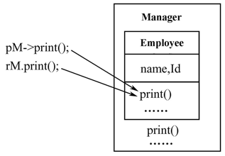
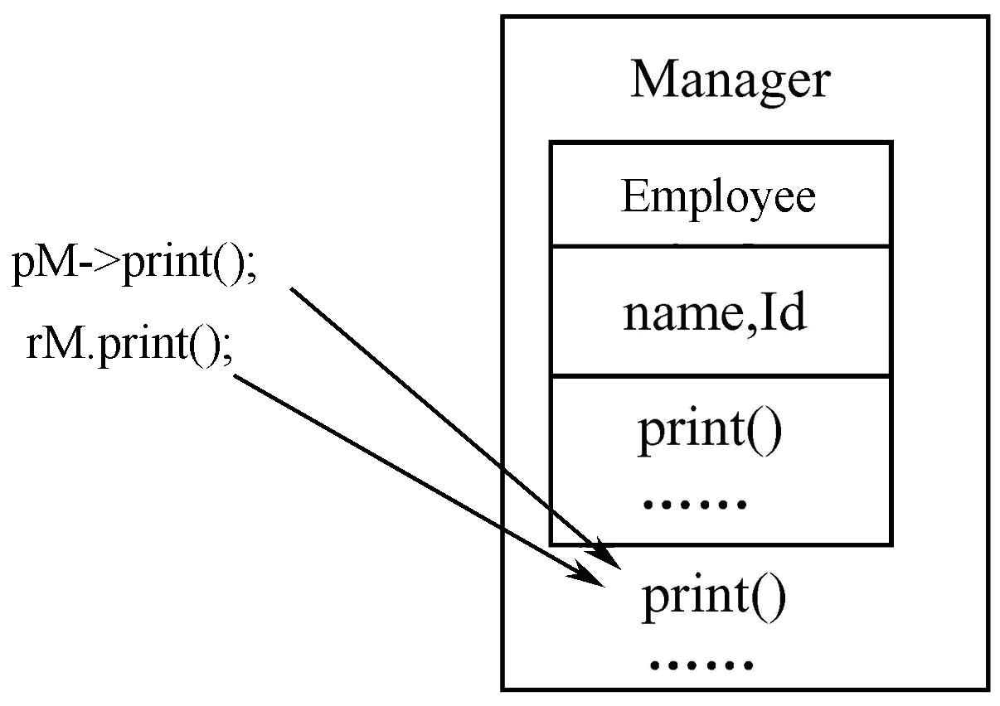
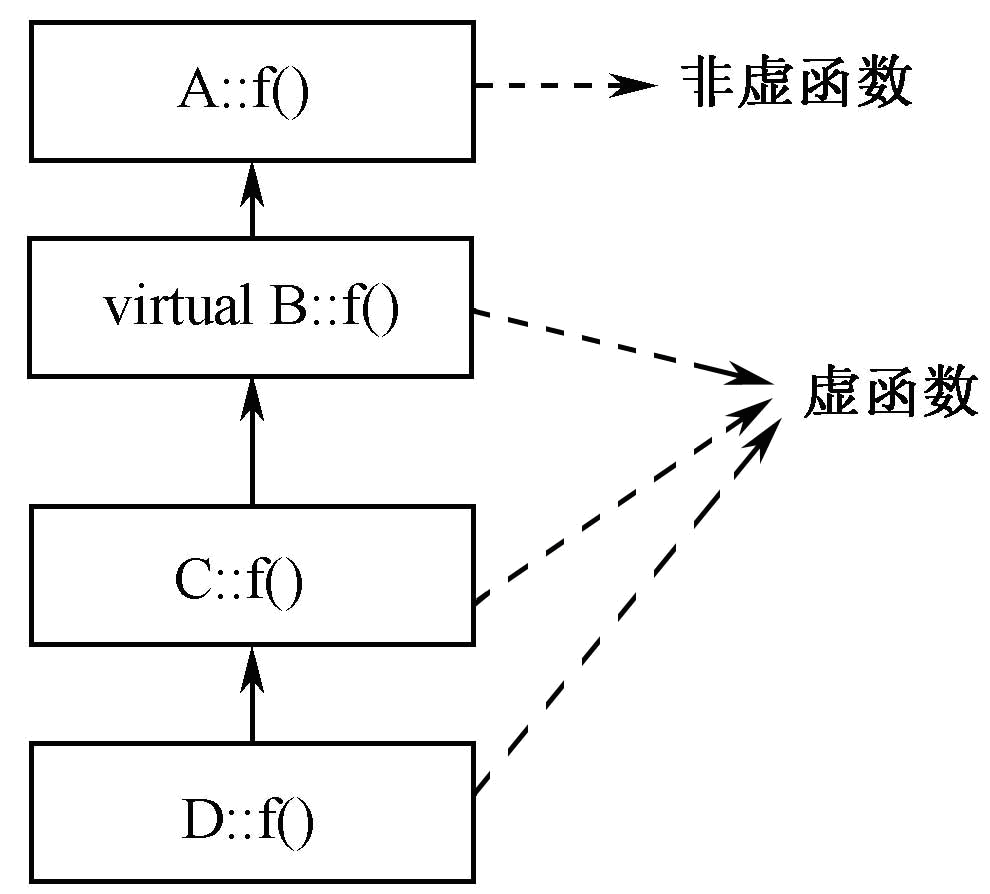
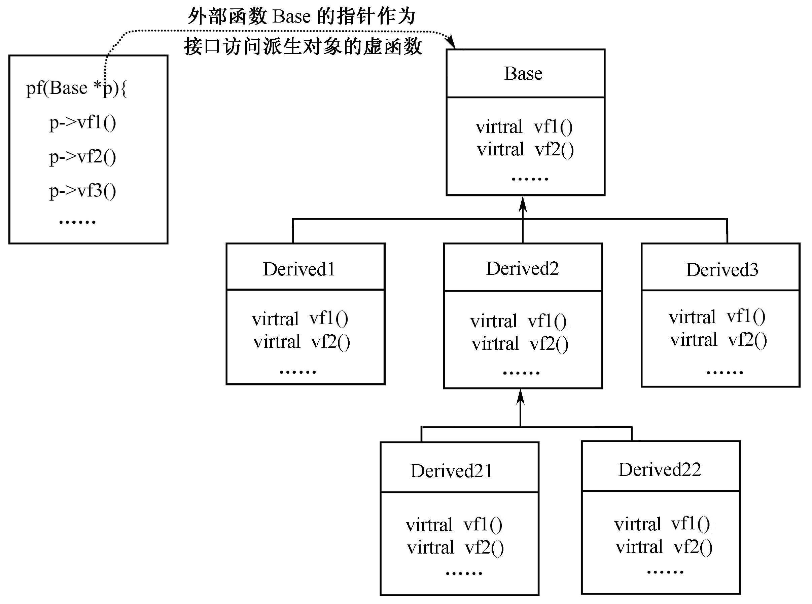
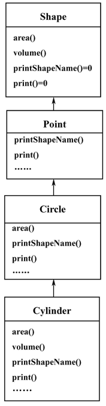
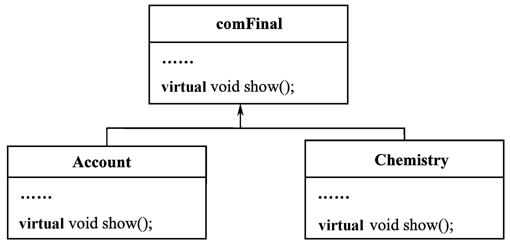

# 第5章 多态性
多态性是面向对象程序设计语言的又一重要特征，它是指不同对象接收到同一消息时会产生不同的行为。

继承所处理的是类与类之间的层次关系问题，而多态则是处理类的层次结构之间，以及同一个类内部同名函数的关系问题。

简单地说，多态就是在同一个类或继承体系结构的基类与派生类中，用同名函数来实现各种不同的功能。
## 5.1 静态绑定和动态绑定
### 1、多态（polymorphism）
对象根据所接收的消息而做出动作，同样的消息为不同的对象接收时可导致完全不同的行动，该现象称为多态性。

简单的说：单接口，多实现
### 2、联编
一个程序常常会调用到来自于不同文件或C++库中的资源（如函数、对话框）等，需要经过编译、连接才能形成为可执行文件，在这个过程中要把调用函数名与对应函数（这些函数可能来源于不同的文件或库）关联在一起，这个过程就是绑定（binding），又称联编。 
### 3、静态绑定与动态绑定
- 静态绑定又称静态联编，是指在编译程序时就根据调用函数提供的信息，把它所对应的具体函数确定下来，即在编译时就把调用函数名与具体函数绑定在一起。 

- 动态绑定又称动态联编，是指在编译程序时还不能确定函数调用所对应的具体函数，只有在程序运行过程中才能够确定函数调用所对应的具体函数，即在程序运行时才把调用函数名与具体函数绑定在一起。 
### 4、多态性的实现
编译时多态性： 
- ---静态联编----系统在编译时就决定如何实现某一动作,即对某一消息如何处理.静态联编具有执行速度快的优点。在C++中的编译时多态性是通过函数重载和运算符重载实现的。

运行时多态性：
-  ---动态联编----系统在运行时动态实现某一动作,即对某一消息在运行过程实现其如何响应。动态联编为系统提供了灵活和高度问题抽象的优点,在C++中的运行时多态性是通过继承和虚函数实现的。

## 5.2.1 虚函数的意义
### 1、回顾：基类与派生类的赋值相容
```
	B b, *pB;	// B为基类
	D d;		// D为继承于B的子类
```
派生类对象可以赋值给基类对象。如：
```
b=d;
```
派生类对象的地址可以赋值给指向基类对象的指针。如：
```
pB=&b;
```
派生类对象可以作为基类对象的引用。
如：
```
B &rb=d;
```
赋值相容的问题：
__不论哪种赋值方式，都只能通过基类对象（或基类对象的指针或引用）访问到派生类对象从基类中继承到的成员， 不能借此访问派生类定义的成员。__
### 2、虚函数使得通过基类对象的指针或引用访问派生类定义的成员可以施行。
【例5-1】  某公司有经理、销售员、小时工等多类人员。经理按周计算薪金；销售员每月底薪800元，然后加销售提成，每销售1件产品提取销售利润的5%；小时工按小时计算薪金。每类人员都有姓名和身份证号等数据。为简化问题，把各类人员的共有信息抽象成基类Employee，其他人员则继承该类的功能。 

```
//Eg5-1.cpp
#include <iostream>
#include <string>
using namespace std;
class Employee
{
public:
    Employee(string Name, string id)
    {
        name = Name;
        Id = id;
    }
    string getName() { return name; } //返回姓名
    string getID() { return Id; }     //返回身份证号
    float getSalary() { return 0.0; } //返回薪水
    void print()
    { //输出姓名和身份证号
        cout << "姓名: " << name << "\t\t 编号: " << Id << endl;
    }

private:
    string name;
    string Id;
};
class Manager : public Employee
{
public:
    Manager(string Name, string id, float s = 0.0) : Employee(Name, id)
    {
        WeeklySalary = s;
    }
    void setSalary(float s) { WeeklySalary = s; } //设置经理的周薪
    float getSalary() { return WeeklySalary; }    //获取经理的周薪
    void print()
    { //打印经理姓名、身份证、周薪
        cout << "经理：" << getName() << "\t\t 编号: " << getID()
             << "\t\t 周工资: " << getSalary() << endl;
    }

private:
    float WeeklySalary; //周薪
};
int main()
{
    Employee e("黄春秀", "NO0009"), *pM;
    Manager m("刘大海", "NO0001", 128);
    m.print();
    pM = &m;
    pM->print(); // 想打印“经理”的信息
    Employee &rM = m;
    rM.print();
    return 0;
}

```
例5-1程序的运行结果如下：
```
经理：刘大海        编号: NO0001         周工资: 128
姓名: 刘大海        编号: NO0001
姓名: 刘大海        编号: NO0001
```
输出的第2、3行表明，通过基类对象的指针和引用只访问到了在基类中定义的print函数。  
这非常典型，因为基类对象想通过赋值派生类对象的地址来直接操控派生类对象，但实际上是不行的，因为类型不相同，在这里不论怎样都是只能打印基类对象的方法  
不管是通过引用还是赋值都一样..  
如果想通过指针对象来索引对应的方法，那就是虚函数的用法了  

  
所以可以将基类Employee的print指定为虚函数，如下形式：
```
class Employee{
    ……
    virtual void print(){ cout<<"姓名: "<<name<<"\t\t 编号: "<<Id<<endl; }
};
```
将得到下面的程序运行结果：
```
经理：刘大海         编号: NO0001         周工资: 128
经理：刘大海         编号: NO0001         周工资: 128
经理：刘大海         编号: NO0001         周工资: 128
```
基类指针或引用指向派生类对象时，虚函数与非虚函数的对象，图左为非虚函数，图右为虚函数
  

### 1、什么是虚函数?
用virtual关键字修饰的成员函数

virtual关键字的实质是告知编译系统，被指定为virtual的函数采用动态联编的形式编译。
### 2、虚函数的定义形式
```
class x{
　……
　virtual f(参数表);
　……
}
```
虚函数的虚特征：基类指针指向派生类的对象时，通过该指针访问其虚函数时将调用派生类的版本；

例题没有虚函数的情况
```
class B {
public: 
	void f ( ) {cout << "B::f";}; 
};
class D : public B {
public: 
	void f ( ) { cout << "D::f"; };
};

void main()
{
	D d;
	B *pb = &d;
	pb->f( );
}
```

例题：虚函数版
```
class B {
public: 
	virtual void f ( ) {cout << "B::f";}; 
};
class D : public B {
public: 
	void f ( ) { cout << "D::f"; };
};

void main()
{
	D d;	
	B *pb = &d;
	pb->f( );
}
```
总结：通过指向派生类对象的基类指针访问函数成员时:
- 非虚函数由指针类型决定调用的版本
- 虚函数由指针指向的实际对象决定调用的版本
### 5.2.2 虚函数的特性 

**一旦将某个成员函数声明为虚函数后，它在继承体系中就永远为虚函数了** 
```
【例5-2】  虚函数与派生类的关系。
#include <iostream>
#include<string>
using namespace std;
class A { 
public: 
    void f(int i){cout<<"…A"<<endl;}; 
};
class B: public A { 
public:
    virtual void f(int i){cout<<"…B"<<endl;}
};
class C: public B {
public: 
    void f(int i){cout<<"…C"<<endl;}
};
class D: public C{
public:
    void f (int){cout<<"…D"<<endl;}
};
void main(){
    A *pA,a;
    B *pB, b;    
    C c;    
    D d;
    pA=&a;    pA->f(1);	//调用A::f
    pA=&b;    pA->f(1);	//调用A::f
    pA=&c;    pA->f(1);	//调用A::f
    pA=&d;    pA->f(1);	//调用A::f
}

注：因为A的f()不是虚函数。从B开始，f()才是虚函数。

```
  
如果基类定义了虚函数，当通过基类指针或引用调用派生类对象时，将访问到它们实际所指对象中的虚函数版本。

例如，若把例5-2中的main的pA指针修改为pB，将会体现虚函数的特征。
```
void main(){
    A *pA,a;
    B *pB, b;  C c;  D d;
//  pB=&a;  pB->f(1);		//错误，派生类不能访问基类对象
    pB=&b;  pB->f(1);		//调用B::f
    pB=&c;  pB->f(1);		//调用C::f
    pB=&d;  pB->f(1);		//调用D::f
} 
```

**只有通过基类对象的指针和引用访问派生类对象的虚函数时，才能体现虚函数的特性。**
```
【例5-3】  只能通过基类对象的指针和引用才能实现虚函数的特性。
//Eg5-3.cpp
#include <iostream>
using namespace std;
class B{
public: 
    virtual void f(){ cout << "B::f"<<endl; };
};
class D : public B{
public: 
    void f(){ cout << "D::f"<<endl; };
};
void main(){
    D d;
    B *pB = &d, &rB=d, b;
    b=d;
    b.f();
    pB->f();
    rB.f();
}
```
本程序的运行结果如下：第1行输出没有体现虚函数特征  
__意思就是，用指针调用才是真不错！！__
```
B::f
D::f
D::f
```


__派生类中的虚函数要保持其虚特征，必须与基类虚函数的函数原型完全相同，否则就是普通的重载函数，与基类的虚函数无关。__
```
【例5-4】  基类B和派生类D都具有成员函数f ，但它们的参数类型不同，因此不能体现函数f在派生类D中的虚函数特性。
//Eg5-4.cpp
#include <iostream>
using namespace std;
class B{
public: 
    virtual void f(int i){ cout << "B::f"<<endl; };
};
class D : public B{
public: 
    int f(char c){ cout << "D::f..."<<c<<endl; }
};
void main(){
    D d;
    B *pB = &d, &rB=d, b;
    pB->f('1');
    rB.f('1');
}
```
本程序的运行结果如下：
```
B::f
B::f
```
所以啊，还要用参数相同来体现！  
__派生类通过从基类继承的成员函数调用虚函数时，将访问到派生类中的版本。__

```
【例5-5】  派生类D的对象通过基类B的普通函数f调用派生类D中的虚函数g
//Eg5-5.cpp
#include <iostream>
using namespace std;
class B{
public: 
    void f(){ g(); } 
    virtual void g(){ cout << "B::g"; }
};
class D : public B{
public: 
    void g(){ cout << "D::g"; }
};
void main(){
    D d;
    d.f();
}
```
运行结果：
```
D::g
```
这个设计的真不错
```
例题5-6.cpp
class B {
public:
        void f ( )   { cout << "bf "; };
        virtual void vf ( )   { cout << "bvf "; };
        void ff ( )    { vf(); f(); };
        virtual void vff ( )  { vf(); f(); };	
};
class D: public B {
public:
        void f ( )       { cout << "df "; };
        void ff ( )      { f(); vf(); };
        void vf ( )      { cout << "dvf "; };	
};
void main()
{    	D d;  
		B *pB = &d;
		pB->f();		 // f()不是虚函数，故调用 B::f()
		pB->ff();		// B::ff() -> B::vf() ->D::vf(), 再调用B::f()
		pB->vf();		// vf是虚函数，故调用D::vf()
		pB->vff();	// B::vff() -> D::vf(), 再B::f()
}

```
结果
```
bf dvf bf dvf dvf bf
```
不错不错，快晕了

只有类的非静态成员函数才能被定义为虚函数，类的构造函数和静态成员函数不能定义为虚函数。原因是虚函数在继承层次结构中才能够发生作用，而构造函数、静态成员是不能够被继承的。

内联函数也不能是虚函数。因为内联函数采用的是静态联编的方式，而虚函数是在程序运行时才与具体函数动态绑定的，采用的是动态联编的方式，即使虚函数在类体内被定义，C++编译器也将它视为非内联函数。
## 5.3虚析构函数 
基类析构函数几乎总是为虚析构函数。假定使用delete和一个指向派生类的基类指针来销毁派生类对象，如果基类析构函数不为虚,就如一个普通成员函数，delete函数调用的就是基类析构函数。在通过基类对象的引用或指针调用派生类对象时，将致使对象析构不彻底！
```
【例5-7】  在非虚析构函数的情况下，通过基类指针对派生对象的析构是不彻底的。
#include <iostream>
using namespace std;
class A {
public:
     ~A() { cout<<"call A::~A()"<<endl; }
};
class B:public A {
    char *buf;
public:
    B(int i) {buf=new char[i];}
     ~B() {
          delete [] buf;
          cout<<"call B::~()"<<endl;
	}
};
void main() {
    A* a=new B(10);
    delete a;
}

```
程序运行结果：
```
call A::~A()
```
此结果表明没有析构buf
```
class A {
public:
	virtual ~A() {
		cout<<"call A::~A()"<<endl;	
	}
};
class B:public A {
	char *buf;
public:
	B(int i) {buf=new char[i];}
	virtual ~B() {
		delete [] buf;
		cout<<"call B::~()"<<endl;	
	}
};

void main(){
	A* a=new B(10);
	delete a;
}

```
程序运行结果：
```
call B::~()
call A::~A()
```
此结果表明回收了buf空间！
## 5.4纯虚函数和抽象类 
### 5.4.1  纯虚函数和抽象类
#### 1.纯虚函数的概念
仅定义函数原型而不定义其实现的虚函数
##### Why pure function?
- 实用角度：占位手段place-holder
- 方法学：接口定义手段，抽象表达手段
##### How?
```
class X
{
	virtual ret_type func_name (param) = 0;
}
```
#### 2、抽象类的概念
##### What is an abstract class?
包含一个或多个纯虚函数的类
##### Using abstract class
不能实例化抽象类,但是可以定义抽象类的指针和引用
##### Converting abstract class to concrete class
- 定义一个抽象类的派生类
- 定义所有纯虚函数

#### 3、C++对抽象类具有以下限定：
- 抽象类中含有纯虚函数，由于纯虚函数没有实现代码，所以不能建立抽象类的对象。
- 抽象类只能作为其他类的基类，可以通过抽象类对象的指针或引用访问到它的派生类对象，实现运行时的多态性。
- 如果派生类只是简单地继承了抽象类的纯虚函数，而没有重新定义基类的纯虚函数，则派生类也是一个抽象类。

#### 4、抽象类的主要用途——作接口
  

```
【例5-8】  抽象图形类及其应用。
//Eg5-8.cpp
#include <iostream>
using namespace std;
class Figure{                                    
protected:
    double x,y;
public:
    void set(double i,double j){ x=i; y=j; }
    virtual void area()=0;	//纯虚函数
};

class Triangle:public Figure{
public:
    void area(){cout<<"三角形面积："<<x*y*0.5<<endl;}//重写基类纯虚函数
};
class Rectangle:public Figure{
public:
    void area(int i){cout<<"这是矩形，它的面积是："<<x*y<<endl;}
}; 
void main(){
    Figure *pF;
//  Figure f1;			//L1，错误
//  Rectangle r;			//L2，错误
    Triangle t;			//L3
    t.set(10,20);
    pF=&t;
    pF->area();			//L4
    Figure &rF=t;
    rF.set(20,20);
    rF.area();			//L5
}
```
运行结果：
```
三角形面积：100
三角形面积：200
```
【例5-9】  建立一个如右图所示图形类的继承层次结构。基类Shape是抽象类，通过它能够访问派生类Point、Circle、Cylinder的类名、面积、体积等内容。  
  
虚函数及抽象类的应用
- 多态
    - 从外部看：
        - 同一方法（函数）作用不同对象时，导致不同行为发生
    - 从内部看：
        - 单接口
        - 多实现
    - 好处
        - 代码重用
        - 软件功能局部的修改和替代
        - 抽象手段（抽象类）

## 5.5 运行时类型信息
### 1、RTTI
运行时类型信息（Run-Time Type Information，RTTI）提供了在程序运行时刻确定对象类型的方法，是面向对象程序设计语言为解决多态问题而引入的一种语言特性，在最初的非多态程序程序设计语言中，并没有RTTI机制。 

在C++中，用于支持RTTI的运算符有：dynamic_cast，typeid，type_info 
### 5.5.1  dynamic_cast
#### 1、dynamic_cast的用途
dynamic_cast是一个强制类型转换操作符，主要用于多态基类的指针或引用与派生类指针或引用之间的转换，它是在程序运行时刻执行的。

const_cast、static_cast和reinterpret_cast强制类型转换则是在编译时期完成的。
#### 2、 dynamic_cast的用法
dynamic_cast<目标类型>(表达式) 
#### 3、dynamic_cast强制类型
向上强制转换、向下强制转换的概念：

向上转换是指在类的继承层次结构中，从派生类向基类方向的转换，即把派生类对象的指针或引用转换成基类对象的指针或引用，这种转换常用C++的默认方式完成（例如：学生－>人）。

与向上强制转换的方向相反，向下转换是指在类的继承层次结构中，从基类向派生类方向的转换，即把基类对象的指针或引用转换成派生类对象的指针或引用（例如：人->学生）。

```
【例5-10】
//Eg5-10.cpp
class Base{
public:
    virtual ~Base() {}
};
class Derived:public Base {
    void f() { cout<<“f  in Derived!\n"<<endl; }
}; 
void main() {
    Base *pb,b;
    Derived d,*pd;
    pb=&d; 		//默认转换，编译时完成，是常用方式
    pd=&d;
    pb=dynamic_cast<Base *>(&d);	//向上转换，运行时完成
    pb=dynamic_cast<Base *>(pd);	//向上转换，运行时完成
}

```
对例5-10，修改main见到向下转换

```
void main(){
    Base *pb,b;
    Derived d,*pd;
    pb=&b;
    pd=dynamic_cast<Derived *>(pb);	//L1：向下强制转换
    if  (pd)  cout<<"ok";   
    else cout<<"error!\t";
    pd=dynamic_cast<Derived *>(&b);    	//L2：向下强制转换
    if (pd)  cout<<"ok";   
    else  cout<<"error!\t";
    pb=&d;
    pd=dynamic_cast<Derived *>(pb);	//L3：向下强制转换
    if  (pd)  cout<<"ok!";   
    else  cout<<"error!\t\n";
}

```
在默认情况下，在类的继承体系结构中，当用基类对象的指针操作派生类对象时，只能通过该指针访问派生类中的虚函数（这些虚函数也是基类中的虚函数）。而那些在基类中没有被定义为虚函数，或派生类所新增加的函数，通过基类指针是无法访问的。请看下面的例子。
```
【例5-11】  有3个类B、D1、D2，B是D1和D2的基类，通过B的指针能够访问派生类的虚函数f。
//Eg5-11.cpp
#include <iostream>
#include <typeinfo>
using namespace std;
class B{
    int x;
public:
    B(int i){x=i;}
    int getx(){return x;}
    virtual void f(){cout<<"1: 基类B中的f, x="<<x<<endl;}
};
class D1:public B{
    int x;
public:
    D1(int i):B(i){}
    virtual void f(){ cout<<"2: 派生类D1中的f, x="<<getx()<<endl; }
};
class D2:public B{
    int x;
public:
    D2(int i):B(i){}
    virtual void f(){ cout<<"3: 派生类D2中的f, x="<<getx()<<endl; }
    void g(){ cout<<"4: 这是派生类D2特有的函数，其他类都没有！----\n"; }
};
void AccessB(B *pb){
    pb->f();
//  pb->g();                        //B中没有定义g()为虚函数，不能访问
}
void main(){
    B b(1);
    D1 d1(2);
    D2 d2(3);
    AccessB(&b);
    AccessB(&d1);
    AccessB(&d2);
}


```
修改5-11的AccessB，访问正确对象的成员函数！  
利用dynamic_cast将例5-10中的AccessB函数改写为下面的形式，其余程序代码不作任何修改，就能够通过基类对象B的指针pb访问到派生类D2新增加的函数g( )。
```
void AccessB(B *pb){
    D2 *p=dynamic_cast<D2 *>(pb);
    if (p)                           //如果转换成功，就调用p->g()
        p->g();
    else                            //如果转换不成功，调用p->f()
        pb->f();
}
```
当将AccessB改写为上面的形式后，例5-11的运行结果如下。这就对了
- 基类B中的f, x=1
- 派生类D1中的f, x=2
- 这是派生类D2特有的函数，其他类都没有！
### dynamic_cast应用说明：
① 在用dynamic_cast进行基类与派生类的指针或引用之间的转换时，基类必须是多态的，即基类必须至少有一个虚函数(否则，就没有多态特性了) 。

② 只有在支持RTTI的程序环境中，才能使用dynamic_cast进行类型转换。

③ 在向下强制类型转换时，只有当基类对象指针或引用实际指向了一个派生类对象时，dynamic_cast才能将它们转换成派生类对象的指针或引用，否则转换将不会成功。 
## 5.5.2 typeid 
typeid操作符在程序运行时判定一个对象的真实数据类型，typeid定义于头文件typeinfo中，它的用法如下：
```
typeid(exp) 
```
```
【例5-12】  用typeid判定数据的类型。
//Eg5-12.cpp
#include <iostream>
using namespace std;
class A{};
void main(){
    A a,*p;
    A &rA=a;
    cout<<"1: "<<typeid(a).name()<<endl;
    cout<<"2: "<<typeid(p).name()<<endl;
    cout<<"3: "<<typeid(rA).name()<<endl;
    cout<<"4: "<<typeid(3).name()<<endl;
    cout<<"5: "<<typeid("this is string").name()<<endl;
    cout<<"6: "<<typeid(4+9.8).name()<<endl;
}
```
输出
```
1: class A
2: class A * __ptr64
3: class A
4: int
5: char const [15]
6: double
```
```
【例5-13】  在多态程序中，利用typeid获取基类指针所指的实际对象，并进行不同的成员函数调用。
//Eg5-13.cpp
#include <iostream>
#include <typeinfo>
using namespace std;
class B{
    int x;
public:
    virtual void f(){ cout<<"1: B::f()"<<endl; }
};
class D1:public B{
public:
    virtual void g(){ cout<<"2: D1::g()"<<endl; }
};
class D2:public B{
    int x;
public:
    virtual void f(){ cout<<"3: D2::f() "<<endl; }
    void h(){ cout<<"4: D2::h()\n"; }
};
void AccessB(B *pb){
    if (typeid(*pb)==typeid(B))
        pb->f();
    else if (typeid(*pb)==typeid(D1)) {
        D1 *pd1=dynamic_cast<D1 *>(pb);
        pd1->g();
    }
    else if (typeid(*pb)==typeid(D2)) {
        D2 *pd2=dynamic_cast<D2 *>(pb);
        pd2->h();
    }
}
void main(){
    B b;
    D1 d1;
    D2 d2;
    AccessB(&b);    		//输出：        1: B::f()
    AccessB(&d1);   		//输出:         2: D1::g()
    AccessB(&d2);   		//输出:         4: D2::h()
}

```
与python中自带的type有点像，返回整个对象..  
# 5.5 编程实作
在本书4.9节设计的课程体系继承结构中，设计了comFinal、Account、Chemistry三个类，这些类的相关头文件comFinal.h、account.h、chemistry.h，以及类的实现文件comFinal.cpp、account.cpp、chemistry.cpp，都保存在目录C:\course中。

现对4.9节的编程实作进行完善，将comFinal、Account、Chemistry中的成员函数show设计成虚函数，并设计一个访问该类继承结构的接口函数display ，此函数通过基类comFinal对象的指针，访问派生类Account、Chemistry 类对象的虚函数show 。下图是类的继承层次图。

为comFinal继承结构设计虚函数show
