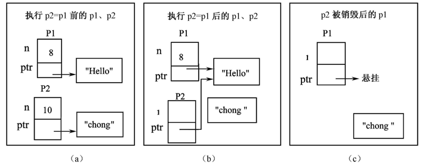

# 第6章 运算符重载 
运算符重载是C++的一项强大功能。通过重载，可以扩展C++运算符的功能，使它们能够操作用户自定义的数据类型，增加程序代码的直观性和可读性。  

本章主要介绍 类成员运算符重载与友元运算符重载,  二元运算符与一元运算符重载,  运算符++、--、[]、（）重载,  this指针与运算符重载及 流运算符<<和>>的重载。
## 6.1 运算符重载基础
### 1、运算符重载的概念
C++的运算符对语言预定义类型是重载的
```
int  i=2+3;
double  j=2+4.8;
float  f=float(3.1)+float(2.0);
```
对于上面的3个加法表达式，C++系统提供了类似于下面形式的运算符重载函数：
```
int  operator+(int,int);
double  operator+(int,double);
float  operator+(float,float);
```


C++允许程序员通过重载扩展运算符的功能，使重载后的运算符能够对用户自定义的数据类型进行运算。  
比如，设有复数类Complex，其形式如下：
```
class Complex{
		double real,image;
public:
	......
};
```
假设定义了下面的复数对象，并且要实现两个复数相加的运算。
```
Complex  c1,c2,c3；
……
c1=c2+c3;
```
我们要做的就是类似上面这种自定义加减法  
### why?
- 使程序便于编写和阅读
- 使程序定义类型与语言内建类型更一致
### how?
- 使用特殊的成员函数
- 使用自由函数，一般为友元
### 1.  运算符重载的限制
可以重新定义大多数运算符，如
```
+    -    / * % ^ & | ~ ! = < > += 
-=  *=   /=  %=  ^=  &=  |= >>
>>=   <<=  ==   !=  <=  >=  [ ]
()  new  new[]  delete  delete[]  
```
- 不能定义新的运算符
- 不能重载某些特殊运算符，包括：
```
.   .*   ->   ::   ?:  sizeof   typeid 
```
- 不能改变运算符的优先级、结合性
- 不能重载语言预定义类型的运算符含义如 #
- 程序定义的含义与运算符固有含义吻合
### 2.  运算符重载的语法
运算符的计算结果是值，因此运算符函数是要返回值的函数。其重载的语法形式如下：
```
　　　返回类型  operator@(参数表)
```
其中，operator是C++的保留关键字，表示运算符函数。@代表要重载的运算符，它可以是前面列举的可重载运算符中的任何一个（例如“+”和“-”等）。
### 3、与类相关的运算符重载方式
#### （1）C++为类使用的默认重载运算符如下：
① 赋值运算（=）；

② 取类对象地址的运算函符（&）；

③ 成员访问运算（如“.”和“->”）。

这些运算符不需要程序员重载就可以使用，但要在类中使用其他运算符，就必须明确地重载它们。
#### （2）非静态成员运算符重载
以类成员形式重载的运算符参数比实际参数少一个，第1个参数是以this指针隐式传递的。 
```
class Complex{
		double real,image;
public:
		Complex operator+(Complex b) {……}
	  ......
};
```
#### （3）友元或普通函数方式重载运算符
如果将运算符函数作为类的友元重载，它需要的参数个数就与运算符实际需要的参数个数相同。比如，若用友元函数重载Complex类的加法运算符，则形式如下：
class Complex{
	……
	friend Complex operator+(Complex a,Complex b);	//友元声明
};
Complex  operator+(Complex a,Complex b){……}     	//友元定义
Complex  operator-(Complex a,Complex b){……}     	//普通函数


## 6.2  重载二元运算符
### 6.2.1  类与二元运算符重载
#### 1、二元运算符的调用形式与解析
```
aa@bb   
```
可解释成  aa.operator@(bb)或解释成 operator@(aa,bb)  
如果两者都有定义,就按照重载解析
```
class X{
public:
	void operator+(int);
	X(int);
};
void operator+(X,X);
void operator+(X,double);
```
```
void f(X a)
{
   a+2;    //a.operator+(2)
   2+a;    //::operator+(X(2),a)
   a+2.0;  //::operator+(X,double);
}

```
#### 2、类成员方式重载二元运算符
作为类的非静态成员函数的二元运算符，只能够有一个参数，这个参数是运算符右边的参数，它的第一个参数是通过this指针传递的，其重载形式类似于下面的代码：
```
class X{
	……
	T1 operator@(T2 b){ ……};
}
```
其中，T1是运算符函数的返回类型，T2是参数的类型，原则上T1、T2可以是任何数据类型，但事实上它们常与X相同。

#### 3、友元重载运算符
当重载二元运算符为类的友元函数时，需要两个参数，其形式如下：
```
class X{
	……
	friend T1 operator(T2 a,T3 b);
}

T1 operator(T2 a,T3 b){ ……}
```
T1、T2、T3代表不同的数据类型，事实上它们常与类X相同。
```
【例6-1】  有复数类Complex，利用成员运算符函数重载实现复数的加、减运算符，用友元运算符函数重载实现其乘、除等复数运算。
//Eg6-1.cpp
#include<iostream>
using namespace std;
class Complex {
private:
	double  r, i;
public:
	Complex (double R=0, double I=0):r(R), i(I){ };
	Complex operator+(Complex b); 	
	Complex operator-(Complex b); 	
	friend Complex operator*(Complex a,Complex b); 
	friend Complex operator/(Complex a,Complex b); 	
	void  display();
};
Complex Complex::operator +(Complex b){return Complex(r+b.r,i+b.i);}
Complex Complex::operator -(Complex b){return Complex(r-b.r,i-b.i);}
Complex operator *(Complex a,Complex b){
	Complex t;
	t.r=a.r*b.r-a.i*b.i;
	t.i=b.r*b.i+b.i*b.r;
	return t;
}
Complex operator /(Complex a,Complex b) {
	Complex t;
	double x;
	x=1/(b.r*b.r+b.i*b.i);
	t.r=x*(a.r*b.r+a.i*b.i);
	t.i=x*(a.i*b.r-a.r*b.i);
	return t;
}

void Complex::display(){
	cout<<r;
	if (i>0) cout<<"+";
	if (i!=0) cout<<i<<"i"<<endl;
}
void main(void) {
	Complex c1(1,2),c2(3,4),c3,c4,c5,c6;
	c3=c1+c2;
	c4=c1-c2;
	c5=c1*c2;
	c6=c1/c2;
	c1.display();
	c2.display();
	c3.display();
	c4.display();
	c5.display();
	c6.display();
}
```


#### 3、重载二元运算符的调用形式
可以用下面两种方式调用以类成员函数形式重载的二元运算符：
```
a @ b;                           //隐式调用二元运算符@
a.operator@(b)              //显式调用二元运算符@
```
友元运算符函数的调用也有下面两种形式：
```
a@b;                           // 隐式调用二元运算符@
operator@(a,b)            // 显式调用二元运算符@
```

#### 4、说明：
① 在C++的标准命名空间std中预定义了复数类Complex，并且通过友元重载了Complex的各种运算，包括本程序中重载的+、、*、/。

② 对于不要求左值且可以交换参数次序的运算符（如+、、*、/ 等运算符），最好用非成员形式（包括友元和普通函数）的重载运算符函数实现。

③ 对于前面分析过的“2+c2”和“c2+2”之类的对称运算表达式，也可以直接通过友元运算符重载实现。
### 6.2.2  友元二元运算符重载的特殊用途
因为在用运算符计算表达式的值时，如果参数的类型与运算符需要的类型不匹配，C++会对参数进行隐式转换。对于重载的二元运算符而言，如果运算符的第2个参数与要求的类型不匹配，C++将进行所有可能的隐式转换。

对于第1个参数，就要分情况了：对于非类成员的重载运算符函数，C++编译器在参数不匹配的情况下将对第1个参数进行隐式类型转换，但不会对作为类成员的运算符函数的第1个参数进行任何隐式类型转换。

```
【例6-2】  用友元运算符重载实现复数与实数的加法运算。实数与复数的实部相加，复数的虚部保持不变。
//Eg6-2.cpp
#include <iostream.h>
class Complex {
private:
double  r, i;
public:
	Complex (double R=0,double I=0):r(R),i(I) {};
	friend Complex operator+(Complex a,double b) {
	return Complex(a.r+b, a.i);
	}  

	friend Complex operator+(double a,Complex b) {	
	return Complex(a+b.r, b.i);
	}  
	void  display();
};
void Complex::display(){
cout<<r;
if (i>0)  cout<<"+";
if (i!=0)  cout<<i<<"i"<<endl;
}
void main(void)
{
Complex c1(1,2),c2;
c2=c1+5;
c2.display();                //输出：6+2i
c2=5+c1;
c2.display();                //输出：6+2i
}

```
## 6.3  重载一元运算符 
### 1、一元运算符
一元运算符只需要一个运算参数，如取地址运算符（&）、负数（）、自增加（++）等。
### 2、一元运算符常见的调用形式为：
```
@a     或    a@ 		//隐式调用形式
a.operator@()                   	// 显式调用一元运算符@
```
其中的@代表一元运算符，a代表操作数。

@a代表前缀一元运算，如“++a”；

a@表示后缀运算，如“a++”。
### 3、@a将被C++解释为下面的形式之一
```
a.operator@()              //成员运算符重载
operator@(a)                //友元或普通函数运算符重载
```
一元运算符作为类成员函数重载时不需要参数，其形式如下：
```
class X{
……
		T operator@(){……};
}
```
T是运算符@的返回类型。从形式上看，作为类成员函数重载的一元运算符没有参数，但实际上它包含了一个隐含参数，即调用对象的this指针。

```
【例6-3】  设计一个时间类Time，它能够完成秒钟的自增运算。
//Eg6-3.cpp
#include<iostream>
using namespace std;
class Time{
private:
int hour,minute,second;
public:
Time(int h,int m,int s);
Time operator++();
void display();
};
Time::Time(int h,int m,int s) {
hour=h;
minute=m;
second=s;
if (hour>=24) hour=0;               	//若初始小时超过24，重置为0
if (minute>=60) minute=0;            	//若初始分钟超过60，重置为0
if (second>=60) second=0;            	//若初始秒钟超过60，重置为0
}
Time Time::operator ++() {
	++second;
	if (second>=60) {
		second=0;
		++minute;
		if (minute>=60) { 
		        minute=0;   ++hour;
      	        if (hour>=24)  hour=0;
		}
	}
	return *this;
}
void Time::display() {
	cout<<hour<<":"<<minute<<":"<<second<<endl; 
}
void main() {
	Time t1(23,59,59);
	t1.display();
	++t1;                        	//隐式调用方式
	t1.display(); 
	t1.operator ++();               	//显式调用方式
	t1.display();
}

```

用友元函数重载一元运算符时需要一个参数。如在例6-3中，将++运算符重载为Time类的友元函数的情况如例6-4。
```
【例6-4】  用友元重载Time类的自增运算符++。
//Eg6-4.cpp
class Time{
		……                      //省略的代码与例6-3相同
		friend Time operator++(Time &t);
};
Time operator ++(Time &t) {
	++t.second;
	if (t.second>=60){
		t.second=0;
		++t.minute;
		if (t.minute>=60) {
			t.minute=0;
			++t.hour;
			if (t.hour>=24)  t.hour=0;
		}
	}
	return t;
}
void main() {
	Time t1(23,59,59);
	t1.display();
	++ t1;                       			//隐式调用方式
	t1.display();
	operator++(t1);              			//显式调用方式
	t1.display();
}

```
在用友元和普通函数重载++、--这类一元运算符函数时，如果用值传递的方式设置函数的参数，就可能会发生错误，不能把运算结果返回给调用对象 。
```
#include <iostream.h>
class Coord {
	int x,y;
public:
	Coord(int i=0,int j=0);
	void print();
	Coord operator ++();
};
Coord::Coord(int i,int j) {
	x=i;y=j; 
}
void Coord::print(){
	cout<<" x= "<<x<<" ,y="<<y<<endl; 
}
Coord Coord::operator ++() {
	++x; ++y; return *this; 
}
void main() {
	Coord ob(10,20);
	ob.print();
	++ob;
	ob.print();
	ob.operator ++();
	ob.print();
}


```
结果：
```
x=10, y=20
x=11, y=21
x=12, y=22
```
思考：若将++重载为下面形式的友元，能实现自增运算吗？
```
friend Coord operator++(Coord op) {
    ++op.x;
    ++op.y;
    return op; 
}
```
若不能实现自增,问题在哪里?  
在哪里?? 我咋知道，我觉得应该是需要返回一个实例的对象，而不是这个op吧。
例如这样就可以
```

Vector operator+(Vector t1,Vector t2)//在类外定义友元函数,重载之后原来的功能保存,只是增加了一个新功能; 
		{
			Vector tempvector;
			tempvector.a=t1.a+t2.a;
			tempvector.b=t1.b+t2.b;
			return tempvector;
        }

```
## 6.4  特殊运算符重载
### 6.4.1  运算符++和--的重载
特殊性：区分前缀、后缀
```
++x;    				//前自增
x++;    				//后自增
--x;     				//前自减
x--;     				//后自减
```
将它们重载为类的成员函数时就会都是下面的形式：
```
class X{
	……
  	X operator++(){……};     			//前自增
  	X operator++(){……};     			//后自增
}
```
若将它们重载为友元运算符，将是下面的形式：
```
class X{
  	friend X operator++(X& o);   //前自增的友元声明
  	friend X operator++(X& o);   //后自增的友元声明
}
```
问题：
无法区分到底是前自增还是后自增运算！同样的问题发生在自减运算符身上：  

C++编译器可以通过在运算符函数参数表中是否插入关键字int 来区分这两种方式
前缀
```
	operator -- ();
	operator -- (X & x);
```
后缀
```
	operator -- (int);
	operator -- (X & x, int);
```
这个 蛮重要的，区分前后  
前缀
```
	operator ++ ();
	operator ++ (X & x);
```
后缀
```
	operator ++ (int);
	operator ++ (X & x, int);
```


```
例题x.cpp
class X
{
public:
	void operator++ (int) { cout << "a" << endl; };
	void operator++() { cout << "b" << endl; };
};

void main ()
{
	X obj;
	++obj;
	obj++;	
}
```
```
【例6-5】  设计一个计数器Counter，用类成员重载自增运算符实现计数器的自增，用友元重载实现计数器的自减。
//Eg6-5.cpp
#include<iostream>
using namespace std;
class Counter{
private:
	int n;
public:
	Counter(int i=0) {n=i;}
	Counter operator++();	// （注：建议返回引用，下同）
	Counter operator++(int);
	friend Counter operator--(Counter &c);
	friend Counter operator--(Counter &c,int);
	void display();
};
Counter Counter::operator++() {
	++n;
	return *this;
}
Counter Counter::operator++(int) {
	n++;
	return *this;
}
Counter operator--(Counter &c) {
	--c.n;
	return c;
}
Counter operator--(Counter &c,int) {
	c.n--;
	return c;
}
void Counter::display() {
	cout<<"counter number = "<<n<<endl;
}
void main() {
	Counter a;
	++a;                		//调用Counter::operator++()
	a.display();
	a++;                		//调用Counter::operator++(int)
	a.display();
	--a;                 		//调用operator--(Counter &c)
	a.display();
	a--;                 		//调用operator--(Counter &c,int)
	a.display();
}


```
程序运行结果如下：
```
counter number = 1
counter number = 2
counter number = 1
counter number = 0
```

### 6.4.2  重载赋值运算符=
#### 1、赋值运算符“=”的重载特殊性
- 赋值运算进行时将调用此运算符
- 只能用成员函数重载
- 如果需要而没有定义时，编译器自动生成，该版本进行bit-by-bit拷贝
- 编译器生成的版本与copy constructor有类似问题

例题:默认的赋值运算符
```
【例6-6】  默认赋值运算符引起的指针悬挂问题。
//Eg6-6.cpp
#include <iostream>
#include <string>
using namespace std;
class String {
	char *ptr;
    	int n;
public:
	String(char * s,int a) {
		ptr=new char[strlen(s)+1];
		strcpy(ptr,s);
		n=a;
	}
	~String() {delete ptr;}
	void print() {cout<<ptr<<endl;}
};

```
```
void main() {
string p1("Hello",8);				
{	
		string p2("chong qing",10); 			p2=p1;						cout<<"p2:";					p2.print();				
		}								cout<<"p1:";						p1.print();					
}											
本程序在将引发指针县挂问题！
```
由于作用域的问题，p2指向p1后，p2的生存期在{}后过期了，那么p2无了，这就导致了p2的析构函数把指向空间的内存释放了，那么p1指向了个被删除的内存，就是悬挂了
### 产生指针悬挂的原因分析
  
#### 2、赋值运算符“=”的重载
语法
```
class X
{
	ret_type operator= (type_name param);
}；
```
仅能有一个参数
一般返回自身类：如下
```
class X
{
	X& X::operator= (const X &source);
}；
```
```
例题ch.cpp
#include <iostream.h>
class X {
public:
	X& operator=(const X& x){
		cout << "a"; 
		return *this;
	};
};
void main()
{
	X obj1, obj2, obj3;
	obj1 = obj2;           	//调用重载“=”
	obj1.operator=(obj2); 	//调用重载“=”
	obj1 = obj2 = obj3;    	//调用重载“=”
}

```

```
【例6-7】  重载类String的赋值运算符，解决赋值操作引起的指针悬挂问题 
class String{
	char *ptr;
public:
	String(char * s)
	{	ptr=new char[strlen(s)+1]; strcpy(ptr,s);	}
	~String( ) {	delete ptr;	}
	String & operator=(const String & );
	void print( ) {	cout<<ptr<<endl;	}
};
String & String::operator=(const String &s )
{
	if (this==&s) return *this;
	delete ptr;	
  ptr=new char[strlen(s.ptr)+1];
	strcpy(ptr,s.ptr);	
  return *this;
}

```
#### 3、重载=的小技巧
将operator=设置为private可以阻止对象赋值
```
class X
{	
private: 
	X operator= (…) {…};
}；
…
obj1 = obj2;
…
```
在operator=实现中要检查自赋值(self assignment)
```
class X
{	
	…
	X & operator= (X & obj)
	{	
		if (this == & obj)    return *this;	
	}
	…
};
```
### 6.4.3  重载[ ]

#### 1、[ ]是一个二元运算符，其重载形式如下：
```
class X{
	……
	X& operator[](int n);
}；
```
#### 2、重载[]需要注意的问题
① [ ]是一个二元运算符，其第1个参数是通过对象的this指针传递的，第2个参数代表数组的下标

② 由于[ ]既可以出现在赋值符“=”的左边，也可以出现在赋值符“=”的右边，所以重载运算符[ ]时常返回引用。

③ [ ]只能被重载为类的非静态成员函数，不能被重载为友元和普通函数。

```
【例6-8】  设计一个工资管理类，它能根据职工的姓名录入和查询职工的工资，每个职工的基本数据有职工姓名和工资。
//Eg6-8.cpp
#include <iostream>
#include <string>
using namespace std;
struct Person {                		//职工基本信息的结构
		double salary;
		char *name;
};
class SalaryManaege {
	Person *employ;          	//存放职工信息的数组
	int max;                  	//数组下标上界
	int n;                    	//数组中的实际职工人数
public:
	SalaryManaege(int Max=0) {
		max=Max;
		n=0;
		employ=new Person[max];
	}
	double &operator[](char *Name) {       	//重载[]，返回引用
		Person *p;
		// 查找姓名与 Name 参数同名的职工，如有，就返回其工资
		for (p=employ;p<employ+n;p++)      	
			if (strcmp(p->name,Name)==0) 
				return p->salary;
		// 否则建立该职工，存入工资，然后返回该职工的工资
		p=employ + n++; 
		p->name=new char[strlen(Name)+1];
		strcpy(p->name,Name);
		p->salary=0;
		return p->salary;
	}

	void display() {      							for(int i=0;i<n;i++)
			cout<<employ[i].name<<"   "<<employ[i].salary<<endl;
	}
}；
void main() {
		SalaryManaege s(3);
		s["杜一为"]=2188.88; 
		s["李海山"]=1230.07;
		s["张军民"]=3200.97;
		cout<<"杜一为\t"<<s["杜一为"]<<endl;     			cout<<"李海山\t"<<s["李海山"]<<endl;
		cout<<"张军民\t"<<s["张军民"]<<endl;
	
		cout<<"-------下为display的输出--------\n\n";
		s.display();
}

```
### 6.4.4  类与其它数据类型之间的转换
#### 1、关于类型转换运算
C++是强类型语言，类型转换经常发生  

两种类型转换
- 隐式类型转换implicit conversion
- 显式类型转换explicit conversion

隐式类型转换发生的时机
- 赋值
- 函数调用
- 函数返回值
#### 2、用构造函数实现类的类型转换
*若将Y类型转换成X类类型，用如下形式的构造函数
```
class X 
{
public: 
	X (Y y) {……};
};
…
Y y;
X x1 = y;
X x2 (y);
x1 = y;
……
```
```
【例6-9】  有日期类Date，设计其构造函数，能够将整型数据转换成一个Date类对象。
//Eg6-9.cpp
#include <iostream>
using namespace std;
class Date {
private:
	int year,month,day;
public:
	Date(int yy=1900,int mm=1,int dd=1) {
		year=yy; month=mm; day=dd;
	}
	void Show() {
		cout<<year<<"-"<<month<<"-"<<day<<endl;
	}
};
void main() {
	Date d(2000,10,11);
	d.Show();
	d=2006;
	d.Show();
}
```
#### 3. 类型转换函数
类X转换为其他类型Y：类型转换运算符  
语法
```
class X
{
		public: operator Y ( ) 
		{	……
			return   Y类型的数据；
		};
};
```
一旦定义类型转换运算符，就可以显式或隐式地进行类型转换，如同系统预定义的类型转换一样

定义类的类型转换函数时，需要注意以下3点：

- 类型转换函数没有参数。
- 类型转换函数没有返回类型。
- 类型转换函数必须返回将要转换成的type类型数据。
```
Ex2.cpp
class X
{
public: 	
	X (int i=0) { this->i = i;};
	operator int ( ) {return i;};
	operator float ( ) { return float (i+1); };
private:	
	int i;
};
void main ( )
{	X x (10);
	int i = x;		// 将 x 转换为 int 类型
	float f = float (x);	// 将 x 转换为 float 类型
}
【例6-10】  有一个类Circle，设计该类的类型转换函数，当将Circle对象转换成int型时，返回圆的半径；当将它转换成double型时，就返回圆的周长；当将它转换成float型时，就返回圆的面积。
//Eg6-10.cpp
#include <iostream>
using namespace std;
class Circle {
private:
		double x,y,r;
public:
		Circle(double x1,double y1,double r1) {x=x1;y=y1;r=r1;}
		operator int() {return int(r);}
		operator double() {return 2*3.14*r;}
		operator float() {return (float)3.14*r*r;}
};
void main() {
		Circle c(2.3,3.4,2.5);
		int r=c;        //调用operator int()，将Circle类型转换成int
		double length=c;  //调用operator double()，转换成double
		float area=c;   //调用operator float()，将Circle类型转换成float
		double len=(double) c;	//将Cirlce类型对象强制转换成double
		cout<<r<<endl;
		cout<<length<<endl;
		cout<<len<<endl;
		cout<<area<<endl;
}

```
### 6.5.1  重载输出运算符<<
输出运算符<<也称为插入运算符，通过输出运算符<<的重载可以实现用户自定义数据类型的输出。   
重载运算符<<的常见格式如下：
```
ostream &operator<<(ostream &os,classType object) {
   		……
		os<< …    							//输出对象的实际成员数据  
		return os;  							//返回ostream对象
}
```

### 6.5.2  重载输入运算符>>
输入运算符>>也称为提取运算符，用于输入数据。通过输入运算符>>的重载，就能够用它输 入用户自定义的数据类型
其重载形式如下：  
```
istream &operator>>(istream &is,class_name &object) {
 	 ……
		is>> …    							//输入对象object的实际成员数据  
		return is;   	//返回istream对象
}
```

```
【例6-11】  有一销售人员类Sales，其数据成员有姓名name，身份证号id，年龄age。重载输入/输出运算符实现对Sales类数据成员的输入和输出。
//Eg6-11.cpp
#include<iostream.h>
#include<string.h>
class Sales {
private:
	char name[10];
	char id[18];
	int age;
public:
	Sales(char *Name,char *ID,int Age);
	friend	 ostream& operator<<(ostream& os,Sales& s);	//重载输出运算符
	friend	 istream& operator>>(istream& is,Sales& s);	//重载输入运算符
};
Sales::Sales(char *Name,char *ID,int Age) {
	strcpy(name,Name);
	strcpy(id,ID);
	age=Age;
}

ostream& operator<<(ostream& os,Sales& s) {
		os<<s.name<<"\t";                 			//输出姓名
		os<<s.id<<"\t";                    			//输出身份证号
		os<<s.age<<endl;                  			//输出年龄
		return os;
}

istream& operator>>(istream& is,Sales& s) {
		cout<<"输入雇员的姓名，身份证号，年龄"<<endl;  			is>>s.name>>s.id>>s.age;                       	
		return is;
}

void main() {
		Sales s1("杜康","214198012111711",40);   		//L1
		cout<<s1;                             				//L2
		cout<<endl;                           				//L3
		cin>>s1;                              				//L4
		cout<<s1;                             				//L5
}
```


##  6.6  编程实作
标准C++提供了一个string类。string类重载了+、+=、==、>、>=、<、<=等运算符函数，这些重载运算符函数让字符串数据类型的操作变得非常简单，使字符串的赋值、连接与大小比较等操作与C++内置的int和float等类型的数据一样简便。

要使用标准C++的string类，需在程序中引用头文件#include <string>。 
```
【例6-12】  设计一个字符串类String，通过运算符重载实现字符串的输入、输出以及+=、==、!=、<、>、>=、[ ]等运算。
//Eg6-12.cpp
#include <iostream.h>
#include <string.h>
class String {
private:
	int length;                     		//字符串长度
	char *sPtr;                     		//存放字符串的指针
	void setString( const char *s2);	
	friend ostream &operator<<(ostream &os, const String &s); 
	friend istream &operator>>(istream &is, String &s);  //重载输入运算符
public:
	String( const char * = "" );            
	~String();                            
	 const String &operator=(const String &R); 	//重载赋值运算符 =
	 const String &operator+=(const String &R);	//字符串的连接 +=
	bool operator==(const String &R);		//字符串的相等比较 ==
	bool operator!=(const String &R);		//字符串的不相等比较 !=
	bool operator!() ;               			//判定字符串是否为空
	bool operator<(const String &R) const;     	//字符串的小于比较 <
	bool operator>(const String &R);                	//字符串的大于比较 >
	bool operator>=(const String &R);             	//字符串的大于等于比较
	char &operator[](int);                         		//字符串的下标运算
};
const String &String::operator+=(const String &R) {
char *temp = sPtr;              
length += R.length;           
sPtr = new char[length+1]; 
strcpy(sPtr,temp );           
strcat(sPtr,R.sPtr );         
delete [] temp;                 
return *this;                         
}
bool String::operator==(const String &R) {
	return strcmp(sPtr,R.sPtr)==0;
}
bool String::operator!=(const String & R) {return !(*this==R);}
bool String::operator!() {return length ==0;}
bool String::operator<(const String &R) const
{return strcmp(sPtr,R.sPtr)<0;}
bool String::operator>(const String &R) {return R<*this;}
bool String::operator>=(const String &R) {return !(*this<R);}
char &String::operator[](int subscript) {return sPtr[subscript];}
ostream &operator<<(ostream &os,const String &s) {
    os << s.sPtr;
    return os;   
}

istream &operator>>(istream &is,String &s) {
    	char temp[100];     
	is>>temp;                           
    	s=temp;                                           
    	return is;                                       
}
int main() {
    String s1("happy"),s2("new year"),s3;
    cout << "s1 is " << s1 << "\ns2 is " << s2 << "\ns3 is " << s3       
<< "\n比较s2和s1:"
<< "\ns2 ==s1结果是 " << ( s2 == s1 ? "true" : "false")
<< "\ns2 != s1结果是 " << ( s2 != s1 ? "true" : "false")
<< "\ns2 >  s1结果是 " << ( s2 >  s1 ? "true" : "false") 
<< "\ns2 <  s1结果是 " << ( s2 <  s1 ? "true" : "false") 
<< "\ns2 >= s1结果是 " << ( s2 >= s1 ? "true" : "false");
	cout << "\n\n测试s3是否为空: ";                         	
	if  (!s3) {
	cout << "s3是空串"<<endl;                           	//L3
	cout<<"把s1赋给s3的结果是：";                    		       	
	s3 = s1;                                         
     	      cout << "s3=" << s3 << "\n";                          	//L5
    	}
    	cout << "s1 += s2 的结果是：s1=";                      	//L6
    	s1 += s2;                                       
    	cout << s1;                                             		//L7
                                                        
    	cout << "\ns1 +=  to you 的结果是：";                  //L8
    	s1 += " to you";                               
    	cout << "s1 = " << s1 <<endl;                              	//L9
    	s1[0] = 'H';      
    	s1[6] = 'N';
	s1[10] = 'Y';
    	cout << "s1 = " << s1 << "\n";                               //L10
    	return 0;
}

```
## 2. 编程实作二
```
【例6-13】  改写5.7节的课程结构类，为comFinal、Account、Chemistry类重载输出运算符函数operator<<，使程序能够直接利用cout输出各个类的对象。
（1）重载comFinal类的输出运算符operator<<
启动VC++ 6.0，打开目录C:\course中的com_main.dsw工程文件；打开comFinal.h头文件，并在comFinal类的声明中添加operator<<运算符函数的重载声明，如下所示：
//comFinal.h
class comFinal {
	friend ostream &operator<<(ostream &os, comFinal &s);
	……    			//其余代码不作任何修改；
}

打开comFinal.cpp源文件，并在其中添加operator<<的程序代码。代码如下：
//comFinal.cpp
……
ostream& operator<<(ostream &out,comFinal &o) {
	out<<"姓名\t"<<"汉语\t"<<"数学\t"<<"英语\t"
               <<"总分\t"<<"平均分"<<endl;
	out<<o.name<<"\t"<<o.Chinese<<"\t"<<o.Math<<"\t"<<o.English<<"\t"
		<<o.Total<<"\t"<<o.average<<endl<<endl;
	return out;
}
……
（2）重载Account类的输出运算符operator<<
在Account头文件的类中添加如下函数声明：
//Account.h
class Account {
	friend ostream &operator<<(ostream &os, Account &s);
	……   	//其余代码不作任何修改
}

添加在Account.cpp中的实现代码如下：
//Account.cpp
ostream& operator<<(ostream &out, Account &o) {
	out<<"姓名\t"<<"汉语\t"<<"数学\t"<<"英语\t"
		<<"会计学\t"<<"经济学\t"<<"基础总分\t"<<"基础平均分"<<endl;
	out<<o.name<<"\t"<<o.Chinese<<"\t"<<o.Math<<"\t“
           <<o.English<<"\t"   <<o.Accoun<<"\t"<<o.Econ<<"\t“
           <<o.Total<<"\t\t"   <<o.average<<endl<<endl;
	return out;
}
（3）重载Chemistry类的输出运算符：operator<<
在Chemistry类的头文件和源代码中分别添加如下代码：
//Chemistry.h
class Chemistry {
	friend  ostream &operator<<( ostream &os, Chemistry &s);
	……    		//其余代码不作任何修改；
}
……
添加在Chemistry.cpp文件中的函数代码如下：
//Chemistry.cpp  
ostream& operator<<(ostream &out,Chemistry &o) {
	out<<"姓名\t"<<"汉语\t"<<"数学\t"<<"英语\t"<<"化学\t"
		<<"化学分析\t"<<"基础总分\t"<<"基础平均"<<endl;
	out<<o.name<<"\t"<<o.Chinese<<"\t"<<o.Math<<"\t"
		<<o.English<<"\t"<<o.Chemistr<<"\t"<<o.Analy<<"\t\t"
		<<o.Total<<"\t\t"<<o.average<<endl<<endl;
	return out;
}
（4）验证重载结果
改写应用程序的主函数main，如下所示：
//com_main.cpp
#include"Chemistry.h"
#include"Account.h"
#include<iostream.h>
void main() {
		comFinal com("刘科学",78,76,89);
		Account a1("张三星",98,78,97,67,87);
		Chemistry c1("光红顺",89,76,34,56,78);
		cout<<com;  								cout<<"---------------------------------------------------"<<endl;
		cout<<a1;    								cout<<"---------------------------------------------------"<<endl;
		cout<<c1;    						
}

```