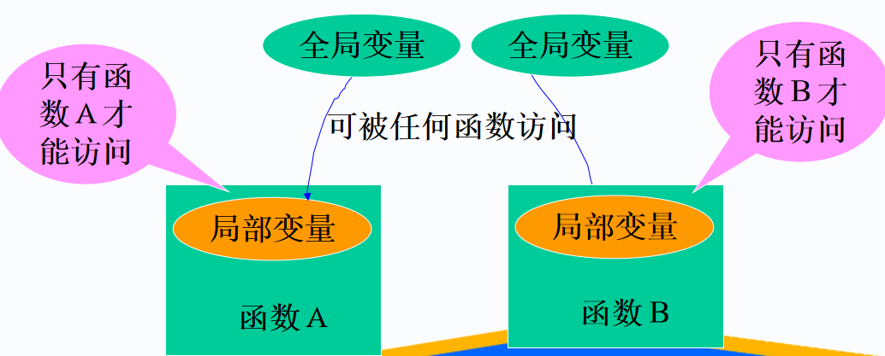
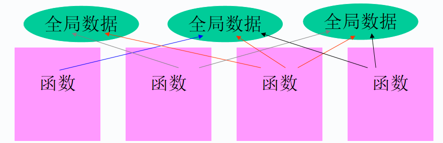
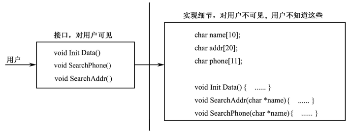
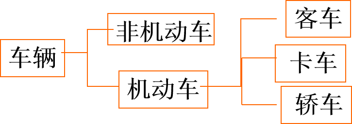
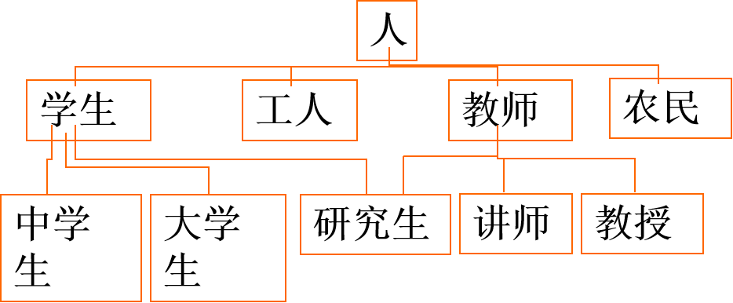
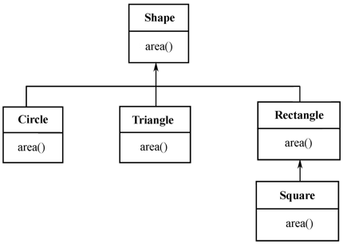
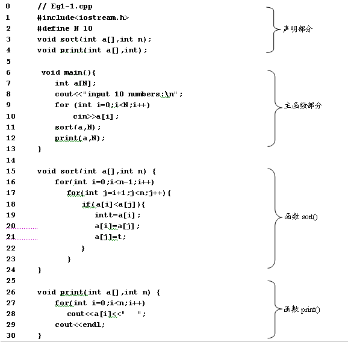
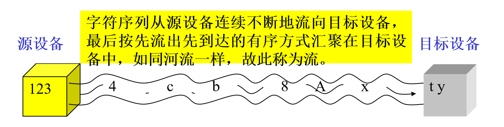

# 第1章 C++与面向对象程序设计概述
## 本章主要讲述：
- 面向过程与面向对象程序设计
- 面向对象程序技术的基本特征
- C++的发展演化
- C++程序的结构及数据输入与输出
- C++实例编程
## 1.1  面向过程与面向对象程序设计
### 一、面向过程程序设计
1. 面向过程程序设计的产生
- 个人开发方式与软件危机
2. 基本思想
- 利用过程或函数来抽象和模拟客观现实
- 程序代码采用三大结构
    - 顺序
    - 分支
    - 循环
- 结构化程序设计方法
    - 自顶向下
    - 逐步求精
    - 模块化
3. 面向过程程序设计的软件实现方法  _重点放在如何实现细节过程方面，将数据与函数分开。_
- 形式：主模块+若干个子模块（如Ｃ：main()+子函数）。
- 特点：自顶向下，逐步求精——功能分解。
- 缺点：效率低，是手工作坊式的编程。  

4. 面向过程程序设计的问题——数据和算法分离，程序数据和操作数据的函数是分离的。  
  
5. 面向过程程序的案例——个人通信录程序
```
struct Person {			
         char name[10];
	    char addr[20];
	    char phone[11];
}
Person p[100];		
int n=0;			
void InputData(){ ......}	
void SearchAddr(char *name){……}	
void SearchPhone(char *name){……}	
void PrintData(){……}
void main(){
	……
	//调用前面编写的函数，完成通信录数据处理
	……
}	

```
6. 结构化程序设计范型  
  
大型程序中，有很多全局数据和全局函数，这导致了函数和数据之间数目巨大的潜在连接！  
若全局数据有所改动，可能会导致所有访问这个数据的全部函数需要重写．
### 二、面向对象程序设计
1. 面向对象程序设计的基本观点
自然界是由各种各样的实体（对象）所组成,每种对象都有自己的内部状态和运动规律,不同对象之间的相互联系和相互作用就构成了各种不同的系统,进而构成整个客观世界.  
2. 程序设计方法
使用面向对象的观点来描述模仿并处理现实问题。
要求：高度概括、分类和抽象。
3. 目的
实现软件设计的产业化。
4. 基本概念  
- 对象
    - 客观存在的实体称为对象
- 属性
    - 描述对象特征的数据
- 行为
    - 对象自身的行为，对现实世界某些信息的响应．
    - 对象之间通过传递消息相互影响
5. 面向对象范型  
将客观事物的属性和行为抽象成数据和操作数据的函数，并把它们组合成一个不可分割的整体（即对象）的方法能够实现对客观世界的真实模拟，反映出世界的本来面目。从客观世界中抽象出一个个对象，对象之间能够传递消息 ．  
  
## 1.2  面向对象程序语言的特征
__本节主要介绍类与对象的基本概念，以及面向对象程序设计的主要特征__
### 1.2.1 类与对象
1. 对象的基本概念  
- 对象: 
    - 用来描述客观事物的一个实体，它是构成系统的一个基本单元。一个对象具有一组属性和行为。  
    - 实体对象  一台计算机
    - 抽象对象  一项计划
- 对象构成要素:
    - 对象标识符：是对象的名称，用来区别其他对象。
    - 属性:  是用来描述对象静态特征的一个数据项。 
    - 行为:  是用来描述对象动态特征和行为的一个操作。 	
```
对象示例1：一个“学生”对象的例子
对象名：学生
对象的属性：
学号：123456
姓名：令狐冲
年龄：18
专业：信管
行为
修改学号、姓名、专业、年龄等等
```
```
对象示例2：一个“课程”对象的例子：
对象名：课程
对象的属性：
课程号：123456
课程名：程序设计
任课教师：莫名
选课要求：
学时：48
行为
获取并修改课程名、课程号、学时数、选课要求、任课教师等


```  

2. 类的基本概念  
- 类 ：
    - 是具有相同属性和行为的一组对象的集合,它为属于该类的全部对象提供统一的抽象描述
    - 类和对象的关系：类<=>对象  
    -            (抽象定义<=>实例)
- 类等价于对象举例
    - 学生<=>学生王强
    - 课程<=>C++程序设计
    - 类型<=>变量——如 C 语言中的 int 和 int x;  

- 类的实例——用类定义的类变量，即对象。类是对多个特性相同的对象实例的抽象，所以同一类的不同实例之间必有：  
    - 相同的操作集合
    - 相同的属性集合
    - 不同的对象名，分配有不同的存储空间。
3. 类的确定与划分    
- 类的确定——对所遇到的对象进行分析、归纳，根据共同的特征来确定一个类。   
    - 类的确定的方法：
        - 判断是否有一个以上的实例
        - 判断类的实例中是否有绝对的不同点  
_类的划分不是绝对的，可以根据不同的实际需要确定不同的类_  
4. 类的描述  
类的描述——不同的OOP语言用不同的描述形式。在C++中用关键字class来定义描述一个类。 
```
class classname
{
	public:	
		//public members
		//friend function prototypes
	private:
		//private members
};
```
### 1.2.2抽象与封装
1. 封装性
- 封装encapsulation——将数据和与这个数据有关的操作集合在一起,形成一个实体——对象，且尽可能隐藏对象的内部细节．  
- 从外面看只能看到对象的外部特性，即明确能够受理哪些信息，具有哪些处理能力？对象的内部，即处理能力的实行和内部状态，对外是不可见的。
- 从外面不能直接使用对象的处理能力，也不能直接修改其内部状态，对象的内部状态只能由其自身改变。
    - 特点:
        - 具有一个清楚的边界,对象的所有私有数据、内部程序（成员函数）细节都被固定在这个边界内。
        - 具有一个接口，描述了对象之间的相互作用、请求和响应——消息
        - 对象内部的实现代码受到封装壳的保护，其它对象不能直接修改本对象所拥有的数据和代码。
        - 封装的单位是对象。
    - 优点：
        - 降低部件间的耦合度，提高部件的独立性
        - 具有隐藏性和安全性  (如银行的帐户)
        - 易于维护(由于数据独立,易于发现问题) 
        - 封装将对象的使用者与设计者分开,使用者只需要通过接口访问对象,不必须了解对象的内部细节.提高了软件的复用性.
    - 缺点：
        - 需要更多的输入输出函数。 
2. 抽象
- 抽象（abstract）是指有意忽略问题的某些细节和与当前目标无关的方面，以便把问题的本质表达得更清楚。 
- 案例：
    - VCD机器的抽象
3. 封装的形式  
一个Class定义了一种抽象的数据类型,用户只能访问Public成员,不能直接访问Private成员
```
class classname
{
	public:	
		//public members
		//friend function
	private:
		//private members
};

```
通信录程序在C++中的类代码形式
```
class Person {				  
private:
char name[10];
char addr[20];
char phone[11];
public:
void InitData(){……}      
void SearchAddr(char *name){……};		
void SearchPhone(char *name){……};		
};

```
在class中。数据与函数构成了一个整体。其中的private和public是访问权限。

4. 抽象与封装形成了程序接口与实现的分离
    
### 1.2.3继承
1. 继承的基本概念  
_古语：龙生龙，凤生凤，老鼠生儿会打洞_  
- 继承
    - 对象类之间的相交关系,使得某类对象可以继承另外一类对象的特征和功能
    - 类间具有继承关系的特性:
    - 类间具有共享特征(包括数据和程序代码的共享)：遗传
    - 类间具有细微差别或新增部分(包括非共享的程序代码和数据)：变异
    - 类间具有层次结构（如同人类通过继承构成了家族关系一样）
2. 继承分类
- 从继承源上划分：
    - 单继承（一个派生类只有一个基类）
    - 多继承（一个派生类有多个基类）
- 从继承内容上划分：
    - 取代继承
    - 包含继承
    - 受限继承
    - 特化继承。
3. 继承的作用:
- 实现软件的可重用性
- 实现软件的独立性
- 增加软件的可维护性

4.继承的层次结构  
    
5. 继承与封装的关系
- 封装是指对象的封装，在对象中数据和操作总是包裹在一起的，继承不会影响对象的这种封装性，但无限制的派生继承会在一定程度上损害对象中数据的隐蔽性。
- 封装使类定义中实现的代码可以用于该类的各个实例（对象）中，实现了动态共享代码；继承使用派生类能与基类共享基类中实现的代码，实现了静态共享代码。
6. 类的层次
- 由一个类可以派生出任意多个派生类，这样就形成了类的层次关系，这是现实世界中事物的分类问题在计算机中的解形式。

7. 继承的优势  
_能清晰体现相关类间的层次结构关系。_  
- 有效地提高了程序的可重用性，减小了程序代码的冗余度。
- 增强了程序的一致性，减少了程序模块间的接口和界面，使程序更易于维护。
- 继承是自动传播程序代码的有力工具。
- 继承是新类构造、建立和扩充的有效手段。
- 继承具有传递性    
	- 如果类C继承类B，类B继承类A，则类C继承类A  
_“站在巨人的肩头上”。用户在开发新系统时不必从零开始，可以继承原有相似功能或者从类库中选取需要的类，再派生新类。_
8. 两个继承的案例  
- 例1：车辆的继承关系  
 
- 例2：人类按职业划分的一种继承关系  
 
### 1.2.4 多态
1. 多态polymorphism
- 对象根据所接受的消息而做出动作，同样的消息为不同的对象接受时可导致完全不同的行动，该现象称为多态性。
- 简单的说：单接口，多实现  

举例：在C语言中:
```
sqrt_i (int i)，sqrt_f (float f)

```
在C++语言中：
```
sqrt (int i)，sqrt (float f)
```
- 作用:
    - 减轻程序员负担
    - 降低程序员出错机率
2. 多态性的实现
- 运行时多态性：虚函数
- 编译时多态性：重载
    - 重载
        - 函数重载：是指在同一作用域内的若干个参数特征不同的函数可以使用相同的函数名字。
        - 运算符重载：是指同一个运算符可以施加于不同类型的操作数上面。
        - 优点：重载进一步提高了面向对象系统的灵活性和可读性
3. 多态的一个案例
图中同名函数area( )作用在Circle、Triangle等不同类上时，将执行不同的操作，这就是多态。  
 
## 1.3	C++与面向对象程序设计
1. 面向对象程序设计语言的基本情况
最早最成熟的领域萌芽于60年代（Simula），成熟于80年代70年代,纯面向对象语言,smalltalk  
常见面向对象的语言
- Java：纯面向对象的语言
- VB.Net：可视化程序设计  
早期的VB或许算不上真正的面向对象程序设计语言，不具备面向对象程序的一些特征，但VB.NET已经改变了这一切！  
- C#：具有VB和ＶＣ++的特征
- C++，Object Pascal，Efficl  
其它常用的具有面向对象特征的语言
- Borland Delphi
- PowerBuilder
- Visual FoxPro
……

2. C++起源
20世纪80年代，AT&T Bell　实验室　Bjarne Stroustrup Ｃ语言的扩展
3. C++常用领域
系统软件
设备驱动程序
图形学
用户界面
……

4. C++特征
兼容Ｃ语言，支持面向过程的程序设计
具有高效性、灵活性、可移植性
丰富的数据类型
支持面向对象程序设计
5. 常见Ｃ＋＋编译系统
C++Builder
VC++
VC++.net
## 1.4 C++程序的结构
1. C++程序的构成
声明部分
主函数部分
函数定义
2. C++程序文件
头文件：.h ,  .hpp
源文件:  .cpp
3. 程序结构的一个例程如下  
  

对例程的补充：
C++的注释
//
/*   …… */
C++的函数需要先声明，然后才能调用
## 1.5 数据的输入与输出
本节主要介绍C++程序中数据输入输出的方法，是C++程序设计的基础。应该掌握流的概念，如下面这几行输入输出流
```
iostream.h
cin
cout
endl
```
### 1.5.1 流的概念

1. C及C++中的流概念
I/O（input/ouput，输入/输出）数据是一些从源设备到目标设备的字节序列，称为字节流。除了图像、声音数据外，字节流通常代表的都是字符，因此在多数情况下的流（stream）是从源设备到目标设备的字符序列。  
  
- 输入流
    - 输入流（input stream）是指从输入设备流向内存的字节序列。 
- 输出流
    - 输出流（output stream）是指从内存流向输出设备的字节序列。
- C++中的输入输出流
    - iostream
    - cin 	(see-in）输入流对象，C++已将其与键盘关联
    - cout （see-out）输出流对象，C++已将其与显示器关联
### 1.5.2 cin和析取运符
1. cin的用途
- cin读作(see-in）是一个输入流对象，用于从键盘输入数据。在C++程序中，也可以使用c语言中常用的scanf函数输入数据，但cin更简单。
2. cin的用法
- 输入单个变量的值
    - cin>>x；
- 输入多个变量的值
    - cin>>x1>>x2>>x3>>x4……>>xn     
_其中x,x1……x2可是以内置数据类型如int，char，float，double等。_
3. 用cin时的注意事项
- 在一条cin语句中同时为多个变量输入数据。在输入数据的个数应当与cin语句中变量个数相同，各输入数据之间用一个或多个空白（包括空格、回车、Tab）作为间隔符，全部数据输入完成后，按Enter键结束。 
- 在>>后面只能出现变量名，下面的语句是错误的。
    - cin>>"x=">>x;	//错误，>>后面含有字符串"x="
    - cin>>12>>x;	//错误，>>后面含有常数12
    - cin>>‘x’>>x;	//错误，>>后面含有字符’x’
- cin具有自动识别数据类型的能力，析取运算>>将根据它后面的变量的类型从输入流中为它们提取对应的数据。
- 比如：
    - cin>>x;
    假设输入数据2，析取运算符>>将根据其后的x的类型决定输入的2到底是数字还是字符。若x是char类型，则2就是字符；若x是int，float之类的类型，则2就是一个数字。
- 再如：
    - 若输入34，且x是char类型，则只有字符3被存储到x中，4将继续保存在流中；若x是int或float，则34就会存储x中。
	
- 数值型数据的输入。
    - 在读取数值型数据时，析取运算符>>首先略掉数据前面的所有空白符号，如果遇到正、负号或数字，就开始读入，包括浮点型数据的小数点，并在遇到空白符或其他非数字字符时停止。例如：
```
int x1;
double x2;
char x3;
cin>>x1>>x2>>x3;
```
假如输入“35.4A”并按Enter键，x1是35；x2 是.4；x3是'A'
4. 输入数据案例分析
```
【例1-2】  假设有变量定义语句如下：
int a,b;
double z;
char ch;
下面的语句说明数据输入的含义。
语句		 		输入	内存变量的值
 1	cin>>ch;		A	ch='A'
 2	cin>>ch;		AB	ch='A'，而'B'被保留在输入流中等待被读取
 3	cin>>a;		32	a=32
 4	cin>>a;		32.23	a=32，.23留在输入流中等待被读取
 5	cin>>z;		76.21	z=76.21
 6	cin>>z;		65	z=65.0
 7	cin>>a>>ch>>z		23 B 3.2	a=23，ch='B',Z=3.2
 8	cin>>a>>ch>>z		23B3.2	a=23，ch='B',Z=3.2
 9  cin>>a>>b>>z		23 32	a=23，b=32，等待输入下一个数据存入z
10	cin>>a>>z		2 3.2 24	a=2，z=3.2，24被保留在输入流中等待被读取
11	cin>>a>>ch		132	a=132，计算机等待输入 ch的值
12	cin>>ch>>a		132	ch='1'，a=32

```
### 1.5.3 cout和插入运算符<<
1. cout的用途
- cout（读作see-out）是一个输出流对象，已被C++默认关联到显示器，用于在屏幕上输出数据。
- 在C++程序中，也可使用C语言的sprintf输出数据，但cout更简单。

2. cout的用法
- cout<<x  
其中x可以是内置数据类型如int，char，float，double等。

3. 输出字符类型的数据
- 对于字符变量和字符串变量，cout将把变量的值输出到显示屏幕上。
- 对于字符常量和字符串常量，cout将把它们原样输出在屏幕上
```
【例1-3】  用cout输出字符数据。
//Eg1-3.cpp
#include<iostream.h>
void main()
{
	char ch1='c';
	char ch2[]="Hellow C++!";
	cout<<ch1;
	cout<<ch2;
	cout<<"C";
	cout<<"Hellow everyone!";
}

```
4. 连续输出
- cout能够同时输出多个数据，用法如下：
- cout<<x1<<x2<<x3<<…;
- 例：
    - cout<<ch1<<ch2<<"C"<<"Hellow everyone!";
    - 与C语言一样，在C++程序中也可以将一条命令写在多行上。
    - 比如，上面的语句也可写成下面的形式：
```
cout<<ch1
		<<ch2
		<<"C"
		<<"Hellow everyone!";

```
5. 输出换行
- 在cout语句中换行可用：“\n”或endl
```
【例1-4】  在例1-3的输出语句中增加换行符。
//Eg1-4.cpp
#include<iostream.h>
void main(){
		char ch1='c';
		char ch2[]="Hellow C++!";
		cout<<ch1<<endl;
		cout<<ch2<<"\n";
		cout<<"C"<<endl;
		cout<<"Hellow everyone!\n";	
}
```

6. 输出数值类型的数据
- 在连续输入多个数据时，应注意在数据之中加插入间隔符。如
```
int x1=23;
float x2=34.1;
double x3=67.12;
cout<<x1<<x2<<x3<<900;
```
其中的cout语句将在屏幕上输出，
```
2334.167.12900
```
_谁知道这是个什么数据呢？_
### 1.5.4  输出格式控制符
(1)设置浮点数的精度 
```
setprecision(n)
```
(2)设置输出域宽和对齐方式
```
setw(n) 
```
(3)设置对齐方式 
```
setiosflags(long f);
resetiosflags(long f);
```
_【例1-5】  用setiosflags和 resetiosflags设置 和取消输出数据的对齐方式。_
```
//Eg1-5.cpp
#include<iostream.h>		
#include<iomanip.h>				    
void main(){					
    cout<<“123456781234567812345678”<<endl; 	
    cout<<setiosflags(ios::left)<<setw(8)
		       <<456<<setw(8)<<123<< endl; 		
    cout<<resetiosflags(ios::left)<<setw(8) <<123<<endl;  
}

```
### 1.5.5 数制基数
- C++在iostream.h中预定义了hex、oct、dec等操纵符。分别表示十六、八和十进制数。
- 在默认方式下，C++按照十进制形式输入输出数据。当要按其他进制输入输出数据时，就需要在 cin和cout语句中指定数据的基数。在用键盘输入数据时，
    - 十进制整数：直接输入数据本身，如78。
    - 十六进整数：在要输入的数据前加0x或0X，如0x1A（对应的十进制数是26）。
    - 八进制整数：在输入的数据前加0，如043（代表十进制数35）。

_hex：16进制，oct：8进制，dec：10进制_  
【例1-6】  输出不同进制的数据。
```
//Eg1-6.cpp
#include<iostream.h>
void main() {
	int x=34;
	cout<<hex<<17  <<"  "<<x<<"  "<<18<<endl;
	cout<<17 <<"  " <<oct <<x<<"  "<<18<<endl;
	cout<<dec<<17  <<"  "<<x<<"  "<<18<<endl;
}
```
## 1.6 编程实作  
___额，打开vscode或者vs2019冲啊___
