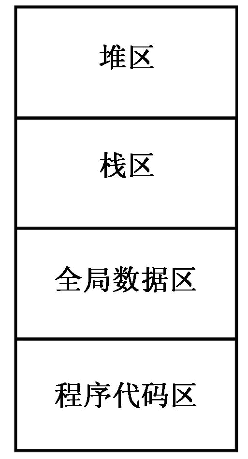

# 注意事项
- 本代码所有代码都是传统c++，即包括iostream.h等头文件以及void main，在如今的编译器vscode和vs是不能够通过的。
- [上一章的地址在这里](c++基础1.md)

## 2.7 函数
本节主要介绍C++函数的相关知识，应着重了解函数默认参数、引用参数及返回值、重载函数及其解析过程等方面的知识。
### 2.7.1 函数原型
#### 1、相关概念
函数原型就是常说的函数声明，由函数返回类型、函数名及参数表构成。形式如下：
```
rtype f_name(type1 p1,type2 p2,…)；
```
函数定义就是给出函数体的程序代码
函数原型描述了函数的接口。它描述了函数必须接收的信息类型（参数表），以及它的返回类型。
调用函数前必须声明或定义
函数原型常被放在头文件中。
#### 2、【例2-9】  函数原型的一个简单例子。

```
//Eg2-9.cpp
#include<iostream.h>					
double sqrt(double f);		//函数原型
void main(){
	for(int i=0;i<10;i++)
		cout<<i<<"*"<<i<<"="<<sqrt(i)<<endl;
}
double sqrt(double f) {
	return f*f;
}
```
#### 3、C++函数原型的一些注意事项
① 函数原型中的参数名可以省略。  
② 函数定义时的返回类型、函数名、参数个数、参数的次序和类型必须与函数原型相符，但参数名可以不同。  
③ 如果函数的定义出现在程序中第一次调用此函数之前，就不需要函数原型。  
④ C++与C语言的函数参数声明存在区别。  
⑤ 如果函数原型中没有指出函数的返回类型（包括主函数main），C++将默认该函数的返回类型是int。   
⑥ 如果一个函数没有返回类型，则必须指明它的返回类型为void。   
⑦ 在C++中无参数函数与C语言是有区别的。在C++中，下面的函数原型等价：  
```
int f();               		//该函数没有参数 
int f(void);           		//该函数不需要参数
```
在C语言中，下面的函数是不同的：
```
int f();               		//该函数可以有很多个参数
int f(void);           		//该函数不需要参数
```
### 2.7.2 函数默认参数
#### 1、概念
C++允许为函数提供默认 参数。在调用具有默认参数的函数时，如果没有提供调用参数，C++将自动把默认 参数值作为相应参数的值。
#### 2、规则
只能默认全部或部分右边的参数  
函数声明和定义同时存在时，仅声明中才能出现默认的说明.  
默认参数的声明必须先于函数调用.
#### 3、【例2-10】  默认参数的一个应用例子。
```
//Eg2-10.cpp
#include <iostream.h>            
double sqrt(double f=1.0);	
void main(){
	cout<<sqrt()<<endl; 	//采用默认参数
	cout<<sqrt(5)<<endl;	
}
double sqrt(double f) {
	return f*f;  
}
```

#### 4、注意
一旦某个参数开始指定默认值，它右边的所有参数都必须指定默认。
```
int f(int i1,int i2=2,int i3=0);	//正确
int g(int i1,int i2=0,int i3);	//错误，i3没有缺省值
int h(int i1=0,int i2,int i3=0);	//错误，i1缺省后，其右i2没有缺省
```
在调用具有默认 参数值的函数时，若某个实参默认 ，其右边的所有实参都应默认 。  
例如：
```
	int f(int i1=1,int i2=2,int i3=0){ return i1+i2+i3; }
```
针对此函数，有如下调用：
```
f();                		//正确，i1=1,i2=2,i3=0
f(3);               		//正确，i1=3,i2=2,i3=0
f(2,3);               	//正确，i1=2,i2=3,i3=0
f(4,5,6);             	//正确，i1=4,i2=5,i3=6
f(,2,3);              	//错误，i1缺省，而右边的i2,i3没有  
```
_这个与python的默认函数参数要求是一样的。_
### 2.7.3 函数与引用
### 一、引用参数
#### 1、C++参数传递的主要形式
- 传值
- 传指针
- 传引用

#### 2、传引用参数的意义
- 需要从函数中返回多于一个值。
- 需要修改实参值本身。
- 传递地址可以节省复制大量数据的内存空间和时间。
#### 3、引用应用： C语言用指针交换两个变量值
```
#include <iostream.h>
void swap(int *a,int *b) {
	int temp=*a;
	*a=*b;
	*b=temp;
}
void main(){
	int x=5;
	int y=10;
	swap(&x,&y);
	cout<<"x="<<x<<"\ty="<<y<<endl;
}
```
#### 3、引用应用： C++可用引用交换两个变量值
```
//Eg2-11.cpp
#include<iostream.h>
void swap(int &a,int &b) {
	int temp=a;
	a=b;
	b=temp;
}
void main(){
	int x=5;
	int y=10;
	swap(x,y);
	cout<<"x="<<x<<"\ty="<<y<<endl;
} 
```
引用就是非常方便的能够节省大量的时间
#### 3、引用应用：返回多值——计算平方、立方
```
int fun(int n,int &rSquar,int &rCubed)
{
	if(n>20 && n<0)
			return 1;
	rSquar=n*n;
	rCubed=n*n*n;
	return 0;
}
```
#### 3、引用应用：实现两个字符串的交换
```

#include <iostream.h>
void Swap(char*& str1, char*& str2);
void main()
{
  char* ap="hello";
  char* bp="how are you?";
  cout <<ap <<endl <<bp <<endl;
  Swap(ap, bp);
  cout <<"交换以后:\n";
  cout <<ap <<endl <<bp <<endl;
}
void Swap(char*& str1, char*& str2)
{   char* temp=str1;
  	str1=str2;  str2=temp;
}
```
#### 4、引用传递大型对象的效率问题
C++引入引用的另一原因是传递大型的类对象或数据结构  。  
__在按值传递参数的情况下，传递小型类对象和结构变量不存在效率问题，但在传递大型结构变量或类对象时，需要进行大量的数据复制（把实参对象或结构变量的值复制到函数参数在运行栈分配的存储区域中），效率就太低了。__
#### 【例2-12】  按值传递参数与引用传递参数的效率对比。
```
//Eg2-12.cpp
#include <iostream.h>
#include <string.h>
struct student{
	char name[12];        	//学生姓名
	char Id[8];            		//学号
	int age;               		//年龄
	double score[10];       	//10科成绩
};
void print(student a) {
	cout<<a.name<<endl;
	cout<<a.Id<<endl;
	cout<<a.age<<endl;
	for(int i=0;i<10;i++) 	
		cout<<a.score[i]<<endl;
}
void main(){
	student x;
	……                		//对x进行赋值的语句省掉了
	print(x);
	cout<<sizeof(x)<<endl;  	//计算x的内存块大小
}

若改为以下函数，则效率将提高：
void print(student &a)
```
#### 5、引用参数与指针参数比较
指针与引用都能使函数修改实参所指对象的值，都能向函数有效地传送大型类对象的地址。但引用参数更为直观方便。  
指针允许传递空对象，但引用必须传递有效的对象。
```
//Eg.cpp
int  swap(int *a,int *b)
{
  if (b)  {
   	int t=*a;   *a=*b;   *b=t;
   	return 1;
  }
  else return 0;
}
void main(){
	int x=9,y=20;
    cout<<swap(&x,0);//ok
}
```
```
//ch.cpp
int  swap(int &a,int &b)
{  if (b)  {
       int t=a;   a=b;   b=t;
       return 1;
   }
   else return 0;
}
void main(){
    int x=9,y=20;
    cout<<swap(x,0);//err
}

```
### 二、函数与返回引用
#### 1、相关概念
除了返回值或指针外，函数还可以返回一个引用。返回引用的函数定义形式如下：
```
rtype  & f_name(type1 p1,type2 p2,…)；
```
当一个函数返回引用时，实际返回了一个变量的内存地址。  
既然是内存地址，就能够读和写该地址所对应的内存区域中的值，这使函数调用能够出现在赋值语句的左边。
#### 2、引用应用【例2-13】  返回引用的两数相加函数。
```
//Eg2-13.cpp
#include <iostream.h>
int temp;
int& f(int i1,int i2){
	temp=i1+i2;
	return temp;
}
void main(){
	int t=f(1,3);          	//L1
	cout<<temp<< "  ";    	//L2
	f(2,8)++;              	//L3
	cout<<temp<< "  ";     	//L4
	f(2,3)=9;              	//L5
	cout<<temp<<endl;     	//L6
}
```
#### 2、引用应用：函数调用作为左值
例题：
```
#include <iostream.h>
int a[]={1,3,5,7,9};
int &index(int);
void main()
{
	index(2)=30;
	cout<<index(2);
	cout<<index(3);
}
int &index(int i)
{	return a[i];}
```
显示：307
#### 3、引用应用：不可返回函数内部的临时变量 
```
#include <iostream.h>
float fn1(float r) {  float temp= r*r*3.14;     return temp;}
float& fn2(float r)
{  float temp = r*r*3.14;    
   return temp;              //这样的返回值定会产生不可预期的错误值
}
void main()
{ 	float a=fn1(5.0);      	//L1
  	// float& b=fn1(5.0);     	//L2:error
   	float c=fn2(5.0);      	//L3
    	float& d=fn2(5.0);     	//L4
    	cout<<a<<endl;	// cout<<b<<endl;
    	cout<<c<<endl;  cout<<d<<endl;
	fn2(3.2)=9.9;
	float &a1=fn2(3.2);
	cout<<"a1="<<a1<<endl;
	float &a2=fn2(3.4);	
	cout<<“a1=”<<a1<<endl;     //可能会产生与上次不同的结果
}
```

### 2.7.4 函数与const
- 用const 限制函数的参数能够保证函数不对参数做任何修改。
- 对于按值传递的函数参数而言，将参数限定为const型意义不大，因为它们不会引起函数调用时实参的变化。但对于指针和引用参数而言，就存在实参被意外修改的危险。
#### 将函数返回值指定为引用值
```
【例2-14】  返回const引用的函数。
//Eg2-14.cpp
#include<iostream.h>
const int& index(int x[],int n){
	return x[n];
}
void main(){
	int a[]={0,1,2,3,4,5,6,7,8,9};
	cout<<index(a,6)<<endl;
	index(a,2)=90;             		//编译错误原因：左值为常量
	cout<<a[2]<<endl;
}
```
__上面这些const 弯弯道道太多了，我特么看裂开了。也不是看不懂，就是觉得很难用到__
### 2.7.5  函数重载
#### 1、函数重载的概念
- 函数重载就是允许在同一程序中（确切地讲是指在同一作用域内）定义多个同名函数，这些同名函数可以有不同的返回类型、参数类型、参数个类，以及不同的函数功能。
#### 2、引用函数重载的原因
- 实现简单的“多态”：单接口、多实现。减少程序应用人员的负担。
#### 3、函数重载的注意事项
- 在C++中，可以为两个或多个函数提供相同的名字，只要每个函数的参数表唯一就行（参数个数、参数类型、或参数顺序上有所不同）
- 不能仅仅以不同返回类型区分重载函数，返回类型不参与函数的重载解析过程，意即仅返回类型、而参数表相同的函数不是重载函数。
- 重载函数适用于实现不同环境下的相同功能

例如:
```
【例2-15】  重载计算int、float、double三种类型数据绝对值的函数。
//Eg2-15.cpp
#include<iostream.h>
int abs(int x) {return x>0?x:-x;}
float abs(float x) {return x>0?x:-x;}
double abs(double x) {return x>0?x:-x;}
void main(){
	cout<<abs(-9)   <<endl;
	cout<<abs(-9.9f) <<endl;
	cout<<abs(-9.8)  <<endl;
}

```
_这些大家都看得懂，冲_

#### 函数重载解析过程
按下面的3个步骤的先后顺序找到并调用函数：
- （1）准确匹配：无须任何转换或只须做平凡转换（如数组名到指针、函数名到函数指针、T到const T等）的匹配。
- （2）利用提升，包括整数的提升
```
例:bool->int,char ->int,short-> int ，float ->double
```
- （3）标准转换
如：
```
int<->double，
double<->long double.
Derive *->base *,
T*->void *,
int ->unsigned int
```
- （4）通过一个用户定义的转换（第6章介绍）
- （5）利用在函数声明中的省略号…

_这些涉及的就比较哦详细了，先看看例子_
```
【例2-16】  函数重载解析的例子。
//Eg2-16.cpp
#include <iostream.h>
void f(int i){cout<<i<<endl;}
void f(const char*s){cout<<s<<endl;}
void main(){
	char c='A';	int i=1;	short s=2;
	double ff=3.4;
	char a[10]="123456789";
	f(c);             		//f(int i)   提升 
	f(i);             		//f(int i)   精确匹配
	f(s);             		//f(int i)   提升
	f(ff);             		//f(int i)   转换
	f('a');            		//f(int i)   提升 
	f(3);             		//f(int i)   精确匹配
	f("string");       	//f(const char*s) 精确匹配
	f(a);            		//f(const char*s) 精确匹配
} 

```

```
重载函数匹配的二义性（Ambiguity）
#include<iostream.h>
void print(double a){
	cout<<"print_d  "<<a<<endl;
}
void print(long a){
	cout<<"print_l "<<a<<endl;
}
main(){
	int a;
	print(a);		//error
	print(double(a));   	//ok
	print(long(a));    	//ok
}

```

_这些都很简单，懂得都懂_
## 2.8  内联函数
用一个函数的代码替换函数调用叫内联。  
用inline 关键字声明,如
```
inline int abs(int n){return n<0 ? -n:n}
```
- 内联函数减少了函数调用时的现场保护和函数调用完成时的现场恢复,提高了时间效率.
- 内联函数和C中的#define相似，但消除了#define不安全性
- 小函数一般可定义为内联，可提高速度。

_我们这个听得多了，但实际上用的却很少，还不是因为自己c++写得少！！！我真废物_  
举例
```
inline min(a,b){
	return(a<b?a:b);
}

int minval=min(i,j)
```
在编译时将被展开为：
```
int minval=i<j?i:j;
```

> inline对于编译器只是一个建议，并非一定被编译器在调用点展开（如递归inline函数）。一般而言，inline机制常用于优化小的、只有几行的、经常被调用到的函数。

```
//Eg2-17.cpp
#include<iostream.h>
inline int max(int a,int b){
	return a>b?a:b;
}
void main(){
	int x1=max(3,4);
	int x2=max(7,2);
	int x4=max(x1,x2);
}

```

### warning
- 内联函数在调用前必须有完整的定义
- 内联函数不能有复杂的结构，如含有for,while,switch等结构的复杂程序
- 递归函数是不能用来做内联函数的


## 2.9 typedef
typedef是一个类型定义符，C++允许用它来定义新的数据类型名。  
事实上，它并不能创建一种新的数据类型，而是为已存在的类型定义一个新名称。

typedef的用法如下：
```
typedef  type  newname;
```
例如：
```
typedef float house_price;		//L1
house_price x,y;				//L2
```

_这个大家都会，就又没什么好说的了_

## 2.10 命名空间
### 1、C++引入命名空间的原因
- C++编程环境中，系统定义了大量的变量、函数和类的名称。
- 在编程中可能定义出系统已存在的变量、函数或类名称，产生冲突。
- 多人合作进行软件开发时，可能定义出相同的名称，产生冲突。
- 这些问题导致命名空间的运用：即程序员可以将自己定义的名字局限在一个自定义的名字空间中，就不会与其它人定义的名字冲突。

_说白了就是一个自定义名字的作用域罢了_

### 2、命名空间的定义
```
namespace  namespace_name
{
	members;
}
```
其中，namespace是定义命名空间的关键字；namespace_name是程序员指定的名字空间的名字；   
merbers 是命名空间中包括的成员  
可以是
- 变量定义
- 函数声明
- 函数定义
- 结构声明
- 以及类的声明等。  
### 3、命名空间案例：下面的例子定义了名字空间ABC
```
namespace ABC{
	int count;
	typedef float house_price;
	struct student{
		char *name;
		int age;
	}；
	double add(int a,int b)	{ return (double)a+b;}
	inline int min(int a,int b);
};
int ABC::min(int a,int b){
	return a>b?a:b;
}
```
### 4、命名空间的应用
命名空间成员的作用域局限于命名空间内部，可以通过作用域限定符（::）访问它，语法如下：
```
namespace_name::identifier
```
命名空间ABC有5个成员：count、 student、 house_price、add 和min 。对其引用如下：
```
void main(){
	ABC::count=1;	//访问ABC空间中的count
	int count=9;		//main函数中的count与ABC中的count无关
	ABC::student s;	//用ABC空间中的student结构定义s
	s.age=9;
	int x=ABC::min(4,5);	//调用ABC中的min函数计算两数最小值
}  
```
_这个也很简单，没啥好说的_
### 5、用using namespace访问命名空间成员
#### 引用命名空间的单个成员。用法如下：
```
using namespace_name::identifier
```
例如，用using简化ABC命名空间中count的使用：
```
void main(){
	using ABC::count;  //L1，引入成员后不能再定义同名变量
	count =2;           	//L2
	//int count=9;        	//L3，因同名而不能再定义
	……
	count=count+2;    	//L4
}
```

#### 引入命名空间的全部成员。用法如下：
```
using namespace_name
```
例如，引有前述ABC命名空间的全体成员
```
void main(){
	using namespace ABC;    //L1，引入命名空间，允许有同名变量
	int count=9;           	//会隐藏ABC中的count
	student s;             
	count=5;   
	ABC::count=count+1; // ABC::count的值为 6          
	s.age=min(43,32);       
}
```
#### 【例】命名空间的应用举例。
```
//Eg2-.cpp
#include<iostream.h>
namespace A{
	int n;
	void f(){ cout<<"namespace A::f()"<<endl; }
	void g(){ cout<<"namespace A::g()"<<endl;}
};
namespace B{
	int n;
	void f(){ cout<<"namespace B::f()"<<endl;	}
	void t(){ cout<<"namespace B::t()"<<endl;	}
};
void main(){
	using namespace A;
	using namespace B;
	A::n=0;
	A::f();
	B::f();
	g();
	t();
}
```

### 6．std命名空间
C++标准化过程形成了两个版本：一个是以Bjarne Stroustrup最初设计的C++为基础的版本，称为传统C++；另一个是晚期（约1989年）以ANSI/ISO标准化委员会创建的C++，称为标准C++。  

两种版本的C++有大量相同的库和函数。为了将两者区分：传统C++采用与C语言同样风格的头文件；标准C++的新式头文件没有扩展名，即不需要.h之类的扩展名。  

例如，传统C++的头文件有iostream.h、fstream.h、string.h；标准C++对应的头文件有iostream、fstream、string。  

传统C++中的内容被直接放到了全局名字空间中。标准C++将新格式头文件中的内容全部放到了std命名空间中。

许多C++编译器都提供了对两种版本C++的支持，并允许在同一程序中同时引用两种版本的C++函数。如果程序要引用标准C++新格式头文件中的函数，就需要在程序中使用下面的语句将std命名空间中的名称引入到全局命名空间中。
```
using namespace std;
```
#### 【例2-18】  标准C++程序设计的简单程序。
```
//Eg2-18.cpp
#include <iostream>
#include <cstdio>
#include <cmath>
#include <string>
using namespace std;
void main(){
	string s1="ddd",s2;     		//string是字符串，定义于<string>
	s2=s1;               			//字符串赋值，不需要strcpy函数
	int i;
	int s=sin(30);          		//调用cmath库中的sin函数
	scanf("%d",&i);        		//scanf、printf来源于cstdio
	printf("i=%d\n",i);
	cin>>i;               		//cin、cout来源于iostream
	cout<<"i="<<i<<endl;
	cout<<s2<<endl;
}
```

using namespace std会将std命名空间中的标志符都引入到程序中，如果只需用到std名字空间中的个别标志符，可以在要使用的标志符前面加上前缀std::，不必用“using namespace std;”将std中的全部名称引入到程序中来。

例如：
```
std::cout<<"not use using……"<<std::endl;
std::cout<<"not use using……\n";
std::cin<<xx;
```
_这里给点小建议，就是我们一般都是喜欢用std::的方法引入，当然新手不用管这么多，那我也是新手，我也不管了_

## 2.11 预处理器
### 1、预处理器的基础知识
C++预处理器（也称预编译器）提供了一些预处理命令，这些命令在正式编译之前完成，它们可以在编译之前改变源程序中的内容。所有的预处理命令都以“#”号开头，独占一行，语句结束时不需要分号。
### 2、常用预处理器命令
```
 #define,#else, #elif, #endif, #error, #if, #ifdef, #ifndef, #include, #line, #pragma #undef等。 
```
### #define和#undef
#### #define
常用于定义一个标识符常量，例如：
```
#define  pi 3.14159
```
也可以用#define定义带参数的宏，例如：
	#define  MAX(a,b) ((a)>(b)?(a):(b))
#### #include
```
#include将另一个源程序文件的内容合并到程序中
#include  <文件名>
#include  "文件名"
```
#### 条件编译
在通常情况下，源程序中的所有语句都要参与编译，条件编译指示编译器只对满足条件的语句或语句块进行编译，它使同一程序在不同的编译条件下，能够得到不同的目标代码。常见的条件编译有以下4种形式。

1. 第1种形式
```
#ifdef  标识符
       语句组1
[#else
       语句组2 
]
#endif
```
2. 第2种形式
```
#ifndef  标识符
    语句组1
[#else
    语句组2 
]
#endif
```
#### 【例2-19】  #ifdef条件编译的应用例子。
```
//Eg2-19.cpp
#include <iostream>
using namespace std;
#define DK
#ifdef DK
	void f1(){ cout<<"Dk is defined!"<<endl; }
#else
	void f1(){ cout<<"DK not defined!"<<endl; }
#endif
void main(){
	f1();
}

```

## 2.12 作用域与生命期

本节主要介绍C++程序的几种作用域、不同变量类型的生命期和C++对之实施的不同初始化策略。
### 2.12.1 作用域
#### 1、作用域的概念
变量的有效性范围
#### 2、作用域的类型
_程序作用域_  
- 程序作用域是指一个名字在整个程序范围内有效。   

_局部域（块作用域）_  
- 在函数内部或语句内定义的变量具有块作用域.  

_函数作用域_  
- 语句标号具有函数作用域    

_函数原型作用域_   
- 函数原型中的形参的作用域   

_文件作用域(近于全局域，但仅在一个文件内有效)_  

#### 3、作用域限定符::

#### 4、作用域示例：分析各变量的作用域
```
int x;                                                 //全局变量,其值初如为0
void f1(int x1,int x2);                         //函数原型作用域
x1=x;                                                 //x1未定义                         
void f2(int x3){           //函数参数被视为函数体最外层块中定义的变量.
	int x;                        //局部变量,函数块内有效
	int x3;                      //错误,与本函数的参数重复定义
	x=1;
	{
		int y=x;                              //y的值为1,此X是外层X
		int x;                                   //局部变量,本{ }内有效
		x=2;
		::x=5;                                  //全局X被置为5
	}
	x=3;                                              //局部变量X
}
int *p=&x;                                            //P指向全局X.

int main()
{
   	f2(4);
	cout<<x<<endl;
	return 0;
}

```
#### 5、if、switch、for以及while之类的复合语句也是一种块语句，在其中（包括在其条件测试语句中）定义的名字具有块作用域，其有效范围是该语句本身。
```
【例】  下面的程序说明在if语句中定义的变量的作用域。假设在if之前没有i和p的任何说明与定义。
if(int i=5) {                	//i作用域自此开始
	int p=0;             	//p的作用域自此开始
}                      	//p的作用域到此结束
else {
	i=1;
	p=2;                	//错误，p无定义
} 
```
### 2.12.2 变量类型及生存期
#### 1、内存的类型
一个程序在其运行期间，它的程序代码和数据会被分别存储在4个不同的内存区域，如图所示 
  
#### 2、内存类型与变量的关系
全局数据区中的数据由C++编译器建立，对于定义时没有初始化的变量，系统会自动将其初始化为0。这个区域中的数据一直保存，直到程序结束时才由系统负责回收。

堆区的数据由程序员管理，程序员可用new或malloc分配其中的存储单元给指针变量，用完之后，由程序员用delete或free将其归还系统，以便其他程序使用。

#### 3、变量类型
- 全局变量
	- 在程序文件的所有函数之外定义的变量，它存放在内存的全局数据区，可被程序中的所有函数所使用。
- 局部变量
	- 在局部使用域和函数作用域内定义的变量，有效范围在定义它的语句块或函数范围内。
#### 4、生存期
- 静态生存期
	- 从程序开始直到程序结束.
		- 全局变量
		- 静态全局变量
		- 静态局部变量

- 局部生存期
	- 局部变量，生存期从其声明点始，至声明它的块结束。
		- 系统不会自动初始化此类变量，其初值不定。

- 动态生存期
	- malloc，new创建的变量，结束于free、delete操作。
```
【例2-22】  静态变量的生存期长于其作用域的例子。
// Eg2-22.cpp
#include <iostream.h>
static int n;			//n被初始化为0
void  f(){
	static int i;			//i被初始化为0
	int j=0;
	i+=2;
	j+=2;
	cout<<"i="<<i<<", ";
	cout<<"j="<<j<<endl;
}
void main(){
	n+=5;
	f();                     //输出i=2，j=2;
	i=2;                    //错误，i虽然为static，但其作用域为函数f()内部
	f();                	//输出i=4，j=2;
}                           	//i，n的生命期到此才结束
```
### 2.12.3 变量初始化
- C的未初始化的变量的值不定，导致许多程序错误。
- C++强调初始化，常量、引用、类对象必须初始化。
- C++的全局变量初始化时可以使用任意表达式，不再局限于C的常量表达式。
- C++提供一种函数风格的初始化方式，便于对象初始化，因为对象初始化参数可以不止一个。
- 全局的、名字空间的、局部静态的对象将被自动初始化为0（在没有指定初值的情况下。）

_看到没有，初始化是很重要的！！！！！！！_
```
【例2-23】  全局变量、静态变量、局部变量的初始化。
//Eg2-29.cpp
#include <iostream.h>
int n;                               	//初始化为0
void  f(){
	static int i;		//初始化为0
	int j;			//不被初始化，j值未知
	cout<<"i="<<i<<", ";
	cout<<"j="<<j<<endl;
}
int *p1;                            		//p1被初始为0
void main(){
	int *p2;                          		//p2不被初始化，值未知
	int m;                            		//m不被初始化，值未知
	f();                              		//输出i=0，j=?，?表示不确定值
	cout<<"n="<<n<<endl;          	//输出n=0
	cout<<"m="<<m<<endl;    	//输出m=?，?表示不确定值
	if(p1)  cout<<"p1="<<p1<<endl;	//p1=0，无输出
	if(p2)  cout<<"p2="<<p2<<endl;	//输出p2=?，?表示不确定地址
}

```
### 2.12.4 局部变量与函数返回地址
弄清楚了局部变量的存储方式与生命期之后，当用指针或引用从函数中返回一个地址时不要返回局部变量的指针或引用
```

【例2-24】  返回引用的函数。
//Eg2-31.cpp
#include<iostream>
using namespace std;
int &f1(int x){
	int temp=x;
	return temp;
}
void main(){
	int &i=f1(3);
	cout<<i<<endl;
	cout<<i<<endl;
} 
```
_这个也是很正常的错误，传局部变量的_
## 2.13 文件输入和输出
### 1、C++中文件操作的方法
fstream.h定义了ifstream和ofstream两种数据类型，ifstream表示输入文件流，ofstream表示输出文件流。 
### 2、C++文件操作的过程
- （1）在程序中包含头文件fstream.h（或fstream）
```
#include <fstream.h>;
```
- （2）定义文件流变量
```
ifstream inData;		//定义输入文件流变量
ofstream outData;		//定义输出文件流变量
```
- （3）将文件流变量与磁盘文件关联起来
```
fileVar.open(filename，mode)
```
- （4）用文件流（<<或>>）操作文件，读/写文件数据
- （5）关闭文件
```
inData.close();		//inData是输入文件流变量
outData.close();	//outData是输出文件流变量
```
## 2.14 编程实作
#### 1、编程题目及要求：
在C盘根目录下建立一文件student.dat，并从键盘输入3个学生的数据到该文件中。每个学生的数据包括姓名、身份证号，以及数学、英语、计算机等课程的成绩。

_看上去是比较简单的，不过需要熟悉一下c++的io_
```
//Eg2-26.cpp
#include <iostream>
#include <fstream>
using namespace std;
int main() {
	ofstream outfile("student.dat");
	char name[8],id[8];
	int math,eng,computer;
	for (int i=0;i<3;i++) {
		cout<<"输入姓 名: "; cin>>name;
		cout<<"输入身份证号: "; cin>>id;
		cout<<"输入数学成绩: "; cin>>math;
		cout<<"输入英语成绩: "; cin>>eng;
		cout<<"输入计算机成绩: "; cin>>computer;
		outfile<<name<<"  "<<id<<"  "<<math<<"  "<<eng<<""<<computer<<endl;  
	}
	outfile.close();
	return 1;
}

```
_文件流也是可以用>>或者<<来进行操作的，这个叫流操作符？哈哈真不错_

### BUT
问题来了，你不觉得在c++还用低等的char类型很丢人吗？所以我们用一下string
```
#include <iostream>
#include <fstream>
using namespace std;

int main() {
	ofstream outfile("C:\\student.dat");
	string name,id;
	//getline(cin,str)它的两个参数，第一个是输入流对象，另一个是字符串；在它遇到回车就结束，即使第一个字符就是回车它也会结束读入一个空的字串

		cout<<"input your name: "; cin>>name;
		cout<<"input your id: ";cin >> id;
		outfile <<name <<"--" << id<<endl;
	outfile.close();

	return 1;
}

```
最后..
### 2.14.2  读文件数据
```
//Eg2-27.cpp
#include<iostream>
#include<fstream>
using namespace std;
void main() {
	ifstream infile("c:\\student.dat"); 
	char name[8],id[8];
	int math,eng,computer;
	infile>>name;
	while (!infile.eof()) {
		
		infile>>id>>math>>eng>>computer;//文件输出流忽略空格直接读入变量
		cout<<"姓名     : "<<name<<endl;
		cout<<"身份证号: "<<id<<endl;
		cout<<"数学成绩: "<<math<<endl;
		cout<<"英语成绩: "<<eng<<endl;
		cout<<"计算机成绩: "<<computer<<endl<<endl;
		infile>>name;
	}
	infile.close();
}

```
_定义文件变量,对intfile的操作实际是对C盘根目录中的student.dat磁盘文件的操作_  
_将文件变量中的数据读入到内存变量中，实际上是将磁盘文件student.dat中值读入到内存变量中．_
