# 第4章 继承
继承使软件复用变得简单、易行，可以通过继承复用已有的程序资源，缩短软件开发的周期。

本章主要介绍继承的方式，要注意在继承方式下派生类与基类对象之间的关系，以及派生类构造函数如何提供对基类的构造。

## 4.1 继承的概念
### 1、继承的概念
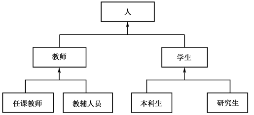  
 
以存在的类为基础定义新的类，新类即拥有基类的数据成员和成员函数。  
  
### 2、继承目的
代码重用code reuse  
描述能力：类属关系广泛存在
> IsA vs. HasA
### 3、有关概念
基类，超类，派生类，子类
### 4、派生类可实施的对基类的改变
- 增加新的数据成员和成员函数。
- 重载基类的成员函数。
- 重定义基类已有的成员函数。
- 改变基类成员在派生类中的访问属性。
### 5、派生类不能继承基类的以下内容
- 基类的构造函数和析构函数。
- 基类的友元函数。
- 静态数据成员和静态成员函数 
## 4.2  protected和继承
### 1、关于protected权限
protected可以用来设置类成员的访问权限，具有protected访问权限的成员称为保护成员。

protected主要用于继承，对于一个不被任何派生类继承的类而言，protected访问属性与private完全相同。

在继承结构中，基类的protected成员虽然不能被派生类的外部函数访问，但却能够被其派生类直接访问。
```
【例4-1】  保护成员的例子
//Eg4-1.cpp
#include <iostream>
using namespace std;
class B{
private:
    int i;                           
protected:
    int j;
public:
    int k;
};

class D: public B{           //L1，此表示D从B派生
public:
    void f(){  
        i=1;				//L1，错误, i是private 
        j=2;				//L2，正确, j是protedted
        k=3;				//L3，正确, k是public
    }
};
void main(){
    B b; 
    b.i =1;				//L4，错误
    b.j=2;					//L5，错误
    b.k=3;
}


```
### 2、例4.1类继承后的成员访问权限
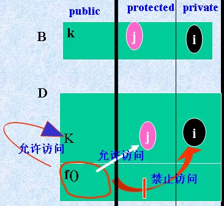  
### 3、说明
①一个类如果不被其他类继承，则其protected和private成员具有相同的访问属性。只能被本类成员函数访问，不能被类的外部函数访问。

②一个类如果被其他类继承，派生类不能直接访问它的private成员，但能够直接访问它的protected成员，这就是protected成员与private成员的区别。  

③尽管基类的public和protected成员都能被派生类直接访问，但它们是有区别的。public成员能够被类的外部函数直接访问，而protected成员则不能。

## 4.3 继承方式
### 1、C++的继承类型
可分为公有继承、保护继承和私有继承，也称为公有派生、保护派生和私有派生。

不同继承方式会不同程度地影响基类成员在派生类中的访问权限。 

### 2、继承语法形式
```
class B {……};
class D : [private | protected | public] B
{
	……
};
```
### 3、public继承
最常见的派生方式
- 维持基类成员的可访问性
- 派生类不可直接访问基类的private成员，可通过基类的共有成员函数访问


```
class Base{
	int x;
public:
	void setx(int n){	x=n;	}
	int getx(){	return x;  }
	void showx()	{	cout<<x<<endl;  }
};
class Derived:public base{
	int y;
public:
	void sety(int n){	y=n;	}
	void sety(){	y=getx();    }
	void showy()
	{	cout<<y<<endl;   }
};
void main()
{	
	Derived obj;
	obj.setx(10);	//从Base继承
	obj.showx();	 //从Base继承
	obj.sety(20);	
	obj.showy();
	obj.sety();
	obj.showx();	 //从Base继承
	obj.showy();
}

```
### 4. 私有继承
Private
- 基类的中的public成员在派生类中是private, private成员在派生类中不可访问。
```
【例4】  私有继承的例子 
//Eg.cpp
#include <iostream>
using namespace std;
class Base{
    int x;
public:
    void setx(int n){x=n; }
    int getx(){return x; }
    void showx(){cout<<x<<endl; }
};
class Derived:private Base{
	int y;
public:
	void sety(int n) { y=n;	}
	void sety() { y=getx(); }
	void showy() {	cout<<y<<endl;   
	}
};
void main(){
	Derived obj;
	obj.setx(10);//cannot access
	obj.sety(20);
	obj.showx();//cannot access
	obj.showy();	
}

```
### 4.2  protected和继承
派生方式为protected的继承称为保护继承，在这种继承方式下，基类的public成员在派生类中会变成protected成员，基类的protected和private成员在派生类中保持原来的访问权限。
```
 【例4】  保护继承的例子。
#include <iostream>
using namespace std;
class Base{
    int x;
protected:
    int getx(){ return x; }
public:
    void setx(int n){ x=n; }
    void showx(){ cout<<x<<endl; }
};
class Derived:protected Base{
    int y;
public:
    void sety(int n){ y=n; }
    void sety(){ y=getx();}   //访问基类的保护成员
    void showy(){ cout<<y<<endl; }
};
void main(){
    Derived obj;
    obj.setx(10); 	//错误
    obj.sety(20);
    obj.showx();	 //错误， 
   obj.showy();    
}

```
## 表4-1:基类成员在派生类中的访问权限
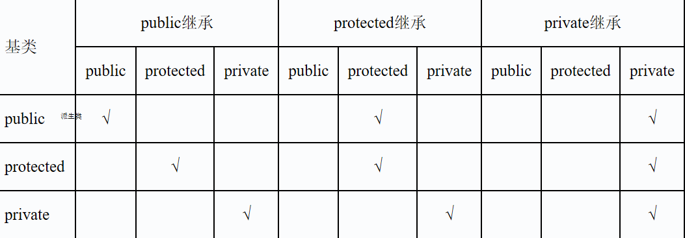   
## 不能继承的基类内容
1. 构造函数、析构函数
2. 友员关系
3. 针对基类定义的一些特殊运算符，如new等。
## 4.4 基类与派生类的关系
### 4.4.1、成员函数的重定义和名字隐藏

派生类对基类成员函数的重定义或重载会影响基类成员函数在派生类中的可见性，基类的同名成员函数会被派生类重载的同名函数所隐藏。
```
【例4-3】  派生类重载基类成员函数的例子。
//Eg4-3.cpp
#include <iostream>
using namespace std;
class Base {
    int x;
public:
    void setx(int i) { x=i;}
    void set(int n) { x=n; }
    void print() { 
		cout<<"Base class: x="<<x<<endl; 
	}
};

class Derived:public Base{
    int m,n;
public:
    void set(int p,int k){ m=p; n=k; }	//L1 重载基类的成员函数set()
    void set(int i,int j,int k) {	//L2 重载成员函数set()
        Base::set(i);			//L3 调用基类成员函数set()
        m=j;       
	   n=k;
    }
    void print(){			//L4重定义基类的成员函数print()
        Base::print();                   
        cout<<"Derived Class: m="<<m<<endl;   
        cout<<"Derived Class: n="<<n<<endl;   
    }
};

void main() {
    Derived d;				    //L5
    d.set(1,3);						    //L6 
    d.print();						    //L7
    d.set(5,6,7);					    //L8 
    d.print(); 						    //L9
 	//   d.set(10);    		//L10，错误，只能是 d.Base::set(10)
    d.Base::print();					    //L11 
    d.setx(8);						    //L12 
}


```
### 2、派生类和基类的关系
派生类继承了基类的所有成员，尽管有些继承的成员是不可访问的  
派生类可以：
- 添加新的数据成员和/或函数成员
- 修改继承的函数成员的行为(overloading, 即重载)
- 覆盖继承的函数成员(overriding，即覆盖)
```
class Base
	{base members;};

class Derived: Base
	{new members;};

```
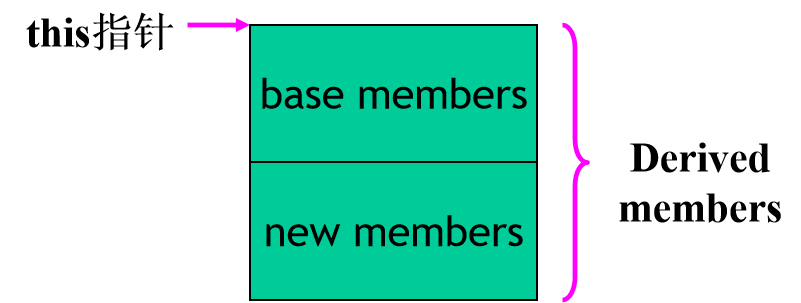   
### 4.4.2 基类成员访问
派生类对基类成员的访问形式
- 通过派生类对象直接访问基类成员 
- 在派生类成员函数中直接访问基类成员 
- 通过基类名字限定访问被重载的基类成员名  
```
【例】  在派生类中访问基类成员。
//Eg.cpp
#include <iostream>
using namespace std;
class B{
    int x;
public:
    void set(int i){ x=i;}
    void setx(int i){ x=i;}
    void printx(){ cout<<"x="<<x<<endl; }
};
class D:public B{
    int y;
public:
    void sety(int p){y=p;}
    void printy(){ cout<<"y="<<y<<endl; }
    void setxy(int i,int j){
        setx(i);		//L1 在派生类成员函数中直接访问基类成员
        y=j;
    }
    void set(int i,int j){
        B::set(i);			//L2 访问基类set成员
        y=j;
    }
};
void main(){
    D obj;
    obj.setx(2);			//L3 访问基类成员
    obj.printx();			//L4 访问基类成员, 输出 x=2
    obj.sety(3);			//L5 访问派生类成员
    obj.set(1,2);			//L6 访问派生类set成员
    obj.B::set(3);			//L7 访问基类set成员
}

```
## 4.5 构造函数和析构函数
类对象成员的构造
- 先构造成员
- 再构造自身（调用构造函数）
```
例题ch.cpp
class A { 
public: 
	A() { cout<<"Constructing A"<<endl;} 
	~A(){ cout<<"Destructing A"<<endl;}
};
class B {
public: 
	B() { cout<<"Constructing B"<<endl;}
	~B(){ cout<<"Destructing B"<<endl;}
};

class C {
public: 
	C() { cout<<"Constructing C"<<endl;}
	~C(){ cout<<"Destructing C"<<endl;}
	B b;
	A a;
};

void main() {	
	C c; 
}

```
结果

```
Constructing B
Constructing A
Constructing C
Destructing C
Destructing A
Destructing B

```

### 4.5.1  派生类构造函数、析构函数的定义和调用次序
派生类可能有多个基类，也可能包括多个成员对象，在创建派生类对象时，派生类的构造函数除了要负责本类成员的初始化外，还要调用基类和成员对象的构造函数，并向它们传递参数，以完成基类子对象和成员对象的建立和初始化。

派生类只能采用构造函数初始化列表的方式向基类或成员对象的构造函数传递参数，形式如下：
```
派生类构造函数名(参数表):基类构造函数名(参数表),成员对象名1(参数表),…{
  	//……
}
```

```
【例4-4】  派生类Derived以构造函数初始化列表的方式向基类构造函数提供参数。
//Eg4-4.cpp
#include <iostream>
using namespace std;
class Base {
	int x;
public: 
    Base(int a){                        				//L1
		x=a;
		cout<<"Constructing Base :x="<<x<<endl; 
	}
    ~Base(){ cout<<"Destructing Base :x="<<x<<endl; }
};
class Derived:public Base {
	int z;
public: 
    Derived(int i,int j,int k):Base(i),b(j){  	//L2
		z=k;
		cout<<"Constructing Derived :z= "<<z<<endl; 
	}
    ~Derived(){ cout<<"Destructing Derived :z="<<z<<endl; }
    Base b;					//L4
};
void main(){
    Derived d(1,2,3);				//L6
}

```
__简简单单，有了python__init__，这些都是小意思  
派生类对象的构造
- 先构造基类
- 再构造成员
- 最后构造自身（调用构造函数）

基类构造顺序由派生层次决定：
- 最远的基类最先构造
- 成员构造顺序和定义时的顺序一致
- 析构函数的析构顺序与构造相反
```
class A { 
public: 
	A() { cout<<"Constructing A"<<endl;} 
	~A(){ cout<<"Destructing A"<<endl;}
};
class B {
public: 
	B() { cout<<"Constructing B"<<endl;}
	~B(){ cout<<"Destructing B"<<endl;}
};

class C {
public: 
	C() { cout<<"Constructing C"<<endl;}
	~C(){ cout<<"Destructing C"<<endl;}
};
class D:public C 
{
public: 
	D() { cout<<"Constructing D"<<endl;}
	~D(){ cout<<"Destructing D"<<endl;}
	B b;
	A a;
	C c;
};

void main()
{
	D d;
}

```
结果
```
Constructing C
Constructing B
Constructing A
Constructing C
Constructing D
Destructing D
Destructing C
Destructing A
Destructing B
Destructing C

```
### 4.5.2  构造函数和析构函数的构造规则
#### 1、派生类可以不定义构造函数的情况 
当具有下述情况之一时，派生类可以不定义构造函数。
- 基类没有定义任何构造函数。
- 基类具有缺省参数的构造函数。
- 基类具有无参构造函数。
```
【例4-5】  没有构造函数的派生类。
//Eg4-5.cpp
#include <iostream>
using namespace std;
class A { 
public: 
    A(){ cout<<"Constructing A"<<endl; } 
    ~A(){ cout<<"Destructing A"<<endl; }
};
class B:public A {
public: 
   ~B(){ cout<<"Destructing B"<<endl; }
};
void main(){
    B b;
}

```
#### 2、派生类必须定义构造函数的情况
 
当基类或成员对象所属类只含有带参数的构造函数时，即使派生类本身没有数据成员要初始化，它也必须定义构造函数，并以构造函数初始化列表的方式向基类和成员对象的构造函数传递参数，以实现基类子对象和成员对象的初始化。 
```
【例4-6】  派生类构造函数的定义。
//Eg4-6.cpp
#include <iostream>
using namespace std;
class Point{
protected:
    int x,y;
public:
    Point(int a,int b=0) {
        x=a;  y=b;
        cout<<"constructing point("<<x<<","<<y<<")"<<endl;
    }
};
class Line:public Point{
protected:
    int len;
public:
    Line(int a,int b,int l):Point(a,b) {	//构造函数初始化列表
        len=l;
        cout<<"Constructing Line,len ..."<<len<<endl;
    }
};
void main(){
    Line L1(1,2,3);
}

```
#### 3、派生类的构造函数只负责直接基类的初始化 
C++语言标准有一条规则：如果派生类的基类同时也是另外一个类的派生类，则每个派生类只负责它的直接基类的构造函数调用。

这条规则表明当派生类的直接基类只有带参数的构造函数，但没有默认构造函数时（包括缺省参数和无参构造函数），它必须在构造函数的初始化列表中调用其直接基类的构造函数，并向基类的构造函数传递参数，以实现派生类对象中的基类子对象的初始化。

这条规则有一个例外情况，当派生类存在虚基类时，所有虚基类都由最后的派生类负责初始化。
```
【例4-7】 当同时存在直接基类和间接基类时，每个派生类只负责其直接基类的构造。
//Eg4-7.cpp
#include <iostream>
using namespace std;
class A { 
    int x;
public: 
    A(int aa) {
        x=aa;
        cout<<"Constructing A"<<endl;
    }
    ~A(){ cout<<"Destructing A"<<endl; }
};
class B:public A {
public: 
    B(int x):A(x){ cout<<"Constructing B"<<endl; }
};
class C :public B{
public: 
    C(int y):B(y){ cout<<"Constructing C"<<endl; }
};
void main(){
    C c(1);
}

```
#### 4、构造函数的调用时间和次序 
当派生类具有多个基类和多个对象成员，它们的构造函数将在创建派生类对象时被调用，调用次序如下：

基类构造函数→对象成员构造函数→派生类构造函数

（1）当有多个基类时，将按照它们在继承方式中的声明次序调用，与它们在构造函数初始化列表中的次序无关。当基类A本身又是另一个类B的派生类时，则先调用基类B的构造函数，再调用基类A的构造函数。

（2）当有多个对象成员时，将按它们在派生类中的声明次序调用，与它们在构造函数初始化列表中的次序无关。

（3）当构造函数初始化列表中的基类和对象成员的构造函数调用完成之后，才执行派生类构造函数体中的程序代码。
```
【例4-8】  构造函数的调用次序验证。
//Eg4-8.cpp
#include <iostream>
using namespace std;
class A {
    int x;
public:
     A(int i=0) {
         x=i;
         cout << "A-----"<<x<<endl;
     }
};
class B {
    int y;
public:
    B(int i) {
        y=i;
        cout << "B-----"<<y<<endl;
    } 
}; 
class C {
    int z;
public:
    C(int i) {
        z=i;
        cout << "C-----"<<z<<endl;
    } 
};
class D : public B{
public: 
    C c1, c2;
    A a0,a4;
    D( ) : a4(4),c2(2),c1(1),B(1) {
		cout << "D-----5"<<endl;
    }
};
void main(){
    D d;		// 构造次序: B -> c1 -> c2 -> a0 -> a4 -> d
}

```
## 4.6 多重继承
### 4.6.1  多继承的概念和应用
C++允许一个类从一个或多个基类派生。如果一个类只有一个基类，就称为单一继承。如果一个类具有两个或两个以上的基类，就称为多重继承。多继承的形式如下：
```
class 派生类名:[继承方式] 基类名1,[继承方式] 基类名2,  …
{
      ……
};
```
其中，继承方式可以是public、protected、private  
  
```
【例4-9】  上图的简单程序。
//Eg4-9.cpp
#include <iostream>
using namespace std;
class Base1{
private:
    int x;
protected:
    int getx(){ return x; }
public:
    void setx(int a=1){ x=a; }
};
class Base2{
private:
    int y;
public:
    void sety(int a){ y=a; }
    int gety(){ return y; }
};
class Base3{
private:
    int z;
public:
    void setz(int a){ z=a; }
    int getz(){ return z; }
}; 
class Derived:public  Base1,public Base2,public Base3{
private:
    int d;
public:
    void setd(int a){ d=a; }
    void display();
};
void Derived::display(){
    cout<<"Base1....x="<<getx()<<endl;
    cout<<"Base2....y="<<gety()<<endl;
    cout<<"Base3....z="<<getz()<<endl;
    cout<<"Derived..d="<<d<<endl;
}
void main(){
    Derived obj;
    obj.setx(1);
    obj.sety(2);
    obj.setz(3);
    obj.setd(4);
    obj.display();
}

```
### 4.6.2 多继承下的二义性
在多继承方式下，派生类继承了多个基类的成员，当两个不同基类拥有同名成员时，容易产生名字冲突问题。  
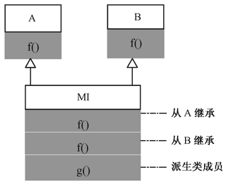  
```
【例4-10】  类A和类B是MI的基类，它们都有一个成员函数f，在类MI中就有通过继承而来的两个同名成员函数f。
//Eg4-10.cpp
#include<iostream>
using namespace std;
class A {
public: 
	void f() { cout<<"From  A"<<endl;}
};
class B {
public: 
	void f() { cout<<"From  B"<<endl;}
};
class MI: public A, public B {
public:
	void g() { cout<<"From  MI"<<endl; } 
};
void main() { 
    MI mi;
    mi.f();					//错误
    mi.A::f();				//正确
} 

```
### 4.6.3 多继承的构造函数与析构函数
派生类必须负责为每个基类的构造函数提供初始化参数，构造的方法和原则与单继承相同。

构造函数的调用次序仍然是先基类，再对象成员，然后才是派生类的构造函数。

基类构造函数的调用次序与它们在被继承时的声明次序相同，与它们在派生类构造函数的初始化列表中的次序没有关系。

多继承方式下的析构函数调用次序仍然与构造函数的调用次序相反。  
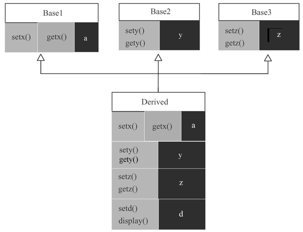  
```
【例4-11】  类Base1、Base2、Base3、Derived的继承关系如图所示，验证其构造函数和析构函数的调用次序。
//Eg4-11.cpp
#include <iostream>
using namespace std;
class Base1{
private:
    int x;
public:
    Base1(int a=1){
        x=a;
        cout<<"Base1 constructor x="<<x<<endl;
    }
    ~Base1(){ cout<<"Base1 destructor..."<<endl; }
};

class Base2{
private:
    int y;
public:
    Base2(int a){
        y=a;
        cout<<"Base2 constructor y="<<y<<endl;
    }
    ~Base2(){ cout<<"Base2 destructor..."<<endl; }
};
class Base3{
private:
    int z;
public:
    Base3(int a){
        z=a;
        cout<<"Base3 constructor z="<<z<<endl;
    }
    ~Base3(){ cout<<"Base3 destructor..."<<endl; }
};


class Derived:public  Base1,protected Base2,private Base3{
private:
    int y;
public:
    Derived(int a,int b,int c):Base3(b),Base2(a){
        y=c;
        cout<<"Derived constructor y="<<y<<endl;
    }
    ~Derived(){ cout<<"Derived destructor..."<<endl; }
};
void main(){
    Derived d(2,3,4);
}

```
运行结果：
```
Base1 constructor x=1
Base2 constructor y=2
Base3 constructor z=3
Derived destructor y=4
Derived destructor…
Base3 destructor…
Base2 destructor…
Base1 destructor…
```
## 4.7 虚拟继承
### 1. 虚拟继承引入的原因：重复基类
派生类间接继承同一基类使得间接基类（Person）在派生类中有多份拷贝，引发二义性。  
  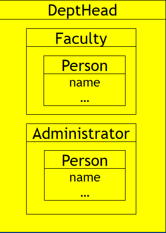  
虚拟基类在派生类中只存在一份拷贝，解决了基类数据成员的二义性问题  
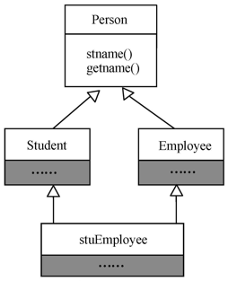  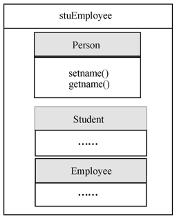  
### 2、虚拟继承virtual inheritance的定义
语法
```
class derived_class : virtual […] base_class
```
虚基类virtual base class
- 被虚拟继承的基类
- 在其所以的派生类中，仅出现一次

```
【例】  类A是类B、C的虚基类，类D从类B、C继承，在类D中调用基类A的成员不会产生二义性。
// 有二义性的示例
class A { 
public:	
	void vf() {
		cout<<"I come from class A"<<endl;	}
};
class B: public A{};
class C: public A{};
class D: public B, public C{};

void main()
{
	D d;
	d.vf ();	// error
}

```
将【例】  改为虚拟继承不会产生二义性。
```
class A { 
public:	
	void vf() {
		cout<<"I come from class A"<<endl;	}
};
class B: virtual public A{};
class C: virtual public A{};
class D: public B, public C{};

void main()
{
	D d;
	d.vf();	// okay
}

```
## 4.7 继拟继承
### 3、虚拟继承的构造次序
虚基类的初始化与一般的多重继承的初始化在语法上是一样的，但构造函数的调用顺序不同；

若基类由虚基类派生而来，则派生类必须提供对间接基类的构造（即在构造函数初始列表中构造虚基类，无论此虚基类是直接还是间接基类）

调用顺序的规定：
- 先调用虚基类的构造函数，再调用非虚基类的构造函数
- 若同一层次中包含多个虚基类,这些虚基类的构造函数按它们的说明的次序调用
- 若虚基类由非基类派生而来,则仍然先调用基类构造函数,再调用派生类构造函数
```
【例4-12】  虚基类的执行次序分析。
//Eg4-12.cpp
#include <iostream>
using namespace std;
class A {
    int a;
public: 
    A(){ cout<<"Constructing A"<<endl; }
}; 
class B {
public: 
    B(){ cout<<"Constructing B"<<endl;}
}; 
class B1:virtual public B ,virtual public A{
public: 
    B1(int i){ cout<<"Constructing B1"<<endl; }
}; 
class B2:public A,virtual public B {
public: 
    B2(int j){ cout<<"Constructing B2"<<endl; }
};
class D: public B1, public B2 {
public:
    D(int m,int n): B1(m),B2(n){ cout<<"Constructing D"<<endl; }
    A a;
}; 
    
void main(){
    D d(1,2);
}

```
### 4、虚基类由最终派生类初始化 
在没有虚拟继承的情况下，每个派生类的构造函数只负责其直接基类的初始化。但在虚拟继承方式下，虚基类则由最终派生类的构造函数负责初始化。
 
在虚拟继承方式下，若最终派生类的构造函数没有明确调用虚基类的构造函数，编译器就会尝试调用虚基类不需要参数的构造函数（包括缺省、无参和缺省参数的构造函数），如果没找到就会产生编译错误。
```
【例4-13】  类A是类B、C的虚基类，类ABC从B、C派生，是继承结构中的最终派生类，它负责虚基类A的初始化。

//Eg4-13.cpp
#include <iostream.h>
class A {
    int a;
public: 
    A(int x) {
        a=x;
        cout<<"Virtual Bass A..."<<endl; 
    }
}; 
class B:virtual public A {
public: 
    B(int i):A(i){ cout<<"Virtual Bass B..."<<endl; }
};
class C:virtual public A{
    int x;
public:
    C(int i):A(i){
        cout<<"Constructing C..."<<endl;
        x=i; 
    }
};
class ABC:public C, public B {
public: 
    ABC(int i,int j,int k):C(i),B(j),A(i) //L1，这里必须对A进行初始化
        { cout<<"Constructing ABC..."<<endl; }
}; 
void main(){
    ABC obj(1,2,3);
}


```
## 4.8基类与派生类对象的关系 
基类对象与派生类对象之间存在赋值相容性。包括以下几种情况：
- 把派生类对象赋值给基类对象。
- 把派生类对象的地址赋值给基类指针。
- 用派生类对象初始化基类对象的引用。

反之则不行，即不能把基类对象赋值给派生类对象；不能把基类对象的地址赋值给派生类对象的指针；也不能把基类对象作为派生对象的引用。 
```
【例4-14】  把派生类对象赋值给基类对象的例子。
//Eg4-14cpp
#include <iostream>
using namespace std;
class A {
    int a;
public: 
    void setA(int x){ a=x; }
    int getA(){ return a;} 
}; 
class B:public A{
    int b;
public: 
    void setB(int x){ b=x; }
    int getB(){ return b;} 
};
void f1(A a, int x){ a.setA(x); }      
void f2(A *pA, int x){ pA->setA(x); }
void f3(A &rA, int x){ rA.setA(x); }
void main(){
    A a1,*pA;
    B b1,*pB;
    a1.setA(1);
    b1.setA(2);
    a1=b1;                  
    cout<<a1.getA()<<endl;		
    cout<<b1.getA()<<endl; 		
    a1.setA(10);              
    cout<<a1.getA()<<endl;		
    cout<<b1.getA()<<endl;		
    pA=&b1;                
    

```
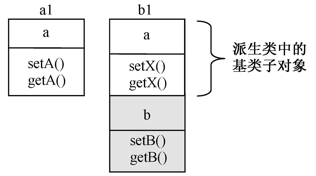  
说明：
① 不论以哪种方式把派生类对象赋值给基类对象，都只能访问到派生类对象中的基类子对象部份的成员，不能访问派生类的自定义成员。 

②只能把派生类对象赋值给基类对象，不能把基类对象赋值给派生类对象。 

_上转型对象！！！！！！！！！！！！！_
## 4.9继承与组合
继承与组合（也称合成）是C++实现代码重用的两种主要方法。通过继承，派生类可以获得基类的程序代码，从而达到代码重用的目的。而组合则体现了类之间的另一种关系，是指一个类可以包容另外的类，即用其他类来定义它的对象成员。

继承关系常被称为“Is-a”关系，即两个类之间若存在Is-a关系，就可以用继承来实现它。比如，水果和梨，水果和苹果，它们就具有Is-a关系。因为梨是水果，苹果也是水果，所以梨和苹果都可以从水果继承，获得所有水果都具有的通用特征。

组合常用于描述类之间的“Has-a”关系，即一个类拥有另外一些类。比如，图书馆有图书，汽车有发动机、车轮胎、座位等，计算机有CPU、存储器、显示器等，这些都可以用类的组合关系来实现。
## 4.10编程实作 
某校每位学生都要学习英语、语文、数学三门公共课程以及不同的专业课程。会计学专业要学习会计学和经济学两门课程，化学专业要学习有机化学和化学分析两门课程。编程序管理学生成绩，计算公共课的总分和平均分，以及所有课程的总成绩。

说明：从本章开始将逐渐用面向对象的C++程序技术构造本程序，并最终将其改造成了个windows系统下的程序。

#### 经过抽象与继承，构造出图所示的类结构

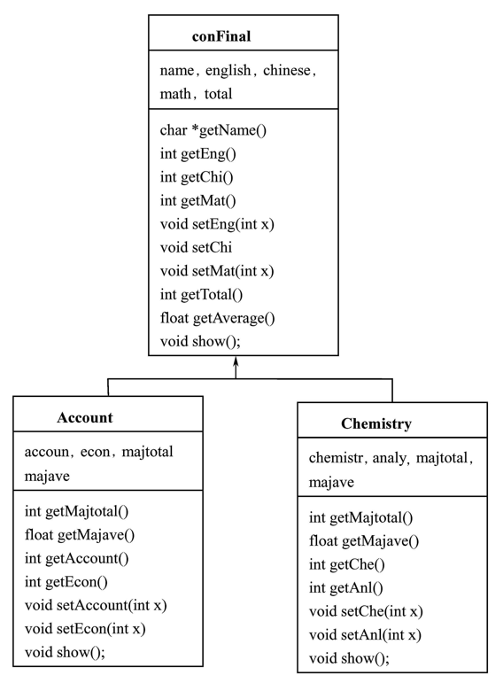  
将每个类的声明与实现分别独立保存在与类同名的.h头文件和.cpp文件中。


